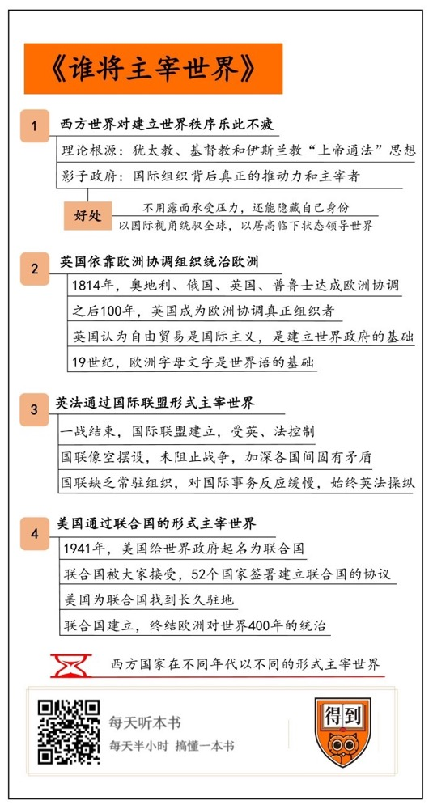

# 《谁将主宰世界》| 曲飞工作室解读

## 关于作者

本书的作者马克·马佐尔，是美国哥伦比亚大学历史学教授，主要研究希腊、巴尔干与20世纪的欧洲史。

## 关于本书

本书介绍了西方国家试图主宰世界的思想根源，阐述了近二百年间，英国与美国为控制世界采取过的种种手段，以历史为镜像，照映的是世界的未来。本书是作者最突出的代表作，获得过很多有分量的奖项，包括2012年度《金融时报》最佳政治类图书、沃夫森历史奖、伦西曼奖等等。

## 核心内容

所谓主宰世界，就是让世界按照某一个意志或是法则来运转。过去两百年间，世界上通行的大多数规则都是西方人制定的，那么，他们是怎么制定出来这些规矩的，又是怎么保证这些规矩顺利运行的呢？这本书讲的就是这种思想和实践的发展历程。我们可以通过了解历史，来洞悉世界运转的规则和潜规则。

## 前言

你好，欢迎每天听本书，这期为你解读的是《谁将主宰世界》。首先我们必须说，这本书的中文译名其实是不太准确的，它的英文原名叫做 Governing the World，可以翻译成统治世界，或者控制世界，从英语的时态上说是进行时，而不是将来时，翻译不出“谁将……”的意思，也就是说，这本书它并不是对未来世界格局的预测，而是对历史的盘点梳理。不过，通过了解历史，来洞悉世界运转的规则和潜规则，这也可以作为展望和预测未来的一个重要参照，甚至可以说，这也是我们读历史书的意义所在。

我们再来说“主宰世界”，听起来很玄，好像是那种特别高端神秘的组织，在幕后决定着世界上的一切，其实远没有这么复杂。所谓主宰世界，说穿了，不就是让世界按照某一个意志或是法则来运转吗？如果谁能制定一套规则和范式，让最广泛的世界都按照这个规矩来，这样就是主宰世界了。过去两百年间，甚至直到现在，世界上通行的大多数规则都是西方人制定的，那么，他们是怎么制定出来这些规矩的，又是怎么保证这些规矩顺利运行的呢？这本书讲的就是这种思想和实践的发展历程，或者用一句最直白的话来说就是，过去两百年，西方人是怎样按照他们的意志玩转了整个世界。

本书的作者名叫马克·马佐尔，是美国哥伦比亚大学历史学教授，研究希腊、巴尔干与20世纪的欧洲史。他善于抓住历史背后的真实事件，认为欧洲主导世界不是必然的，而是一系列偶然的结果。他曾出版过《巴尔干》《希特勒统治下的希腊》和《黑暗大陆：20世纪的欧洲史》等著作，但最有代表性的，还是我们今天讲的这本《谁将主宰世界》。这本书获得过很多有分量的奖项，包括2012年度《金融时报》最佳政治类图书、沃夫森历史奖、伦西曼奖等等。

这本书中，作者马佐尔的论述可以分为四个方面，分别是：一、西方世界为什么对建立世界秩序甚至世界政府乐此不疲；二、英国是如何依靠欧洲协调来统治整个欧洲的；三、英法是如何通过国际联盟的形式主宰世界的；四、美国是如何通过联合国的形式主宰世界的。下面我们就按照这个逻辑结构，把这本40万字、300多页的书化整为零，逐一来讲一下。

## 第一部分

先看第一部分：西方世界为什么对建立世界政府乐此不疲？

一个主宰整个世界的政府，这种东西我们可能觉得只会存在于科幻小说里，因为地球上有200多个国家和地区、数千个民族，各个国家的语言、风俗习惯都不同，怎么可能组合成一个联合的统一政府呢？确实，迄今为止，世界上还不曾出现一个能直接管辖全世界的政府，但是西方人早就有这个打算了，如果把这种思想往源头来追溯，我们可以看到，它的理论依据是来自亚伯拉罕诸教的“上帝通法”思想。所谓亚伯拉罕诸教，是指犹太教、基督教和伊斯兰教，他们都认为自己是生活在公元前1000年左右的一位犹太先知亚伯拉罕的后裔或信徒。上帝通法，就是按照宗教的原则与法规，来作为整个世界的唯一法律。可以说，这是他们宗教中先天自带的一种思维方式。所以，西方人关于建立世界政府的思想不是空想，而是有理论根源和实操纲领的一种思想。

我们可以看到，在历史上，从中世纪的十字军到地理大发现，欧洲人政治版图的扩张总是和宗教的传播伴随在一起，通过他们的传播，基督教也确实成了当今世界上传播范围最广的宗教，但是想完全依靠宗教来一统天下，那是不可能做到的。一是因为世界上有很多不同的文明形态，有些还是已经高度成熟的，不可能完全按照基督教的规范来行事；二来也是因为宗教改革之后，基督教逐渐实现政教分离，宗教对世俗事务的影响越来越弱。所以，以宗教为纽带的世界政府，是不可能实现的。不光是基督教，别的宗教也同样不可能做到。近代以来，欧洲人也逐渐放弃了这种虚幻的理想，他们转而追求其他更切实可行的手段，比如建立一些国际组织，通过它们来实现主宰世界。

## 第二部分

前面第一部分说的是理论根源，西方人为什么一直孜孜以求想要建立一个世界政府，下面几个部分，我们就讲讲他们的实操，看看不同的历史阶段中，他们都是如何通过国际组织来尝试主宰世界的。

说之前我们要插入一个概念介绍：影子政府。一提到影子政府，有人可能会想到传说中的共济会、彼德伯格俱乐部什么的，但其实我们前面说过了，没那么神秘，所谓影子政府，在这就是指那些国际组织背后真正的推动力和主宰者。打个比方，某人或某组织想做某件事，但不好直接出面，于是就躲到幕后去，借助其他的形式和名目来做，这种情况下，这个在幕后发挥作用、贯彻自己意志、达到自己目的的组织，它扮演的角色就是影子政府。

在国际政治中，很多时候影子政府就是某国的真实政府，它们会以某一种联盟的形式，提升自己政府的权威，甚至是操纵整个联盟的走向。好像我们都在同一个组织的框架之下，都遵从同样的一定之规，但其实这规矩就是由我制定的，也是由我来负责解释的，所以还不是按我的规矩来玩吗？所谓国际组织，很多时候起到的就是这样的作用，它搭起一个台子，但台子背后真正说了算的，还是那些制定规则的大国政府。作为影子政府有两点好处：一个是不用承受压力，还能隐藏自己的身份；另一个是以国际视角统驭全球，以居高临下的状态去领导整个世界。

说清了这个概念，我们再结合一些例子来看看，历史上欧美强国是如何通过国际组织，来尝试在幕后主宰世界的。比如19世纪的英国，就是靠着欧洲协调组织控制整个欧洲的；一战二战之间的国际联盟，其实是英法两国政府所控制的；早期的联合国，实际上也是美国想用来控制整个世界的武器。下面我们就顺着时间的脉络，看看这三个阶段，大国们都使用了哪些手段来主宰世界。

我们先从19世纪讲起，来认识一下当时英国主导的欧洲协调组织。欧洲霸王拿破仑被团灭后的1814年，奥地利、俄国、英国与普鲁士达成了一个协议，就是欧洲协调，将它们四国与法国定位为世界头号强国，其他国家只能排在第二、第三、第四等级，屈从于首脑大国们做出的决定。这个协议由于是在奥地利维也纳签署的，所以在很多书上也被称为维也纳体系，这是欧洲警察乃至于世界警察的来历。1815年拿破仑短暂复辟，但很快在滑铁卢被打败，没能撼动这个欧洲协调组织。

在之后的100年里，英国因为一家独大，往往成为欧洲协调的真正组织者，并拥有欧洲协调的最终解释权。但即便如此，既然这是一个旨在制定欧洲乃至世界秩序的组织，那还是要有一个能摆上台面的行事依据，这就是国际法的前身。最早的国际法是来源于战争法的。什么是战争法呢？就是欧洲各国打完仗、按照胜利者要求编制的法律。它就是各国意愿和话语权的体现，是建立在实力基础上的，所以它是一种伪法律。1847年，英国开始了自由贸易阶段，在19世纪的后50年，英国就是依靠自由贸易获得了极大的好处。特别是在1860年左右，英法两国相继与奥斯曼帝国和中国订立了自由贸易条约。在我们看来，这是一种经济侵略，但在他们看来，却是在“传播文明”。因为自由贸易在全世界各地开花结果，所以英国也就想当然地认为，自由贸易就是一种国际主义，也是建立世界性政府的基础。

19世纪初，尽管英国哲学家、法学家边沁创造了“国际”一词，但自始至终就没人对这个词感兴趣。因为只要一说到国际，一定会有两个问题，一个是开放自己，另一个就是吸收他人。吸收他人好说，把他人拉过来进自己的朋友圈就行，但开放自己就意味着共享，自己的一亩三分田就可能被别人所占领，所以最多共享的就是一些思想和文化领域的知识，而比如触及到国家科学和军事武器的共享，自始至终就没有过。即便到现在仍旧是如此，没有任何改变。另外，在语言上，欧美国家并不尊重其他国家。19世纪，英语曾作为整个世界各类和平会议的通用语言，而其他语言，除了法语有时也使用外，都不被欧美国家所承认。19世纪末，一些欧洲人为了改变这种一家独大的情形制造了世界语，但也是以欧洲字母文字为基础的语言，并未考虑其他国家的文字。

总之，我们可以看出，虽然表面上有这种协调组织来协调各国的关系与利益分配，但是在组织背后发挥影响的，还是英国为代表的大国们。越来越狭隘的国家利益，不可避免地造成了紧张的局势，而这一局势已经从一开始就同国际机构联系在一起。世界强国希望利用国际机构实现本国的发展和扩张，而其他加入组织的成员国则不希望一家独大，更不希望某些世界强国利用国际机构强行插手别国的内政，这样导致的结果，就是1914年发生了震惊世界的第一次世界大战。在战争中，欧洲迅速分为两部分，互相为敌，英国所主导的欧洲协调就在这场战争中烟消云散了。

在这一部分里，我们看到，以英国为首的几个国家已经有了初步建立世界政府的计划，只不过它过于高高在上，不仅不尊重其他国家，而且还利用战争法改成的国际法，强行推进世界性自由贸易，以及将英语变成世界通用语，让大家非常不爽。一些后发达国家如德国，立刻起来挑战它的权威，最终酿成了不可预料的后果，以英国为首的欧洲协调也就此谢幕。

## 第三部分

但大英帝国会放弃建立世界政府的实践吗？当然不会。很快，在一战结束后，他们又有了新的想法，就是建立一个国际联盟。这就是接下来要讲的第三部分：英法是如何通过国际联盟的形式主宰世界的？

1919年《巴黎和约》签订，一战正式结束，德奥战败，英法美打赢，它们为了巩固其战胜国的地位，又一次将创造一个国际组织的议题放到大家面前。在英国首相劳埃德·乔治和美国总统伍德罗·威尔逊的斡旋下，一个跨世界性的组织横空出世，这就是今天联合国的前身国际联盟，简称国联。可是国联一经建立，就受到了英国的控制，后来在1930年左右又增加了一个法国一起控制，美国则因为国内议会没通过参加国际联盟的意向书，所以虽然威尔逊是国联的倡导者之一，但美国自始至终也没有加入国联。结果，国联就成了一个欧洲列强结盟共事的交际工具，以确保欧洲各国和平共处，同时还能保障各国权力和利益。

虽然德国于1926年加入国联，但于1933年退出；日本和意大利尽管为常任理事国，也分别于1933年及1937年，为了进一步实践军国主义与法西斯主义而退出国联；苏联于1934年9月18日加入国联，因入侵芬兰，1939年12月14日被开除会籍。而且，国联对于维持和平也像一个空摆设一样，比如1931年日本制造九·一八事变，侵占中国东北，国联根本就没有阻止。国联的重要成员国更倾向于保护自己的利益，如委任统治地制度的建立、对战败国的殖民地和势力范围重新瓜分等，加深了各国之间固有的矛盾，埋下了大国争端的新祸根。同时，国联缺乏常驻组织，对国际事务反应缓慢，所以，等于自始至终就是英法两国在操纵。在上世纪30年代后，它们推行绥靖政策，消极对待法西斯扩张，终于，1939年爆发了第二次世界大战，1亿多人死伤，20亿人卷入战争，5万多亿美元付诸东流，这是人类历史上规模最大的战争。

本来国联是各国为防止武装冲突、加强普遍和平与安全而建立的国际机构的第一次尝试，但在实践中并没有起到维护和平的作用，相反，它的作用只是帮助大国重新划分势力范围。受英法两国的操纵，它缺乏对侵略行为的有力制裁，到二战前，国联已经形同虚设。所以二战后，英国自知国联已经失败了，而且最重要的是，英国以及法国在二战中损失巨大、满目疮痍，再也无力继续建设世界政府，结果，世界政府的建立权就从英国手里过渡到了美国手中，联合国应运而生。

## 第四部分

下面我们就来说第四部分，美国是如何通过联合国的形式主宰世界的。

前面说，英国所领导的国际联盟并没有将第二次世界大战消灭在摇篮里，反而令这次战争比一战造成了更大的破坏，对此，全世界一致诟病英国，完全就是“言行不一，自相矛盾。满嘴的仁义道德，兄弟情谊”。英国建立世界政府失败后，新的主导者美国便开始了建立世界政府之路。对比英国的一毛不拔政策，美国可是下了血本。

说起来，美国人的确比英国人更高明，首先，他们从给这个世界政府起名字上，就比英国人努力。据说1941年美国总统罗斯福为了让战争中同盟国更好地联系，几天不睡觉，想出了“联合国”这个名字。丘吉尔说，别吹了，其实英国诗人拜伦在长篇叙事诗《恰尔德·哈罗德游记》中，曾用此名来描述滑铁卢战役中的盟国：“这里，联合国剑已出鞘，同胞将于彼日踏上战场！这一切都将亘古永存。”的确，这个名字要比国联更能鼓舞人心。而从1943年开始，在许多同盟国的文件上，也确实出现了联合国这个称呼。第二个是，从1943年末，罗斯福就开始和丘吉尔、斯大林一起运作联合国的建立，以代替落下了坏名声的国联，之后又在1944和1945年多次重申建立战后的联合国政府，最终让联合国以混个脸熟的状态被大家所接受，52个国家也在二战结束时签署了建立联合国的协议。第三个，就是美国还为联合国找到了一个长久驻地——位于美国纽约的、由石油大王洛克菲勒家族捐赠的7万多平方米土地。

就这样，美国神不知鬼不觉地先给了大家一个世界联合政府的名字，继而又给了世界联合政府在美国的驻地，最终完成了美国领导下的世界政府的建立。联合国的建立，同时也终结了欧洲对世界400年的统治。

作为联合国总部的创建国和东道国，美国在联合国发展历程中扮演着极其重要的角色，也一直试图给联合国涂抹上更多的美国色彩。冷战爆发后，铁幕落下，以美国和苏联为首的两大阵营剑拔弩张，对峙了整整四十年。和中国一样，美国也把地球划分成三个世界，但标准不同。在他们看来，第一世界是美国及其盟友，第二世界是苏联及其盟友，第三世界是美苏两国之间的夹缝国家。我们接下来提到的三个世界，都是按照这个标准划线。

虽然在二战后，第一世界和第二世界的国家还仍旧是世界强国，但因为二战的洗礼，几乎都是百废待兴，没人更没钱去管理它们在世界各地的殖民地，殖民地便在20世纪的50～70年代纷纷独立。到1979年，世界上独立国家的总数比1945年翻了一番，120多个国家成为联合国会员国，其中多半都属于第三世界。虽然联合国是美国创立的，但联合国大会并不像美国人预想的那样，对美国俯首帖耳，成为美国统治世界的武器，因为联合国大会更关心殖民地人民的安全以及独立问题，最后就造成了美国在世界和平和安全上的统治权，与在殖民问题上的非统治权。换句话说就是，美国在冷战期间可以调动全世界1/4的盟友国家协助自己抗衡苏联、停止战争，并让美国成为名副其实的世界警察，但对于新国家的建立、主权归属问题上，美国就没有那么大能力阻止了。

美国人认为，既然无法阻挡独立的倾向，为何不换个方法，让他们接受美国的一切呢？所以美国也乐于见到更多新国家的建立，因为这样可以将殖民地从庞大的英法等帝国中剥离，防止它们权力过大，影响美国对世界的统治，如果这些殖民地建立的新国家倾向于美国，就更容易让美国用更少的人和更少的钱统治世界，美国称之为反殖民主义。所以从1961年肯尼迪总统开始，就频繁向第三世界国家示好，建立最广泛的国际基础。或者换句话说，就是积极输出美国式的民主，在文化上进行征服。与此同时，美国将自己的文化、政治和经济元素注入到这些新建立的国家之中，使其全部美国化。

在联合国建立的时候，美国顺便建立了两个国际性组织，也是世界上最大的三个金融机构中的两个：世界银行和国际货币基金组织。这两个国际性组织有个不成文的规定：世界银行的行长永远由美国人担任，国际货币基金组织的总裁永远是西欧各国人担任。就是说，如果一个穷国想到联合国借钱，就必须先承认美国人和欧洲人的经济游戏规则，否则就什么都没有。同时也说明了，二战后的世界金融体系是美国所主导的。更为令人气愤的是，每个加入这两个国际性组织的国家，必须经过美国国会的批准。曾有大量第三世界国家为了加入，低下了自己的头，不仅承认美国的经济地位，还把美元作为最大的外汇储备货币。比如中国，也是直到1980年才进入这两个组织，可谓是非常的艰难。

说到这，我们先阶段性总结一下，我们在这部分讲述了美国在二战后建立了自己的世界政府联合国，并借助它完成了自己的三步计划：第一步，在冷战中获得先机，令全世界1/4的国家忠于自己；第二步，鼓励殖民地国家独立，削弱英法等老牌殖民地帝国的力量；第三步，积极输出美国式的文化、政治和经济方式给新国家，让其美国化。

## 第五部分

但是，美国的战略意图，世界其他国家就会甘于就范吗？当然不是。作为昔日的霸主，欧洲各国不愿就这么接受美国的领导，他们在美国人建立的这两个国际性组织的基础上，于1961年建立了属于自己的小圈子，名叫“经济合作和发展组织”，是世界第三大的金融机构。也有人称之为富人俱乐部或者发达国家俱乐部，主要由西欧各国与美国、日本等组成。

对于美国所把持的世界金融秩序，各国几乎都是敢怒不敢言，因为其他国家都没有美国那样的经济实力。最初苏联曾经挑战过这个权威，先是建立了经互会，之后又向非洲和拉丁美洲投资，希望能抗衡美国，但随着苏联在1991年解体，这些也都成了过眼云烟。与苏联强硬对抗美国相对的，是“南南合作”。南南合作是什么呢？由于世界上的发展中国家，绝大部分都处于南半球和北半球的南部分，于是从20世纪60年代开始，这些国家之间为摆脱发达国家的控制，发展民族经济，开展专门的经济合作，即称为南南合作。2000年以后，中国与拉丁美洲、非洲的合作等便是其突出表现。

由于中国的崛起，美国不得已将中国纳入到其体系当中，但还是有所保留，结果逼迫中国走了另一条路——抛开美国，建立自己与其他第三世界国家的经济联系。尽管中国的资金相对紧张，但在各国特别是非洲人看来，却是非常有用的救济款，相比于美国和欧洲各国先考量借钱是否能盈利，更受各国欢迎。特别是中国所采取的引导型发展模式，即按照中国的发展模式引导其他国家的未来发展，对自己的持续投资具有深远的影响。截至到2012年，中国对拉丁美洲和非洲的基础设施和发展借款，已经超过了世界银行和美洲开发银行的贷款总额。因为中国的经济发展迅速且稳定，2008年的金融危机竟然没有影响到中国，这是令世界银行和国际货币基金组织都大跌眼镜的事情。

## 总结

到这里，这本《谁将主宰世界》的核心内容我们就说完了，再来总结一下：

第一，西方世界为什么对建立世界政府乐此不疲？是因为它们的传统中就有相关的理念。第二，英国依靠工业革命的成果，进行自由经济贸易，继而用欧洲协调体系统治整个欧洲。第三，一战前后，英国是世界上最强大的国家，所以可以建立国联并成为世界盟主，但因其置中小国家利益于不顾，使二战发生，国联失败。第四，美国在二战后重新建立了以自己为首的联合国，并以把持经济、干预他国内政为方法，使自己在20世纪下半叶成为名副其实的世界领导者。第五，我们又结合本书之外的现实，探讨了一下中国的崛起，以及对第三世界国家的贡献，对美国式的领导世界提出挑战，或许，这将是未来世界局势的一个变数所在。

这本书讲的主要是历史，但是以历史为镜像，照映的是世界的未来，所以，本书不仅是历史的总结，也是一部前瞻性著作，也正是因此，2012年《金融时报》把最佳政治类图书的荣誉颁给本书，表达了对本书的赞赏。

撰稿：曲飞工作室

脑图：刘艳

转述：徐惟杰