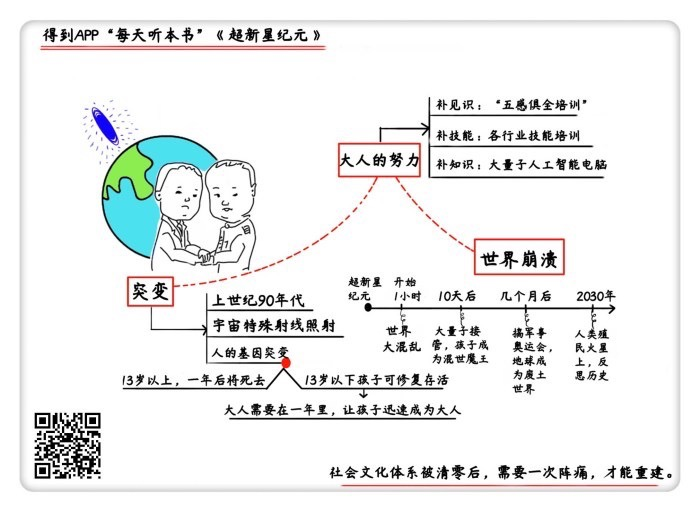

# 《超新星纪元》| 怀沙解读

## 关于作者

刘慈欣，高级工程师，科普作家，被誉为“中国当代科幻第一人”。自上世纪90年代开始，他一边在发电厂担任计算机工程师，一边利用业余时间出版了13本小说集，连续数年获得中国科幻文学最高奖“银河奖”。2015年，刘慈欣凭借《三体》获得世界科幻界的最高奖项“雨果奖”，这是亚洲作家第一次获此殊荣。

## 关于本书

《超新星纪元》写于1991年，是刘慈欣三大长篇小说之一。在本书中，刘慈欣通过一次超新星爆发的事件，构建出一个只有儿童的世界，用大历史的手法展示了当整个文化体系被清零后，人类社会将会面临的重创。

## 核心内容

地球由于受到超新星爆发射线的照射，全体13岁以上的人类都将死亡。经过一年的大学习时代，13岁以下的孩子们掌握了世界的决策权。然而，虽然补齐了见识、技能和知识上跟成年人的差距，但这个没经历过调试、也没有容错率的运行系统还是很快就崩溃了。孩子们的游戏天性不断升级，引爆了核战争，地球最终变成了一个工业瘫痪、政府停摆、民众绝望、遍布仇恨的废土世界。

## 前言

你好，欢迎你每天听本书。我们继续来说科幻。今天说的科幻小说叫《超新星纪元》，作者是中国科幻作家刘慈欣。和这本《超新星纪元》一起推荐给你的，还有英国作家戈尔丁的《蝇王》，之所以要把这两本小说放在一起解读，是因为这两本书的故事背景设定是几乎一样的，就是：如果这个世界突然有一天没有大人了，决策权完全交到孩子手里了，世界会变成什么样呢？两本书的结局也都是悲剧，孩子们都搞砸了，世界最后变成了地狱。

那面对同样的故事设定，我们来看看中国最好的科幻作家刘慈欣给我们讲了一个什么故事，又能给我们带来什么收获？在讲小说之前，我们先来介绍一下刘慈欣和他创作科幻小说的一个特点。

刘慈欣是中国最著名的科幻作家，也是亚洲第一个获得雨果奖的作家。到目前为止，他一共出版了三部长篇科幻作品，分别是《三体》《超新星纪元》和《球状闪电》。这三部长篇科幻小说有一个共性，可以总结成——他用写历史的方法写科幻。

首先，这三部小说都有很强的社会性，讲的都是因为某一个和科学有关的大事件，在一段很长的时间里，改变了世界的历史和人类的走向。我们知道，一般来说，一个作家如果写一段大历史，比较主流的办法是选这段历史的某一个局部来写，比如只写一段特定的时间，或者只写一群特定的人，或者只写一个封闭的小环境。但刘慈欣的选择是：在所有的时间，在所有的场景下，写所有的重大的事件和所有的重要的人物。为了实现这个目的，刘慈欣找到了一种独特的叙事方式。他经常设定一个生活在未来的人，然后通过这个人回望往事的视角，给我们讲一段人类的历史。而且这个未来的叙述者一般是一个纵览过全局的大人物，是个重要历史的见证人，这个人能站在全知的视角上，帮人类总结经验和教训。比如说，整个《三体》的第三部，就是主人公程心的一本回忆录。

而这部《超新星纪元》，也是用这个办法完成叙事的。整本小说，是用一个未来历史学家的口吻写的，这个历史学家是在2030年，回望过去30多年的历史。所以，这就让我们读刘慈欣的长篇科幻小说时，找到一点读司马迁的《史记》的感觉，有时候小说突然能扎到一个特别具体的情景里，描写一个细节，有时候又能快速拉到一个鸟瞰的视角，描写一个大场面，有时候还加入自己的点评和总结。这种讲故事的方法，对于那些喜欢知识增量的读者来说，是非常过瘾的。因为它能让明明是虚构的东西读出非虚构类作品的感觉，获得非虚构内容的收获。

这本《超新星纪元》，给我们的收获点也很多，我们就按照情节顺序给你捋一遍，在音频的最后，我会试着把所有这些收获点，总结成一个核心收获。

## 第一部分

我们就先来看看大人和孩子最本质的区别是什么？

我们先来看故事的大设定。故事发生在上世纪90年代，地球受到了一种特殊宇宙射线的照射，人类在被照射之后，基因会发生突变，一年之后，所有人类就会全部死掉。但不幸中的万幸是，科学家发现，13岁以下的孩子，他们的基因是可以修复的，修复之后什么事也没有，完全可正常生活。等于说，在地球上，落下了一道生死闸，13岁以上的人，一年之后必死无疑，13岁以下的孩子，将来会接管整个地球，小说就是从这开始的。得到这个噩耗之后，大人们的第一反应就是，我们用这一年时间，要把这些孩子比我们大人差的那一块补上来。那孩子到底比大人差在哪呢？除了身体比较弱小之外，小说里给出的回答是三点，分别是：1.没见识；2.没技能；3.没知识。

我们先来看第一点，没见识，这个指的是孩子们对这个世界缺乏基本的了解，对很多大事情没有基本的概念。第二点，没技能，指的是孩子们缺乏具体的工作技术，像开飞机、开火车、做外科手术，这些技能孩子们不会。第三点，没知识。这个泛指一切有用的知识和信息，大到像E=MC ²这样的物理知识，小到一些非常具体的信息，比如说某一个仓库的钥匙放在哪个抽屉里了，这些信息孩子们都不知道。

所以，整部小说就分成了两部分，前半部分是大人们填平这三个差距的努力过程，而后半部分是前面的努力是怎么失败的过程。

首先，大人们做了一个判断，认为时间紧任务急，让全体孩子在一年内，全都变得有见识、有技能、有知识，怕是来不及了，只能把这三块东西分别交到不同人的手里，也就是：让一小部分孩子有见识，让绝大部分孩子有技能，而把知识呢，交给一台电脑。所以，大人们一共做了三件事。

## 第二部分

下面我们来看看大人的三个努力。

大人做的第一件事，是找到领袖，也就是让一小部分孩子填补大人和小孩的第一个差距——见识。

小说主要描写了发生在中国的故事。首先，中国一共有2000万个13岁以下的孩子，中国政府通过各种严苛的挑选，最后选出了8个最适合当领导的孩子。都是聪明、坚毅、善于解复杂问题的超级优秀少年。接下来，国家领导人对这8个孩子展开了一场特训，用了一种叫“五感俱全洞见法”的培养方法。小说对于这一段描写得很有意思，我来给你描述一下细节。

第一个情景。这天，国家总理亲自陪着这几个孩子来到了一个火车站，在火车站里，大人已经事先摆满了几百个火车皮，每个火车皮里都装满了食盐。然后，总理带着孩子站在高处，对着这好几百个火车皮的食盐问大伙：孩子们，你们猜，这么多盐，够我们首都的人吃多久呢？有一个孩子一看这么多，说吃五年？总理说不对，答案是：只够吃一天。孩子吓坏了，说怎么只够一天的呢？总理说没错，这就是你们的第一课：你们要知道，运营一个国家远远比你想象的要困难很多。在接下来的时间里，你们就跟着我，我来教你们怎么管理这个国家。在未来，你们几个就负责内政。好，这是第一个情景。你看，为了培养未来的领导人，国家就这么下血本，总理亲自当老师。

第二个情景。这天，国防部长陪着一个男孩来到一间军事参谋室里，屋里全是国家最高级的军官。国防部长说，孩子，为了教会你什么是战争，就在离这里不远的地方，我们国家的军队搞了一次实弹演习。现在，敌军已经向我们发起了进攻，你就是最高指挥官，请问，该怎么办？

男孩也很进入状态，他想了一会说：我认为，首先要判断敌人的主攻方向。国防部长问：很好！那你怎么判断敌人的主攻方向呢？男孩又想了一会说：我想到战场上，找一个最高的山顶，登高观察！国防部长说行，咱们走，我们陪你去。所有高级军官就都陪孩子去了。结果一到山顶，男孩就傻了。他才发现真实战争和他想象得完全不一样，没错，山顶上视野确实很好，但是一眼看过去，有的地方在冒烟，有的地方在爆炸，偶尔在树丛里开过一辆坦克，偶尔天上划过几架飞机。说白了，谁是敌人谁是自己人都判断不了，更别说判断敌人的主攻方向了。孩子傻了，在那一瞬间，他才知道，原来真实的战争是这么回事。总参谋长说：孩子，现在你懂了，这才是真正的战争。战争要求你必须在信息不完备的情况下做出判断。这就是你的第一课。以后，我们来教你怎么保卫这个国家，在未来，你就负责国防。

通过这两个例子，你就明白了，大人们就是在用这种极端而高效的办法，快速提升孩子的见识。这个方法可以总结成下面这句话：在一个你五感俱全的时刻，制造一个洞见瞬间。

首先，要让孩子打开所有感觉，也就是打开视觉、听觉、嗅觉、触觉、味觉去体验真实的世界。你想，一个孩子突然看到那么多食盐、闻到战场的硝烟、听到爆炸声，那对一个人建构底层认知的塑造作用有多大。这就是那句诗说的——纸上得来终觉浅，绝知此事要躬行。一个年轻人可能站在山头上1分钟，就对很多事情有概念了，比如什么是经济、什么是战争、什么是政府，这几个特别难解释的区域的认知就都亮了一些，这是你背多少书都学不会的。这是第一点，创造五感俱全的环境。

第二点，刚才描述的那两个场景，结论都不是大人硬塞给孩子的，是通过制造一个洞见瞬间，让你自己顿悟的。这样的结论是在大脑里自己生长出来的，是属于你自己的认知。

所以说，我们看，这种五感俱全洞见法是非常优秀的教育方法，它唯一的缺点就是——成本太高。但这可是培养中国的未来啊，成本不是问题。接下来，这8个孩子就在国家领导人的陪同下，用这样的强度培训了一年，可想而知他们的进步会有多快。在大人对未来的设计里，这8个孩子就是国家领袖，负责提供视野和高层决策，解决孩子和大人的第一个差距——见识不足的问题。

接下来，大人们要解决第二个问题，也就是让绝大多数孩子有技能。只有一年时间，大人必须让360行，行行都有人继承。接下来的一年时间，不管是医院、工厂还是军营，全都变成了学校。只要你一推门，基本都能看见一个大人在唠唠叨叨地给一帮孩子上课。所有课程都是一个目标，就是教你怎么实操，教你怎么干活儿。说白了，就是把地球变成了一个全民蓝翔技校。经过一年的突击学习，孩子们基本上算是出师了。医院里，手术台上的主刀大夫12岁；在核电站里，总工程师12岁；军队里，战斗机驾驶员12岁。虽然都不算有经验吧，但是每个孩子对自己的这个技能起码是熟悉的。大人们看到这个情况，总算是松了一口气。

那第二个问题，技能问题解决了。接下来，知识问题怎么解决呢？大人们想，孩子们的学习负担已经够重的了，就别再让他们死记硬背了。大人们就给孩子留下了一台名字叫大量子的人工智能电脑。大量子一共有三个功能，首先它是一个超级信息库，同时还有搜索和智能语音助手的功能，它还可以直接实现人机对话。天下任何问题，大量子无所不知。比如你问，大量子我想喝水。大量子马上能告诉你，你在什么位置，你几分钟之后出发，到哪坐什么车，到什么超市的第几个货架上，从521瓶水里取走一瓶。你看，这个大量子就这么厉害。有了大量子，孩子们就约等于什么都知道了。大人们在设计好了大量子之后，把它交给了8位年轻的国家领导人。所以这下知识存储的问题也解决了。

这些准备工作做完之后，大人也稍微放心了一点。你看，年轻的国家领导人有见识，绝大多数民众有技能，大量子有知识。我们是不是就可以放心走了呢？一年时间到了。在最后一个成年人去世之后，世界启动了一个全新的纪年方式，因为当初那个害死人致命的射线，是一个超新星发出来的，所以叫超新星纪元元年。从此，世界翻开了新的一篇。

## 第三部分

接下来，我们看看这个世界是怎么崩溃的。

最先崩溃的，是绝大多数孩子的速成的技能系统。超新星纪元刚刚开始一小时之后，世界就乱套了，世界各地的发电厂大多数都停转了，85%的铁路和公路系统中断，民航系统100%瘫痪，到处是爆炸、火灾、撞车，整个世界乱成一团。这不对啊，之前不说都训练得好好的？是，孩子们虽然学会了基本的操作，但是，他们并没有处理特殊情况的能力，只要碰到一个小意外，马上就傻眼了。而且，孩子们没有能力把故障控制在自己的领域内，一遇到问题，每个人都马上把这个故障传递给其他工种。所以，孩子们的世界就像多米诺骨牌一样倒下了。

这里有两个原因：第一，这个孩子们掌管的世界，是没有经过试运营和调试的。它第一次正式运行的时候，大人就已经不在身边了，就好像一个技术团队把系统搭建好了之后，就直接撤了，完全没有日后的运营维护，那这个系统肯定是要崩溃的。第二，每个孩子掌握的技能都太单一了，导致整个系统的容错率很低。因为孩子上的都是速成班，每个孩子都只知道自己这个岗位的垂直信息。可能你会说，不对，难道不是应该分工细化一点吗？大家都只懂自己的这一亩三分地，这不就正对吗？其实不对。请注意，我们平时说某人很懂一个领域，指的不是他只懂本领域之内的事，别的全不懂。恰恰说的是，他非常懂他的这一行，以至于对那些周边领域他也都很懂，这样你就能解决工作中所有可能的问题，你这才能叫很懂某个领域。而现在，孩子们的技能都没有交叠重合的空间，而行业之间的交接地带，还偏偏是最容易出问题的，而这个世界，没有一个通才型的工程师能处理这样的问题。所以，整个社会技能系统崩溃，是必然的结果。大人们整整一年的专业技能培训，在超新星纪元开始10小时后，就宣告失败。

接下来失败的，是领导团队。那支经过一年时间精心培养的8人明星领导团队，几乎是一点用也没起到，因为他们完全被架空了。他们发现自己的政令根本下达不下去，各地的政府都中断了。其次，要处理全国那么复杂的情况，别说8个人了，就8万人也不够，每个地方的具体情况都在高速变化，等你把情况问清楚，那边黄花菜都凉了。所以，这8个孩子的认知能力就算再强，他们也没有办法实现中央对局部的控制。整个国家就像一个高位截瘫的人一样，大脑是能高速运转，但是连一个手指头都动不了。

我们看，故事进行到这，大人前面的两个努力都失败了。接下来，那个叫大量子的超级电脑，算是起到了一些作用。眼看世界一团混乱，8个人的领导团队做的唯一有用的事情，就是给大量子开放了最大权限。让大量子接手这个世界，大量子接手之后，它就像电影《黑客帝国》的matrix一样，同时用电话指挥无数个孩子处理各种问题——到哪去灭火，到哪儿去疏散，哪里有吃的——在这个没有大人的世界里，大量子就变成了唯一大人。

10天之后，混乱渐渐平息了。但是，世界不是恢复正常了，而是很多断水断电的地方干脆就被放弃了，在大量子的调度下，孩子开始聚集到少数正常的区域去生活。但是再往后，大量子的局限性就出现了，因为它就只能帮孩子们救个急，面对具体的生活，还是需要孩子们自己来做决策。这个时候，孩子们没有见识、对世界没概念的缺点就开始暴露了。这些孩子过去就是纯粹的小傻孩，过去一年临时抱佛脚学了一些技能，但是价值观和世界观都没有形成，他们根本无从判断什么是对的，什么是错的。

首先，孩子们凭感觉认为，情况没有大人之前说的那么严重吧？好像我干不干活儿也差不多啊。这是因为世界人口锐减，人均资源变多了。而且大量子把很多重要设施，比如说发电厂都接管了，省得在孩子手里出错，所以给孩子们造成了一种错觉，就是我们其实可以不工作的。所以，孩子们的世界观来了一个大反转，他们从一些谨小慎微的技术工人，一夜之间变成了一群混世大魔王，开始各种狂玩。超市、玩具店、宠物店、游戏店全被孩子们洗劫一空。但是，这么玩能坚持多久呢？几个月之后，孩子们在把所有好吃的都尝了一遍，把所有的游戏都通关之后，突然觉得空虚了，真没劲，干啥都没劲。然后他们的世界观就又来了一个反转，小说里把这个时期称为“沉睡时期”，这个时期里，大家就啥也不干，每天就是睡觉。

那这时候，国家的领袖们心里着急啊，他们知道这样的状态是不行的。但不管用什么办法，也叫不醒大伙儿，因为任凭你说破大天，眼皮长在我脸上，我就是想睡觉，你管得着吗？所以整个世界因为认知的差别，就被撕裂成了两部分，忧心忡忡的领导层和浑浑噩噩的普罗大众。那怎么办呢？各国首脑一起开了一个会。会上大家决定，要一起做点什么事来振奋民众的精神。最后的决定是，举办一届奥运会吧！举办地点在南极。而为了更刺激，大家不比体育了，直接比军事。这次奥运会，说白了，就是让几大国家的军队，上战场真枪真炮地打仗。

比赛的方式就是各国分组对战。比如坦克大战，就是两边的坦克列队，一二三，然后开炮互射，还有军舰互射、步兵拼刺刀、飞机凌空格斗，所有规则全一样，都是打到参赛一方死光为止。这个规则听上去非常可怕，但没想到，规则一公布，全世界的孩子都表示支持。因为孩子们对战争是什么根本没概念。孩子的反应是，什么？更好玩更刺激吗？那就搞呗！结果，这场奥运会真的办起来了，各国的军队在南极集合之后，所谓的比赛开始了。孩子一开始还是好奇的，但在战斗开始的第一个瞬间就直接吓傻了，比如在坦克中弹的那一秒，大家的反应都是，啊，我的妈呀，战争这么可怕。但可能就在下一秒，这个孩子就已经直接阵亡了。

后来，比赛开始渐渐失控了，你想，平时小孩一推一搡都可能当真，这么真的流血死人，怎么能不急眼呢？最后比赛变成了一场血肉模糊的大乱战。最后，其中一个国家因为嫌美国不守规矩，直接朝华盛顿发射了一枚400万吨当量的氢弹，华盛顿地区被炸成一片平地。人类避免了那么久的核战争，最后到底在地球上上演了，这颗核弹把全世界都炸醒了，各国首领们又开了一个会，一致决定结束这场战争。所以，这场奥运的结果就是，在赛场上死了50万人，氢弹炸死了几十万人。

这时候，我们再放眼看看这个世界。地球就变成了一个工业瘫痪、政府停摆、民众绝望、遍布仇恨的废土世界。故事进行到这，就进入了最后一个段落。在小说的最后，作者直接把时间快进了30多年。这个烂摊子怎么收场，后来又发生了，全部略去不说了。

刚才说的，所有这些故事，都是一个生活在2030年左右的历史学家，在回顾历史。这位历史学家当年是一个12岁的孩子，他全程见证了超新星纪元这30多年的荒诞历程。在2030年，人类已经殖民到了火星上，可能是地球环境已经毁掉了，也可能人类成为了横跨太阳系的星际文明了，书里没有具体交代，总之这位历史学家是生活在火星上的。不过，从这一段的人物对白和上下文来看，2030年的人类已经从幼稚和疯狂里走出来了，当时的社会充满了反思、沉淀和忏悔，而且科技很昌明，人类的这艘航船，算是回到正轨了。

在故事的最后，这位历史学家给他的孩子讲起了当年的故事。不知不觉的，他的眼泪夺眶而出。整部小说到这就结束了。

## 总结

如果让我们用一句话来总结这本小说，这是一个大人们希望在一年时间里，让孩子们迅速变成大人，但是最后失败了的故事。

那问题到底出在哪里呢？表面上看，我们刚才也提到了很多理由，像技能不能速成、见识不能共享、中枢系统对局部的失控、孩子的界观不稳等等等等。但是所有这些，可能都导向一个根本原因。这个根本原因是：整个社会文化体系被清零了。

我们知道，这个世界保存信息和文化有两种方式，一种是实体保存，像刻在石头上的字、装订成册的书，还有电子数据。在小说里，这部分知识是没有中断的，但是另外一种东西被彻底清零了，就是整个社会文化的传承。打个中国人都熟悉的比方，社会的文化传承就像是一个饭店里的那锅老汤，是人类的传统、文化、善恶观、世界观在一起炖了那么多年的总和。这锅老汤里有陈年的老食材，也接纳新食材，它才是整个社会最有效的教育培训机制，是它在默默地用小火炖着，把一代代年轻人熬煮成成年人，是它降低了社会的波动性，保持主流价值体系没有大的起伏。

如果人类社会是这锅汤的话，那国家领袖就相当于大厨，负责烹调这锅老汤。而人类的知识结晶，就是餐厅里这锅老汤的配料单。而年轻人，就是这家餐厅新来的实习厨师。年轻的厨师在刚上手的时候，火候肯定掌握不好，甚至会在汤里放一些不正确的食材，但没事，老汤有很强的容错能力，它的主体味道不会变。但《超新星纪元》的故事设定，相当于发生了两个大变化。首先，大厨们集体死亡，而且最要命的是，这锅老汤被倒掉了，煮了这么多年的老汤没了，锅空了，整个社会文化系统被一锅端了。整个餐厅只剩下年轻厨师和一张配料单，那这个餐厅就很危险了。

而整本小说，其实就是这帮年轻厨师花了30年时间，重新再熬一锅汤的过程。最后，是因为社会重新建构了底盘和文化基础，人类才算站稳。所以，问题不是出在年轻人身上，也不是出在成年人的教学方式上，而是出在社会文化被清零上。一旦这个东西改变了，别说是孩子，就是成年人也控制不了局势。每当社会的文化基础发生重建后，往往会迎来一次阵痛，不到万不得已，这锅老汤不要重熬，这就是《超新星纪元》这本小说给我们的启示。

这时候，我们更能理解音频最开始说的，刘慈欣是在用写历史的方法写科幻。你看，他借着科幻的设定，给我们演绎了一次人类有史以来最最彻底的清零，让我们看到了最最可怕的浩劫。小说讲的是一个从来没有发生过的故事，带给我们的是一个历史多次重申的道理。

撰稿、讲述：怀沙

脑图：摩西