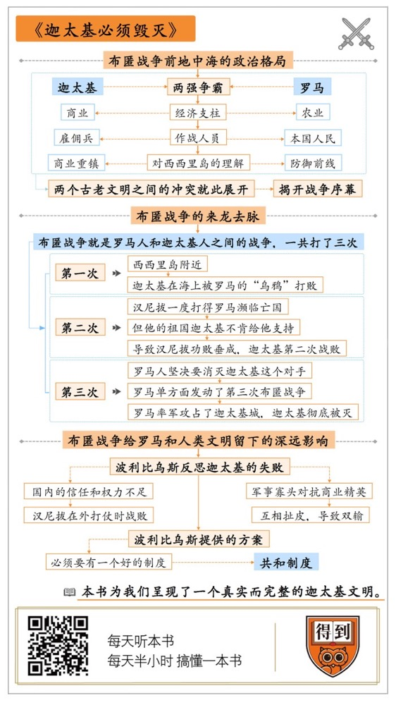

# 《迦太基必须毁灭》丨张笑宇解读

## 关于作者

理查德·迈尔斯，剑桥大学古典学系博士，悉尼大学历史系和考古学系教授。是当今世界上关于古罗马和迦太基最权威的学者之一。

## 关于本书

在书中，作者为我们呈现了一个真实而完整的迦太基文明，再现了迦太基与罗马之间的对决，指出了失败了的迦太基反倒让胜利了的罗马进行了更深刻的反思，进而对整个人类历史产生了深远的影响。

## 核心内容

第一，布匿战争之前，迦太基的历史以及地中海周围的政治格局是怎样的？

第二，布匿战争的来龙去脉是怎样的？

第三，罗马文明从这场战争中学到了什么，以及这场战争对于罗马文明、乃至对整个人类的深远影响是怎样的。

## 前言

你好，欢迎每天听本书，这期为你解读的书是《迦太基必须毁灭》。我们知道，两千多年前，历史上有一场非常重要的布匿战争，这场战争是罗马由弱转强，成为地中海的霸主的关键。而罗马在布匿战争中的对手，就是迦太基，也是我们本期要说的这本书的主角。

你也许会问，我们今天为什么要了解迦太基，更何况它还是个失败者？我们总是习惯去关注历史上那些成功者，但其实历史上的失败者有时候也很有参考价值。正所谓“一失足成千古恨”，成功者未必是因为做对了什么事而成功，失败者却往往因为是做错了什么事才失败的。像迦太基这样的失败者也许强大、也许智慧、也许富饶，然而只要一个失足之处，就足够造成千古遗恨。

但迦太基的失败并非毫无意义。罗马在击败迦太基之后，成了地中海世界的霸主。罗马人中的有识之士却在迦太基的毁灭中也看到了自己的影子，他们因此对政治制度、宪政体制和共和主义有了更多的思考与反省。罗马是一个伟大的胜利者，迦太基也是一个伟大的失败者。迦太基的灭亡，对罗马后来的政体乃至西方政治制度的演化路径产生了深远的影响。从这个角度上讲，失败了的迦太基，也是值得我们了解的。

当然，向迦太基学习不是一件容易的事情。迦太基在两千多年前就被毁灭了。这就给历史学家研究迦太基造成了很大的困难。不过，很困难不代表完全不能进行研究，还是有学者从残存的遗迹、罗马的档案和史料里面，最大程度地还原了迦太基的原貌。

我们本期要说的这本书的理查德·迈尔斯，可以说是当今世界上关于古罗马和迦太基最权威的学者之一。他是在剑桥大学古典学系拿的博士学位，现在是悉尼大学的历史系和考古学系教授。在《迦太基必须毁灭》这本书里，他为我们呈现了一个真实而完整的迦太基文明，再现了迦太基与罗马之间的对决，指出了失败了的迦太基反倒让胜利了的罗马进行了更深刻的反思，进而对整个人类历史产生了深远的影响。

在接下来的解读中，我就从以下三个方面来给你梳理书中的重点，我们一起来看看：

第一，布匿战争之前，迦太基的历史以及地中海周围的政治格局是怎样的？

第二，布匿战争的来龙去脉是怎样的？

第三，罗马文明从这场战争中学到了什么，以及这场战争对于罗马文明乃至对整个人类的深远影响是怎样的。

## 第一部分

首先，我先来介绍一下迦太基这座城邦的起源与历史。“城邦”这个词指的是城市国家。因为古代地中海不像中国，有广袤的、适合农耕的平原，它的地理状况是被丘陵、群山和大海分割开来的，所以这里没那么容易诞生面积比较大的统一国家。相反，当地各个民族都习惯于在不同的地方建立起文化和习俗类似的城市，每个城市就像独立国家一样，这也就是“城邦”的来源。

那么迦太基这个城邦呢，它是由腓尼基人建立的。腓尼基是发源于中东黎凡特和叙利亚地区的一个民族，跟犹太人关系比较近。但是如果说到经商和航海，那他们比犹太人还要早、还要发达。公元前600年，腓尼基人就在埃及国王的支持下绕非洲大陆环行了一周，在同一时代的中国，孔子还没有出生呢。所以你可以想象一下，这个商业民族的古老和伟大。此外，在文化上，腓尼基人发明了最早的表音字母，也就是在象形文字之外的表音文字。从这一点上来说，后来所有的表音文字都要感谢腓尼基人，这是一个非常伟大的民族。

这本书的主角迦太基，就是腓尼基人在非洲北部，也就是今天突尼斯这块地方建立起来的一个城邦。腓尼基人是一个非常善于经商的民族，所以迦太基也是一个以商业立国的城邦。

这个城邦的政治体制非常有意思，它是大商人领导的寡头制，也就是说，它不是像很多古老国家一样，是由一个国王统治的独裁国家，而是由一小堆商业贵族凑起来，通过一个元老院协商议会领导的国家。其实这件事情也不难理解，因为军队肯定只能有一个领袖，否则很容易乱套，所以军事立国的国家容易出现独裁，只有少数国家是例外。但是商业贵族往往彼此之间利益是不一致的，所以容易出现一小撮人领导国家的寡头制。你会听到，迦太基的这种制度，既跟他们的军事扩张相辅相成，但同时也导致了他们的灭亡。

我可以先来解释一下商业贵族与迦太基军事扩张之间的关系。如果你打开一张地中海地图，你会看到，在今天突尼斯的附近，也就是历史上迦太基所在位置的附近，有一个三角形的岛屿，也就是意大利的西西里岛。在历史上，这里有着对迦太基非常重要的通商港口，所以控制它对于迦太基的商业发展是非常重要的。但是你要知道，迦太基作为商业城邦，本身的军事实力是非常弱的。为什么呢？因为商业贵族它肯定要控制军人的权力，万一军人掌握刀把子夺了权，商业贵族的地位就岌岌可危了，对不对？所以迦太基本国的军事实力一直比较弱小。但是它也有办法：我可以找雇佣兵嘛，付工资让他们替我打仗，对不对？

但是等到迦太基找来雇佣兵控制了西西里岛的时候，他们发现问题又来了。因为当时货币制度还不发达，无论是金币还是银币，它的价值都很不稳定的。所以迦太基虽然是个经商民族，很富有，但他们其实都是实物交易，以物易物，基本不用钱。但是你可以不用钱，雇佣兵怎么办呢？过去好办，你打完仗就结账，付给他们当季的货物，比如麦子、橄榄、葡萄，这都没问题。现在你是要求人家长期在这里给你看着港口，人家可不要货物当报酬。于是，迦太基在西西里岛的雇佣军队就开始自己学着铸币。作者通过研究发现，这种货币又继续推动了货币制度在人类历史上的普及。所以你看，迦太基的商业特性就这样跟军事扩张相辅相成，配合起来了。

但是，迦太基的这个军事扩张，很快就威胁到了罗马。前面我介绍过，西西里岛对迦太基来说是一个非常重要的通商港口。然而你打开地图仔细看看，就会发现，这个岛离古罗马的位置也非常近。罗马当时也是一个非常强大的军事城邦。它当时在意大利半岛上是首屈一指的霸主，意大利其余大大小小的民族，可以说都臣服于它的战旗之下。

当然，跟迦太基不同，罗马主要的经济支柱是农业。所以这就有两个影响：第一，它主要依靠的不是雇佣兵，而是罗马本国人；第二，它对西西里岛的理解主要不是商业重镇，而是防御前线。现在这个前线被迦太基人占据了，它当然会感受到威胁。于是，两个古老文明之间的冲突就此展开，这就揭开了布匿战争的序幕。

这就是布匿战争开始之前地中海的大体政治格局。地中海当时实际上是两强争霸，一方是商业立国的迦太基，一方是农业立国的罗马。迦太基主要使用雇佣兵作战，罗马主要使用本国人民作战。而当时整个意大利还存在大大小小的民族，但他们都臣服于罗马人的霸权。

## 第二部分

了解了当时的政治格局，接下来，我就开始为你解答第二个问题：布匿战争到底是怎么回事？

我先来解释一下“布匿战争”这个词。“布匿”是当时罗马人对腓尼基人的称呼。“布匿战争”就是罗马人和迦太基人之间的战争。他们历史上一共打了三次，我先从第一次给你简要讲起。

第一次布匿战争发生于公元前264到公元前261年之间，主要是围绕西西里岛的争夺展开的。你也许知道，罗马是一个非常擅长陆地战争的民族，罗马军团在古代战争里可以说是名扬天下。但是迦太基一直以来都是一个海洋民族，它的海战经验可以说是非常丰富。既然西西里岛是一个四面环海的岛屿，看起来迦太基好像占据了优势，但是事实却让所有人大跌眼镜：几乎没怎么打过海战的罗马却取得了战争的胜利。这是怎么回事呢？

原来，罗马非常天才地发明了一种装置，叫作“乌鸦”，它其实是安装在战船船头的一种舰桥，因为长得像乌鸦的嘴，所以叫乌鸦。如果遇到敌船，这个舰桥就可以勾在敌人的船上，然后罗马士兵就可以从桥上跳过去攻击对方的水手，这样就把罗马人擅长陆地战争的特点发挥出来了。所以在“乌鸦”的帮助下，迦太基在海战中大败，这就是第一次布匿战争的主要经过。

战败后，迦太基接受了罗马人非常苛刻的条约，条约规定迦太基放弃西西里岛，还要赔偿大量损失，同时迦太基能够招募的军队和建造的舰队数量都受到了很大限制。

但是，这场战争的失败却为迦太基埋下了一个转机。这个转机来自一名将军，他叫哈米尔卡，是迦太基向西西里岛派遣的一个将军。由于哈米尔卡当时负责的是陆地上的防务，而迦太基是在海战中失败的，所以他面对败局无能为力。但是，他面对自己祖国的失败十分愤怒，于是他开动脑筋，找到了一个可以反攻的地点，这个地点就是西班牙。

当时的西班牙可以说是一个不毛之地。罗马人觉得这个地方离意大利很远，又没有什么基础，所以在和平条约里根本没关心这个地方。于是，哈米尔卡带着他的属下渡海来到了西班牙，在那里建设了一个殖民地。在这里，他经商贸易、组建军队，积攒实力，为的就是有朝一日向罗马复仇。当然，哈米尔卡知道罗马太强大了，自己年纪又大了，可能看不到罗马的失败了。于是，他把全部的希望都寄托在他的儿子身上。而他的儿子，就是历史上大名鼎鼎的统帅汉尼拔。这位汉尼拔，就是第二次布匿战争的主角。

第二次布匿战争，就是汉尼拔主动发动的。他带领大军翻越崇山峻岭、白雪覆盖、人迹罕至的阿尔卑斯山，从罗马人几乎无法想象到的一条路进入了意大利本土。这是西方历史上最有名的远征之一，后来西方学者在介绍中国红军的长征时，就拿汉尼拔的远征打过比方。

这里我要介绍一下，当时罗马对意大利的统治其实是比较松散的，很多部落只是被罗马征服以后表面上臣服于罗马，实际上暗怀鬼胎，可以说根本就没有我们熟悉的中央集权制度。汉尼拔进入罗马后，巧妙地采取了一个宣传战术，就是派人四处散播神话，说他是古希腊神话中的赫拉克勒斯转世投胎。

这个赫拉克勒斯是很多地中海沿岸非罗马民族共同崇拜的神。所以他这样一宣传，很多被罗马征服的部落就对他产生了好感，进而开始倾向于摆脱罗马的控制。而且，汉尼拔本身也是一个军事天才，这次远征最耀眼的时刻，就是他指挥了一场以少胜多的战争叫作坎尼之战，一场仗屠杀了五万多罗马士兵。消息传来，整个罗马都被震动了。很多人，包括后来的历史学家，都认为，如果这时汉尼拔能够直接进军罗马，是很有可能彻底毁灭掉罗马文明的。

但是，汉尼拔最终没能成功进军罗马，他受到了来自两个方面的阻碍。

第一个方面的阻碍来自他的对手，罗马人。我前面讲过，迦太基打仗是靠雇佣兵的，而罗马打仗靠的是自己的人民。你要知道，罗马当时还是一个城市，坎尼之战一场仗损失五万士兵，这对一座城市来讲已经非常惨重了。但是在这样的危机下，罗马妇女全都把自己的首饰捐出来，年轻人和老人全都要上战场，坚决不跟汉尼拔和谈妥协。

而且这个时候，罗马元老院也选择了最适合对付汉尼拔的对手：费边。费边过去就跟汉尼拔打过仗，他总结了一条经验，那就是：汉尼拔的军事天才太厉害了，你跟他正面作战是没有希望的。但是汉尼拔有一个致命弱点，那就是他不是本土作战，他没办法获得补给。罗马获胜的唯一办法就是拖住他，同时去干掉那些敢于追随他的意大利本土部落。费边就按照这样的作战思路，成了罗马统帅。

第二个方面的阻碍，则来自汉尼拔的祖国，迦太基。汉尼拔不敢直接进攻罗马的一个重要原因就是，在古代战场条件下，你要攻打一座城市是非常困难的，因为你没有大炮火药来轰开城墙。当时军队只能利用各种攻城器械，比如冲车、弩炮之类。但这些武器太笨重了，汉尼拔为了翻越阿尔卑斯山是不可能携带它们的。所以当时汉尼拔就只剩下一个指望：就是迦太基本土能够支援他。而恰恰是这个时候，迦太基没有给他有效的支持。

这里就牵涉到迦太基的政治制度了。我前面介绍过，迦太基是一个商业贵族统治的城邦，这种城邦对于军事领袖掌权是非常忌惮的，他们特别害怕有实力的军人推翻自己的制度。所以，汉尼拔的父亲哈米尔卡在西班牙为迦太基做了这么大的贡献，他还要在国内向那些把持了政局的贵族行贿，培养自己的政治势力，才能保住自己的地位。

而到了汉尼拔这儿，情况也是一样。汉尼拔刚开始进军意大利的时候，迦太基本国很高兴，决定跟罗马开战。但是当他稍微遇上点挫折的时候，迦太基国内就犹豫了，不同派别开始争吵，到底要不要支持他？这样就把特别好的机会给错过了。汉尼拔也就错过了毁灭罗马的最好机会。

与此同时，罗马开始做两手准备了，那就是一边拖住汉尼拔，一边派出了一支舰队，直接登陆非洲，攻到了迦太基城门下。迦太基国内告急，汉尼拔眼看着自己在意大利也没什么机会了，祖国又在危急之中，没办法，咬咬牙回国了。而回国之后，他被迫在不利的条件下与罗马名将西庇阿决战，不幸战败，迦太基被迫签下更为屈辱的和平条约。而汉尼拔被迫亡命它国，最终在罗马人的逼迫下服毒自杀，这位古代首屈一指的伟大军事天才就这样结束了遗憾的一生。

第二次布匿战争虽然失败了，但迦太基毕竟还是一个强者，它依然有重新振作起来的能力。失去了海外殖民地之后，迦太基开始着力发展它在非洲本土的农业，不久就恢复了强大的生产能力，偿清了巨额的战争赔款。但是，罗马人这一次没那么轻易放过迦太基了。罗马有位老政治家叫加图，当时已经八十多岁了，依然把迦太基当作罗马最大的敌人。每次在元老院开完会，不管是讨论什么议题，是修下水道还是组建军队，加图都会加一个强调句，“迦太基必须毁灭。”这也就是本书书名的来源。

最后，在他的推动下，罗马单方面发动了第三次布匿战争，率领一支军队攻占了迦太基城，并且向迦太基人下最后通牒，要毁掉这座城市。听到罗马人的这个通牒，迦太基陷入了悲伤的绝望和恐慌之中。现在没有人再心存幻想了，贵族和平民们开始一起守卫城邦，但是为时已晚。他们没有在关键时刻支持汉尼拔，最后的报应就是罗马人攻破了城墙，大量迦太基人被屠杀，幸存者成为奴隶，城市被彻底烧毁了。

## 第三部分

你已经听完了布匿战争的来龙去脉，接下来，我就为你讲述第三个主题：罗马人从迦太基的失败中到底学到了什么？

我先给你说一个小小的历史片段。第三次布匿战争的时候，率领罗马人攻破迦太基城墙的统帅叫小西庇阿，他是那位击败汉尼拔的西庇阿的儿子。据说当时小西庇阿面对熊熊燃烧的迦太基城，流下了眼泪。他转过头来对跟随自己的私人老师说，“所有人，所有帝国都不能逃脱命运的轮回，再光辉灿烂的城市，也终于有毁灭的一天。迦太基今日如此，不知几时又会轮到我的祖国罗马？”

跟在小西庇阿身边的这个私人教师是个希腊人，叫波利比乌斯。小西庇阿的无心一问，刻在了波利比乌斯的心里，因为波利比乌斯自己的祖国也已经臣服于罗马。面对眼前这一切，他开始了自己的思考。

许多年后，他写下一本卷帙浩繁的历史著作，这部书的开篇是这样的：“世上又有什么人如此低贱、可悲，以至于根本不想了解，罗马人到底是通过怎样一种政治体制和什么手段能够在短短五十三年间征服了整个已知世界？”这句话里的“五十三年”，指的就是从第二次布匿战争开始到第三次马其顿战争结束的时间。“已知世界”，指的就是环地中海的罗马帝国版图。波利比乌斯的这部书，后来成了关于罗马的历史名作。在这部书里，波利比乌斯对罗马的成功和迦太基的失败，给出的答案是：共和制度。

什么是共和制度呢？古希腊哲学家亚里士多德把所有的政治制度分为三类：一个人统治的制度，对应君主制和僭主制；少数人统治的制度，对应贵族制和寡头制；多数人统治的制度，对应民主制和民粹制。这三种制度，各有各的优点，各有各的问题。比如一个人统治的优点是效率高，缺点是一旦犯错无法弥补；少数人统治的优点是可以聚集精英，比较智慧，缺点是容易形成既得利益集团；多数人统治的优点是公平，缺点是群众往往短视。

那最好的政治制度是怎样的呢？波利比乌斯说，最好的制度就是把三个制度的优点结合起来，在擅长的领域得到最大发挥，同时抑制住缺点。比如，既然一个人统治的优点是高效，而最需要效率的领域就是作战，那我们就让这个制度在打仗的时候得到最大发挥。这就是古罗马的独裁官制度，汉尼拔的对手费边，当时担任的就是独裁官这个职责。再比如，既然少数人统治的优点是聚集精英，比较智慧，缺点是容易形成既得利益集团，那么就应该让他们的才智发挥在法律方面，也就是立法和司法工作，同时应该通过民主的手段限制既得利益集团的规模。

讲到这里，你可能会觉得，波利比乌斯说的这些似乎跟启蒙运动时的三权分立学说有点类似。你的感想没错，因为孟德斯鸠的三权分立学说本身就受到波利比乌斯的很大影响。再往后看，美国宪法的制定也是延续了波利比乌斯的共和传统。但波利比乌斯讲的共和制度却要比三权分立学说还要丰富一些。为什么这么说呢？因为波利比乌斯不光强调权力制衡，还强调了一种靠爱国主义凝聚起来的积极进取精神，一种共识精神。否则，权力分立就会变成权力扯皮。

波利比乌斯这里的很多结论，都是在反思迦太基的失败之后得出的。比如汉尼拔在外打仗，而国内没有给他足够的信任和权力，这就是一大问题。再比如，迦太基国内商业寡头力量太强，既得利益集团很难打破，最后形成了军事寡头对抗商业精英，互相扯皮，导致双输，这也是一大问题。但是用什么方法，从什么角度去避免这些具体问题？

波利比乌斯提供的方案是，首先你必须要有一个好的制度，也就是共和制度。而且你还要有一种能维持它的精气神，也就是爱国主义和共识精神。波利比乌斯说，正是因为缺乏这种精神，迦太基的制度变成了扯皮制度，导致它在罗马面前失败了。那么罗马又会因为什么原因失败呢？波利比乌斯说，最大的原因一定是贫富分化，阶级分裂。因为一旦阶级分裂，这个国家就很难再度凝聚起爱国主义，再度达成共识，而分立的权力一定会互相扯皮，最终拖着整个国家一起完蛋。

通过对迦太基的反思，波利比乌斯的共和制度理论很快被罗马人接受，而他关于罗马共和国的预言也成为现实。因此，波利比乌斯的这段论述，也成为罗马历史上关于政治学最为经典的一段论述。

## 总结

到这里，这本书的核心内容就说完了。我们最后再来简单回顾一下。

首先我给你介绍了迦太基的历史渊源和来龙去脉。迦太基是一个由腓尼基人建立起来的商业城邦，它在两千多年前就达到了高度繁荣的程度。但也是因为商业扩张，它占据了西西里岛，从而也就卷入了跟罗马的霸权争夺中。

接着我们说了三次布匿战争的来龙去脉。第一次布匿战争发生于西西里岛附近，迦太基在海上被罗马的“乌鸦”打败，输掉了第一次战争。战后，迦太基的将军哈米尔卡不甘失败，来到西班牙建立殖民地。他的儿子汉尼拔就是第二次布匿战争的发起者和主角。汉尼拔一度打得罗马濒临亡国，但他的祖国迦太基不肯给他支持，导致汉尼拔功败垂成，迦太基第二次战败。而此战之后，罗马人坚决要消灭迦太基这个对手，所以最终发动了第三次布匿战争，彻底毁灭了迦太基。

这场布匿战争给罗马和人类文明留下了深远的影响。就像我在开头介绍过的，罗马是一个伟大的胜利者，迦太基是一个伟大的失败者。罗马在击败迦太基人之后，成了地中海世界的霸主，罗马人中的有识之士却在迦太基的毁灭中也看到了自己的影子，他们因此对政治制度、宪政体制和共和主义有了更多的思考与反省。他们的思考成果超越了两国的恩怨胜败，超越了历史的兴亡轮回，一直流传到今天，为许多国家所继承，成为现代政治思想与制度的渊源与财富。这也许才是历史的真正价值，它比一时的兴衰成败更加动人，更值得我们体味与感悟。

撰稿：张笑宇

脑图：摩西脑图工作室

转述：徐惟杰