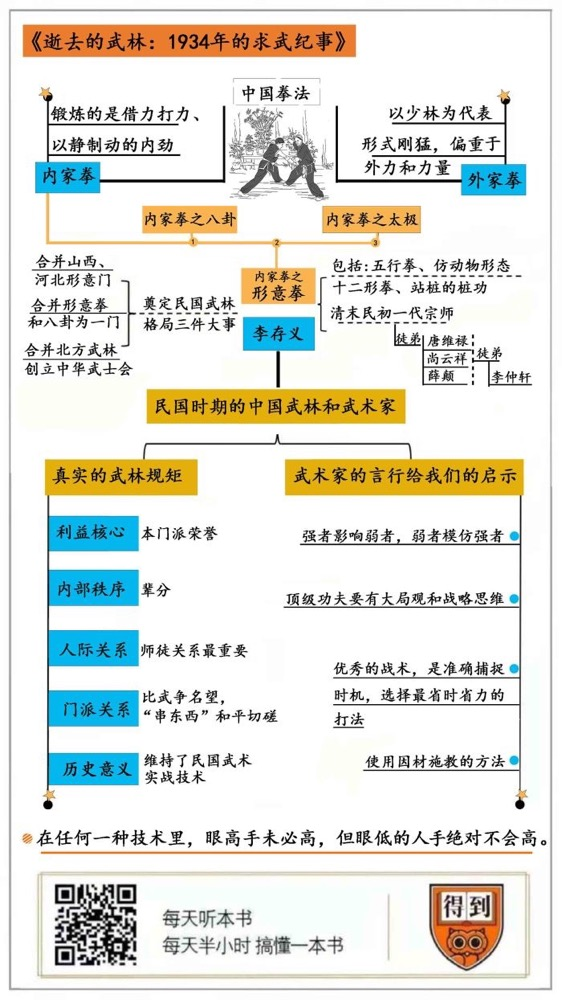

# 《逝去的武林》｜贾行家解读

## 关于作者

讲述者李仲轩，于上世纪三十年代拜入三位形意拳大师门下，被誉为“中华武学最后一个高峰期的最后一位见证者”。整理记录者徐皓峰，是著名武侠电影导演、小说家。

## 关于本书

本书记录了民国时期以形意拳为代表的北方武林和民间武术，回忆了以形意拳宗师为代表的几位著名武术家，这个时期被称为“中华武术的黄金时代”。同时，本书提供了珍贵的史料和拳理，出版后在海内外武术界引起了巨大反响。

## 核心内容

形意拳是三大内家拳之一。清末民初的一代宗师是李存义，他曾经上过战场，与八国联军对战。李存义合并了形意拳和八卦拳，创立中华武士会，奠定了民国武林的黄金时代。在民国时期的真实武林规矩里，利益核心是本门派荣誉，内部秩序核心是辈分。在人际关系里，最重要的是师徒。师傅对徒弟的选择极为严格，徒弟也必须全力维护师门。门派之间会通过比武来争夺名望，交情好的武术家，会通过“串东西”的方式和平切磋。参与军队训练、比武和“串东西”的风气，维持了民国武术的实战技术。本书还揭示了许多有启示的道理，比如，世上的规律是强者影响弱者，一旦以跟上对手为目的，就永远无法取胜了；优秀的战术，是准确捕捉时机，选择最省时省力的打法。传授形意拳，有着禅宗和儒家智慧，善于使用因材施教的方法。

## 前言

你好，欢迎每天听本书。今天我为你解读的书叫《逝去的武林》，这是一位武术家对民国武术界的回忆。

这些年，中国武林可以说是深陷信任危机之中，传统武术的实战水平一再受到质疑。在新闻里，普通的拳击散打运动员，就能轻易打败某个门派的掌门人。同时，一些所谓的名家大师，又总发布那种隔空发力震飞了六七个人的无厘头视频。看到这些，让我这样的外行实在禁不住要问：什么才是真正的中国武术？谁才是真正的习武之人？是不是整个关于武林的历史，都是虚构出来的东西？带着这类困惑来说这本《逝去的武林》，就多了一层意义。

本书的副标题是“1934年的求武纪事”。“求武”这两个字，就是追求武术。因为在学武之前，要有机缘能遇到名师，自己也要具备领悟武学的能力，能用上求武两个字，说明本书的讲述者非同一般。他叫李仲轩，曾在上世纪三十年代，先后师从于近代武术史上的三位名家。李仲轩成名后，被天津武林尊称为“二先生”。他在中年隐退，一生没有收徒。2000年前后，八十多岁的李仲轩在《武魂》杂志上发表了本书的内容，记述民国时代的武林旧事，讲解和演示形意拳奥义。所谓内行看门道，这些文章一出现，就引起了武术界的轰动。据爱好者说，那些过去秘传的高深心法，被李老用几句朴实的话就解释得明明白白，一看就是武学大家的境界。对我们这些外行而言，也能看出很多热闹：原来，那些武侠小说和电影里的武林和武人，是这样一种生存状态。

说起小说和电影，我们再介绍一下本书的执笔者徐皓峰。这个名字你可能很熟悉，他是近年来声名鹊起的武侠电影导演和小说家，担任过王家卫电影《一代宗师》的编剧。他自编自导的电影，像《箭士柳白猿》《师父》，还有《刀背藏身》，因为独特的世界观、真实的动作设计，被誉为是新一代硬派武侠片。李仲轩是徐皓峰的二姥爷，徐皓峰在向他学拳时，建立了对武术和武林的特殊理解。从这本书里我们能感觉到，在徐皓峰的武侠片里，那些被拍出来或是藏起来的内容，有相当一部分是来自李仲轩的回忆。

我对武术完全外行，不过这也有个好处，可以让我谨慎地过滤掉书中超出普通人理解能力的传闻，我只讲对我们外行来说有所启发的内容。因为这本书并不是简单的传奇故事，而是一位智慧老人的感悟。也许，我的这个尺度太保守了，要请武术爱好者原谅。本期音频的素材，不完全出自《逝去的武林》，还补充了徐皓峰及家人、同门师兄合著的另外两本书：《高术勿用》和《武人琴音》。我打算借几代形意拳武术家的生平，为你讲清楚下面这三个话题：

第一，是以形意拳的发展为代表，说说民国时期中国武林的情况。以李仲轩和三位师傅为典型，说说民国时期的武术家。

第二，是从这本书里，我们能观察出当时的武林规则，以及习武人之间的关系。

第三，这些武术家的经验，具有智者和杰出工匠的领悟力，即使我们不练武，也能获得许多启示。

## 第一部分

下面咱们先来说说这本书的基本内容：民国时期的武林和武术家。

这本书主要讲的是形意拳。形意拳在民国时期的北方是最有代表性的拳种，它和太极、八卦并称为三大内家拳。中国拳法在清朝初年被分为内家和外家：外家拳以少林为代表，形式刚猛，偏重于外功和力量；内家拳锻炼的是借力打力、以静制动的内劲。形意门广泛认可的创始人，是明末清初时一个叫姬际可的武官。传说他在古庙中得到了岳飞留下的残书，从关于拳法枪法的记载里，参悟出形意拳的原理，当时叫作心意六合拳。关于岳飞遗留下兵书和武功秘籍的传闻，还被金庸写进武侠小说里。在民国时，形意拳为了推广“强国强种”，更是乐于宣传形意源自岳飞的说法。

本书讲述的武术家，始于李仲轩的师祖、清末民初形意拳大师李存义。李存义的形意拳，主要包括五行拳、仿效动物形态的十二形拳和站桩的桩功。李存义曾经开设过镖局、武馆。八国联军进北京时，他已经五十多岁，率领弟子在天津火车站杀死了多名俄国兵；还在北京利用胡同地形，使单刀袭击落单的洋兵。民国时，他担任过军队的武术教习，编写了一本《刺杀手册》。据说，直到六十年代，部队训练拼刺刀时，还在沿用李存义的技术要领。可见，那个时候的武术是以直接造成伤亡为标准的，具有实战效果。

作为一代宗师，李存义完成了奠定民国武林格局的三件大事。第一件是合并山西、河北的形意门。他通过不断比武和教学推广，使形意成为横扫北方的拳种。第二件是将形意和八卦合成一派，两派弟子可以互相称师兄弟。第三件事是合并了北方武林。1912年，他在冯国璋的资助下，创立了中国第一个大型民间武术团体“中华武士会”，改变了过去单独传授武功的模式。1927年，国民政府创立了国术研究馆——当时把武术称为国术——全国各地都设立了分馆。天津是北方武术中心，拥有23家分馆。名气最大的，就是李存义留下的武士会。这个时期被称为“中国武术的黄金十年”，所以，李仲轩因为师从李存义的三位得意高足，而被称为“中华武术黄金时代的最后见证者”。 

李仲轩1915年生于天津宁河，李家是当地的名门。李仲轩少年时拜的第一个师傅，是李存义的弟子唐维禄。唐维禄本来是中华武士会的杂工，但经过七八年，很多正式弟子没练出来，唐维禄却练出来了。唐维禄学成后一直隐居在宁河。他最出名的是腿功，李仲轩回忆，唐维禄可以在一个晚上从天津走到北平，手提着灯笼，在远处看，快得像连成了一条线。李仲轩的父亲是文人，很反对他学武，而他母亲因为来自武将世家，先辈战死于鸦片战争，很支持他，说“国家有难要靠武将，文人就会斗心眼”。后来，李仲轩和父亲反目，从天津出走。唐维禄觉得李仲轩离家是因为自己，就介绍他向名气更大的尚云祥学拳。

尚云祥身材矮小，能以才智突破先天限制，武功自成一家，是形意拳在北京的代表人物。当初，李存义击杀八国联军就是由他掩护的。尚云祥早年给大户人家看家护院，协助官府捉拿过京城巨盗康小八，这件事被改编成京剧《东黄庄》。尚云祥受聘于西北军，1933年，宋哲元的大刀队凭借他教的刀法，取得了喜峰口大捷。

李存义人称“单刀李”，曾经和“大刀王五”齐名。但他的刀只在刀头开刃，实际上是一种剑法，在师承中，尚云祥最出名的也是用剑。李仲轩向徐皓峰演示尚云祥的形意剑法时，刚刚遭遇了车祸，身体还处于半瘫痪。但他扶着桌子站立，和徐皓峰各拿一根筷子模拟击剑时，徐皓峰无论从哪个方向攻击，李仲轩总能抢先一步，用筷子点中徐皓峰的手腕，动作看起来还是慢悠悠的。这段描写，很像《笑傲江湖》里的独孤九剑。李仲轩说，这是形意拳走中门、占中路的道理。形意拳攻击的特点是发力霸道，取中路硬打硬进，简洁有效，所以有“太极十年不出门，形意一年打死人”的说法。

说到这儿，相信你也和我一样，要插进来提问了：既然传统武术有实战价值，那么它和现在的表演套路是什么关系呢？另外，这些老年人真的还有实战能力吗？李仲轩和尚云祥的再传弟子们是这样解答的：形意拳有演法、练法和用法之分。

演法就是我们看到的武术表演，也就是公开的套路。演法是为了取悦观众，和实战能力没有关系。练法是需要师傅传授的真功夫。形意拳不用蛮力，比如传授给军队的刺刀术和大刀术，并不是教具体招数，而是控制身体、使用巧劲的方法。在战场上使用大刀劈砍，再强壮的人挥舞几分钟也会肩酸手疼，这就需要学习形意拳运用关节和弹性的技巧。其实，这和伐木工人砍树的原理是相通的。比如说，战场上两杆长枪或刺刀顶在一起时，谁都不敢后撤，你撤对手就扎进来，但手和肩部又都使不出向前的力，如果你学会了用躯干回旋带动上肢的力量，你的枪就扎出去了。再比如，自己的肘部和对方的肘部相撞，如果用形意的横劲转动一下，就形成了斜抛运动，也就是借力打力。形意拳的招式很简单，一个姿势可以一练几年，就是在揣摩招数背后的功夫，直到形成无意识的反应。

有了练法，还要会打法，也就是在实战中的表现。掌握了练法，具备了功夫，相当于有财产；实战中精确地应用打法，就像是会投资。形意拳的打法可以利用自身特点，抛开基本招式随意发挥，肩膀、臀部或胯部都能打人，所以，形意拳高手是能够自创拳法和口诀的。在民国武林的鼎盛时代，高手进入了军队，评判高下的标准是实战，简单明了。到这种技术遭到禁止、只剩下演法时，武术自然要走向衰败。

至于年龄和功夫的关系，据说是这样的：人体自然衰老，拳怕少壮，确实都是固定规律，但功夫增长和岁数衰败有一个谁快过谁的不同现象，武术家的功夫如果纯正，就可能把实战能力保持到中老年。李存义、尚云祥，都是到老年时还在比武的。

好，咱们再回来接着说李仲轩的第三位师傅。在上世纪二三十年代，形意门名声最响的人物叫薛颠，是唐维禄、尚云祥的师弟。按李仲轩的话说，“当年的薛颠，是我们心目中天神一样的大人物。”通过两位师傅的介绍和保荐，李仲轩又拜在薛颠门下。

薛颠在民国武林是个传奇。他和师兄傅昌荣比武落败后，曾经多年不知去向。在师傅李存义去世后，他重出江湖，自称一直隐居在五台山，向一个老和尚学了新的拳法。在一次武林人士的集会上，薛颠当众现场表演了一手功夫，并不是打拳，而是像跳舞一样在大厅里演示了挪动步伐。这种移动方法展示出野兽一样的协调性和异常的敏锐反应。当时有人说，薛颠的身法已经像鬼魅一样，达到了神变的程度。表演完以后，薛颠再一次向傅昌荣提出挑战。两个形意高手的全力对决，很容易出现生死，何况傅昌荣又是张作霖的贴身保镖，尚云祥就出面劝阻比武，推举薛颠接替李存义出任国术馆馆长。

薛颠身高体长，平日里待人接物像教书先生，但动手时煞气很重，像妖魔一样可怕。他认为，普及形意是能够振兴民族的大事，他觉得手把手地教来不及，就自创了一门新式拳法“象形术”，在1933年出版了一本《象形拳法真诠》，把拳术的练法和心法都向世人进行公开展示。在《逝去的武林》里，李仲轩对薛颠的拳经进行了讲解。

李仲轩34岁以后，不再和武林人士来往。他做过会计，晚年在北京西单一家电器商店看门，晚景很凄凉。他写这些文章时，名利确实都不重要了，除了不愿意让自己的形意拳失传，应该也是为了排遣寂寞吧。在周星驰的电影《少林足球》和《功夫》里，身怀绝技的武林高手也是这样隐遁民间，生活窘迫。这还真不是夸张，民国武术经过短暂辉煌期后，就被逐渐淘汰了。最开始，是由于火车兴起，镖局行业就没落了。有了现代枪械，到武馆学习武术的人也越来越少，毕竟，再高强的拳法也不抵挡不了乱枪扫射。另外，职业武术家大多是武痴，生活上秉承大手大脚的江湖义气，经常弄得捉襟见肘。李存义的晚年，主要靠弟子和村民接济。李仲轩的几位师傅，唐维禄的本业是在乡下务农；尚云祥也不富裕，一直租住尼姑庵。所以民间有“穷文富武”的说法，意思是习武需要经济基础。

## 第二部分

武人既有自己的生活方式，也有一套独特的价值观和行为守则，下面，咱们就来说说真实的武林规矩。

在武人心目中，武林中的核心利益是本门派的荣誉。在武人看来，门派好比世俗伦理中的家族种姓，价值高于自己的个体生命。武人的尊严，取决于能不能守住门派尊严。所以，一个武人如果被外人打败，即使隐遁多年、和他并不来往的师兄弟，也要出现来扳回本门面子。李仲轩在跟随尚云祥学艺时，已经闯出了一些名气，自我感觉良好，于是，他想到天津去向师叔薛颠挑战，唐维禄特意从宁河赶来，两个师傅一起教训了他一顿。他们说，别说你根本没有资格和薛颠动手，这也会让外人笑话。

薛颠是为整个形意拳挣名声的人，同门都必须维护他。当时，以尚云祥为首的师兄弟，都在武林到处宣扬薛颠，为他建立名望。唐维禄的影响力不大，就暗中代替薛颠和人比武。向薛颠提出挑战的，有很多是其他门派的长辈，我们刚才说了，薛颠一旦出手，就要引来无尽的挑战和麻烦，唐维禄就先找到对方说：“薛颠的武功高我几倍，您能不能先打败我？”为了显露气势，他比武时故意穿拖鞋，一招就分出了胜负。在同门这个共同利益体里，薛颠是面子，唐维禄是里子。形意门在民国缔造的辉煌，始于李存义在武林里带头大哥的地位，成就于薛颠在天津坐镇、尚云祥在北京运筹。

门派立起来后，首要的是建立尊卑秩序，也就是师徒、师兄弟间的名分。许多江湖行当都看重辈分，武行可以说是最严格的。仇人见面，也要先论辈分。李仲轩不收徒，也是出于这个原因。唐维禄介绍他拜师尚云祥时，他的年纪比尚云祥的徒孙还小，尚云祥嫌他打乱了年龄辈分，要他发誓一辈子不收徒，意思是要乱的话，只乱这一辈儿。在形意门还有个规矩，徒弟即使学成之后，为了表示对师傅的尊崇，也往往以代师传艺的名义教徒，正式收徒要得到师傅特别允许。另外，学武之后就不能做官，一旦进入官场或军队，会涉嫌以权欺压武行同道。

从人际关系上来说，在门派内部最重要、最敏感的关系就是师徒了。传统武术最讲秘传心法，核心秘密要一对一传授，按照江湖规矩，这叫“道不传非人，法不传六耳”。当然，这也有“教会徒弟，饿死师傅”的现实顾虑。形意拳尤其如此，形意的核心技术是拳法原理，并没有秘密招式，选择徒弟更要格外慎重。李仲轩曾目睹过唐维禄将两个徒弟逐出师门。第一个是趁唐维禄漫不经心时出手偷袭。在被唐维禄轻易制服以后，这个徒弟很高兴，觉得试出了师傅的功夫，但唐维禄从此不再教他，对外说“某某已经超过我了”。这是开除的委婉说法，因为这人抱着刺探心理，不可靠。另一个徒弟是无故杀死了儿子，违背起码的人伦和道德，也不能教。

武人轻易不接受带艺投师，因为之前学的很难改掉，而且也要顾虑来人是为了从前的师傅报仇。李仲轩拜过三次师，是经过几个师傅当面交接的。李仲轩每次自述门派，都要讲清这个轨迹，以示不忘本。师傅一旦选定亲传弟子，就要倾囊相授，因为这决定着门派和自己的未来，如果每一辈都留几手，这个门派肯定就江河日下了。唐维禄向李仲轩传授的，除了拳法，还有内功道法和治疗外伤的医术药方。李仲轩到外地见同门师兄，只要拿出唐维禄的独门膏药，对方就知道他继承了师傅全部衣钵。

对徒弟来说，练功要经历各种境界，有时候处于近似走火入魔的状态，这个时候最需要师傅点拨。所谓师徒如父子，就是因为师傅对徒弟生命的参与成分很大，造成了徒弟的依恋。师傅承认徒弟，通常会说这么一句话：“我的东西，你身上有了。”意思就是你今后可以代表我。从门派的尊严来说，这也是一种责任。所以，民国武人在没有把握的比武前，会隐瞒自己的师承，生怕损害师傅名誉。这和今天的武术界等传统行业以师傅为社交名片的方式不同。

至于本门派之外的武林规矩，更是充满了叵测的变数，真正应了“江湖险恶”的说法。俗话说“武无第二”，武人见面，总会有分出高下的冲动。在武林中，名气可以说是流通物。成名的过程，常常靠毁掉另一个成名人物来实现，这被形容成“拿走了别人几十年的名声”。要想保持名声，上门公开挑战就必须得接。李存义成立武士会，经常有人找上门来问：“你看我练的是武术还是国术？”意思是指责形意拳将国术划归私有。李存义只能下场比武，因为解释没用。

除了比武，武术家们还可以互相切磋，这叫“串东西”。他们见面，常会问最近有没有什么新东西、新体悟。关系好的，还可以派学生去串，并不保守。武术家相互一搭手，就已经知道彼此的水平了。在搭手时，承认自己输了一筹，会说“晚了”。薛颠和人搭手，张口就说“你晚了”，如果对方不醒悟，他就稍微再明确地加一点儿力量，对方就会连声说“晚了，是晚了”。有时候，彼此聊两句对武学的体会，也能知道对方的功夫程度。这也不算玄，任何一种技术和艺术里都有这种现象。眼高手未必高，但眼低的人，手绝对不会高。至于非要在招式里见输赢的想法，如果是将武术作为一种修养方式，就属于次要的了。

## 第三部分

你可能感觉到为什么这本书要叫“逝去的武林”了。由于生存土壤消失，武林的黄金时代彻底终结，传统武术的模式、内容和方法已经变得面目全非。不过，实战的技艺会退化，但那些经过数代武术家揣摩、积累下来的感悟仍然存在，还是会让我们这些不懂武术的人有所启发。李仲轩并不是知识分子，唐维禄、尚云祥等人更没有什么文化，但他们在书里的言行，表现出了很高的修养和通透的见识。能在一个艺术或技术领域里登峰造极的人，都拥有过人的意志力和领悟力，他们的职业心得也就有特殊的经验价值。

我们先来看看，他们在实战理论中的洞察。在搏击中，步伐都是很重要的。形意拳对步伐有个理论：世上永远是强者影响弱者，弱者在模仿强者。武术中的强，指的是有自己的节奏，并且用自己的节奏去影响对方。李仲轩说，电视里的猎豹追赶羚羊，猎豹要是受羚羊的步伐影响，学它的路线，就永远追不上。比武也如此，情急之下，人的精神和动作容易失控，一旦在步伐上追赶或模仿对手，你的方寸就乱了，一定会败。现代商业中，有一句箴言叫“竞争意识反而会削弱竞争力”，也是这个含义。

形意拳一门，最高级的功夫不是拳法、刀剑，而是古代军事上的排兵布阵，也可以说是审时度势的大局观和战术思维。李仲轩按照对拳法的领悟，对古代小说也有独特解读。他说，关羽是武圣人，是因为把握战机的能力强大。从温酒斩华雄到过五关、斩六将，他很少硬杀硬砍，而是专门攻击敌将不备，瞅个冷子就是一刀。关羽能算出敌人的心理盲区，还有只身闯敌营的勇气，再结合最省时省力的打法，这是高明的武学修养。相比之下，鲁智深拳打镇关西时，先让镇关西切肉，累个半死再打他，这也是有心计，但属于流氓套路，档次要低得多了。

有一个孔武有力、曾经在战场上和日本人进行过白刃战的军官，登门拜访过尚云祥。练武人讲“上一次战场，抵十年功夫”，这样的战士，虽然没有深厚的武术修为，但一般练武人也对付不了。这个军官的反应就非常敏锐，周围有什么动静，视线立刻就能对上。尚云祥告诉他，你的反应很不一般，但反应是反应，反击是反击。他告诉了军官一个将反应和反击合一的训练方法，这个军官听了之后立刻有所领悟，为此专门给尚云祥发了几个月的军饷。这个军官能一点就透，是因为已经积累了丰富的实战经验。形意拳的练法和打法，是在近三百年里，几代人通过上万次比武甚至战争中总结出来的，所以能提升实战水平。

这些经验的表现，也体现在教学理论里。形意拳拜师仪式很严格，教学里也有很多充满仪式感的内容，但师傅们并不迷信。李仲轩向尚云祥请教，为什么练拳必须一个人在夜深人静时练，绝不能让别外人看。尚云祥说，其实很简单，你们年轻人喜欢神秘，不搞得规矩大点，就不好好下功夫学。师徒之间是不能太亲密的，规矩大，才能保证学习效果。你看，这是很实在的心理暗示。

李存义这一派形意拳，主要拜达摩，其次才是岳飞。李仲轩觉得，这可能是因为练形意强调悟性，和修习禅宗有相通之处。在形意的教学里，师傅会先教徒弟基本的口诀和套路，然后就是观察徒弟的练习，揣摩他的性格，等待引导他的最好方式。李仲轩讲，教拳不是用讲的，而是刺激出来的。徒弟经过大量练习，遇到关键门槛过不去时，师傅一句话刺激到他，就会突然达到新境界。这种教学理论，确实和禅宗公案相似。公案里那些让禅师悟道的话，也是针对个人、针对特殊情况所下的。当头棒喝，也不是瞎打，而是要找准时机。所以，李仲轩读《论语》，也能根据学拳经历形成自己的领悟。他发现，孔子管理和教育学生的方式也是因人而异。孔子对同一个概念的解释不同，是因为说话对象不同，内在的困惑不同，甚至也因为学生的未来规划不同。这很符合学术研究观点。

因为这些有洞察、有智慧的见解，也让我相信，逝去的那个武林，和那些能有效提升身体机能的武术，是真实存在过的。李仲轩这样一个明白人，没必要到八九十岁时，孤独地维持无意义的骗局。而且，按照简单推理，中国古代长时期处于战乱动荡，在战争和民间的真杀实砍里，一定会留下以自卫和杀敌为目标的搏击术。这没什么神秘，今天的军事训练里也有搏斗技能。

真正属于武术界的问题也许是：对传统武术的发展，究竟是发展实战技能，是主动融入现代搏击运动，还是继续朝向体操似的表演。行业内部要先选择定位，我们才知道具体的判断标准。语义含糊，经不起实战，同时又用“高手在民间”“真用功夫会出人命”的理由来搪塞，会消磨外界的耐心。

属于我们的问题是：传统文化是很娇嫩的，它像一条河水，如果得不到补充和保护，流到后来，也许就像逝去的武林一样，只剩下一位孤独老者的脆弱回忆。传统一旦断绝，因为既看不见也摸不着，我们当时不清楚究竟损失了什么，但却会在文化结构里留下巨大空洞。一个丧失了文化传统的民族，和丧失了记忆的人，是一样的。

## 总结

这本《逝去的武林：1934年的求武纪事》就为你介绍到这，我们再回顾一下本期音频的要点。这本书讲述的，是民国时期以形意拳为代表的北方武林和民间武术。

第一，形意拳是三大内家拳之一，清末民初的一代宗师是李存义。他曾经上过战场，与八国联军对战。李存义合并了形意拳和八卦拳，创立中华武士会，奠定了民国武林的黄金时代。本书的讲述者李仲轩，曾经先后拜李存义的三位得意弟子为师，见证了传统武术转入沉寂的全过程。

第二，在真实的武林规矩里，利益核心是本门派荣誉，内部秩序核心是辈分。在人际关系里，最重要的是师徒。师傅对徒弟的选择极为严格，徒弟也必须全力维护师门。门派之间会通过比武来争夺名望，交情好的武术家，会通过“串东西”的方式和平切磋。参与军队训练、比武和“串东西”的风气，维持了民国武术的实战技术。

第三，这本书也揭示了许多有启示的道理。比如，世上的规律是强者影响弱者，一旦以跟上对手为目的，就永远无法取胜了；优秀的战术，是准确捕捉时机，选择最省时省力的打法。传授形意拳，有着禅宗和儒家智慧，善于使用因材施教的方法。

撰稿：贾行家

脑图：摩西

转述：李璐