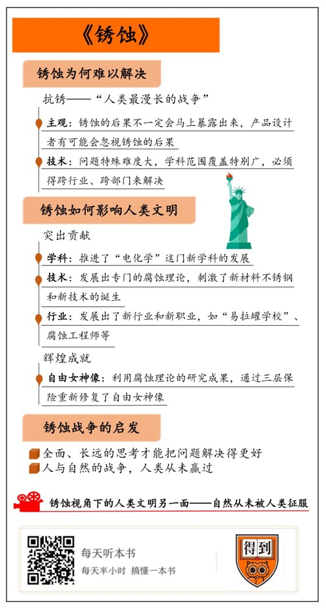

# 《锈蚀》| 砚尘解读

## 关于作者

本书作者是美国环境调查记者乔纳森·瓦尔德曼。他毕业于波士顿大学，原本是研究环境科学的，这十几年来，主要从事科学、文化、政策方面的写作。瓦尔德曼注重实地考察和采访对话，因此，他的作品不只是普及科学，也充满对现实问题的思考和人文情怀。

## 关于本书

本书把锈蚀称为“人类最漫长的战争”。它提醒我们，锈蚀跟人类并不是实力悬殊的对手。这本书先从锈蚀的灾难性后果讲起，探讨了人类抗锈遇到的困难，以及锈蚀怎么反过来影响了人类文明，并让我们思考锈蚀在文化上给我们的启发。通过这本书，你会发现，锈蚀不单单是我们熟知的化学反应，透过锈蚀这个小小的切入点来看待文明，可能会让你反思工业化以来的人类的价值观。

## 核心内容

在抗锈这场“人类最漫长的战争”中，人类和锈蚀可以说是势均力敌。站在人类的角度，锈蚀是个大难题，这既是因为锈蚀的顽固，也因为人们主观上不重视它，而且解决锈蚀需要跨部门的合作；站在锈蚀的角度，可以看到它如何影响了人类的历史，比如，锈蚀启发我们发展了电化学、产生了许多新兴行业，新材料和新技术也应运而生。

锈蚀在文化上也带给我们的启发，它让我们意识到，一个问题往往不是孤立存在的，全面、长远的思考能把问题解决得更好。同时，锈蚀也让我们反思工业化以来的价值观，重新看待人与自然的关系。

## 前言

你好，欢迎每天听本书。本期音频为你解读的是《锈蚀》。它说的是咱们非常常见的金属生锈现象，像是水龙头、电灯泡、小刀、易拉罐等等，都会生锈。很多人会觉得，生锈不是什么大事，东西生锈了就买新的啊，还值得写一本书吗？但这本书的作者可有不一样的看法。这本书的副标题叫“人类最漫长的战争”。你看，他认为人类和锈蚀之间，可是存在战争的。

为什么这么说呢？其实我们对锈蚀的不重视，已经给很多行业，甚至人类自己都带来了非常大的影响。就拿汽车来举个例子。汽车的每个金属零部件都会生锈，想想看，如果防锈不到位，那些关键部位生锈了、失灵了，像是燃油泵、刹车线不好使了，那都是人命关天的事。书里统计说，从1972年以来，因为重要零部件生锈，美国国家公路交通安全管理局已经召回了好几百万辆车了。

同样的道理，飞机的零部件也会生锈，后果就更严重了。拜锈蚀所赐，美国就有过一架战斗机、一架直升机坠毁，还有一家商用飞机在飞行途中断成了两半。如果事先仔细检查的话，事故是可以避免的。但就是因为我们没把锈蚀当成一个大问题，以为只是一点点锈斑，没想到零件内部已经锈烂了，这才酿成了大祸。

本书的作者乔纳森·瓦尔德曼是一位环境调查记者，他花了九年的时间，跟各行各业的抗锈专家对话。为了更好地解读这本书，我还采访了本书的译者孙亚飞老师。他是“得到”App的课程《化学通识30讲》的主理人。

听过这本书你会发现，锈蚀不单单是个化学问题，人类跟锈蚀的互动是一个有趣的视角，可以通过它看到人类文明的另一面。工业革命以来，人类和自然就对立了起来，人们喊出的口号都是“征服自然”。但锈蚀问题却在提醒我们：大自然像一只无形的手，人类种种“征服自然”的成就，可能都会被它慢慢抚平。自然，从来没被“征服”。

下面，我就通过三个问题来为你详细解读，人类和锈蚀之间的战争是什么样的？

第一个问题是，强大的人类为什么解决不了小小的锈蚀？

第二个问题是，小小的锈蚀是怎么反过来影响人类文明的？

第三个问题是，从这场特殊的战争里，我们能学会些什么？

## 第一部分

咱们刚才说到，这本书的副标题叫“人类最漫长的战争”，乍一听有点匪夷所思。你看，一般来说，一场战争如果拖了很长时间，那么在某种程度上，双方应该势均力敌。但照理说，人类的科学进步这么快，早就把发生锈蚀的化学方程式搞明白了。锈蚀呢，万变不离其宗，就是一些金属的氧化物。为什么我们不能速战速决搞定它呢？

这主要是因为，在和锈蚀的战争里，根本没有“速战速决”这么一说，锈蚀一直在发生。这里有两个难点，一个是主观上的，一个是技术上的。

主观上的难点在于，锈蚀的后果不一定会马上暴露出来。所以有些产品设计者觉得，只要东西现在好用，将来锈不锈不关我的事，我何必多掏钱去防锈呢？我们现在评估一个工程、一个项目也一样，最直观的是成本和工期的数据，而不是使用寿命。

举个例子，假如你是美国国防部的项目经理，现在你要去制造一批军用车辆。你有两种选择：一个是用便宜的铆钉、廉价的涂料来造这批军用车，这样预算还会有结余，你会名利双收，不过这些车10年就会锈掉。还有一个选择是，用防锈的铆钉和涂料，这样成本会大幅上升，你要么承受上司的压力，要么自掏腰包，但这么造出来的车可以用40年。你会怎么选？

这只是个简化的例子，现实中的考虑因素要复杂得多。作者就提到，美国国防部的项目经理，的确有过类似的困惑。用便宜材料省下来的钱是确定的，而锈蚀的账到底应该怎么算呢？只能粗略估计一下。书里统计说，因为忽视了锈蚀的影响，美国每年要为锈蚀付出4000亿美元的代价。这其中包括桥梁折断、船只沉没、油管破裂、房屋毁坏等等的费用，远远超过他们为其他自然灾害付出的总和。作者还帮我们换算了一下，拿曾经的北美第一高楼西尔斯大厦换算，这笔钱可以盖500多座西尔斯大厦呢！你看，忽视锈蚀的后果，非常不划算。

不过，就算我们有心解决锈蚀，技术上的难度也很大。锈蚀问题很特殊，要解决它，学科范围覆盖特别广，必须得跨行业、跨部门来解决。比如你觉得谁对锈蚀最有发言权呢？在过去的几十年里，很多跟锈蚀沾边的专业人士，都不认为自己了解锈蚀。

书里提到说，如果你拿锈蚀问题去请教机械工程师，他会让你去找土木工程师；土木工程师觉得，得找化学工程师；化学工程师说，找材料工程师；材料工程师可能给你推荐了电气工程师；而电气工程师让你回去找开头的那位机械工程师。瞧瞧，绕了一个圈，还是没解决问题。这可不是段子，美国最大的锈蚀麻烦之一，就跟这有点类似。

在旧金山东北的苏森湾，有很多严重生锈的商船。它们已经破到不值得废物利用了，但也不能直接拖去外海凿沉，因为那会污染环境。所以，人们只能不计成本地想办法把它拖走。但怎么拖走是个大问题。

比方说，船底下附着了很多贝类，你得请教生物学家，看它们是不是侵略性贝类，转移途中会不会污染水域？你还得问问生态学家和毒理学家，比如船上泄漏的液体有毒吗，对生物有影响吗？然后你还得出动建模人员、测绘专家，讨论转移这个大家伙的具体办法、路线等等。但是这些专家在讨论、制定方案的时候，锈蚀的进度可一刻也没停，没等专家们把问题研究完，船上又脱落了21吨生锈的金属，变成了更大的环境灾难，问题升级了。

你看，小小的锈蚀挑战强大的人类，看起来是不自量力，没想到却是“人类最漫长的战争”。有金属的地方就有锈蚀，而且它一直在发生，只要人类还在使用金属这种材料，那这场战争就不会停止。难道说在这场漫长的战争中，人类就一直损兵折将吗？当然不是，势均力敌的对手会激发潜力，锈蚀就逼着我们去发展技术，它甚至改写了人类历史。接下来，我就要说说第二个问题，锈蚀具体是怎么影响人类文明的？

## 第二部分

赫拉利在《人类简史》这本书里有个颠覆性的观点。他说，不是人类驯化了小麦，是“小麦驯化了人类”。人类把“小麦”这种野草栽种到世界各地，为它辛勤劳作。这样，小麦才得以生生不息。你看，站在小麦的视角上看问题，被驯化的就是我们了。那么，如果站在锈蚀的视角上来看人类文明，又会看到什么呢？

我觉得，锈蚀对人类最主要的贡献，就是推进了“电化学”这门新学科的发展。从本质上看，腐蚀就是金属发生了氧化反应，所以才生锈了。而物质发生氧化反应的时候会失去电子，这就和电化学有关系了。电化学，听名字就知道，它包含两个关键词，电流和化学反应。

科学家发现，参与化学反应的物质，电子会发生转移，就产生了电流。拿金属来说，不同的金属化学性质是不一样的，有的更容易发生化学反应，我们就说它的化学性质更“活泼”。这些更活泼的金属，更容易失去电子。比如锌比铁更活泼，就比铁更容易失去电子。追踪电子迁移的路线，我们就能看到电流了。

利用电化学的原理，人们发明了电池。咱们还拿锌和铁来举例子，失去电子的锌是阳极，得到电子的铁是阴极。在产生电流的同时，阳极持续失去电子，锌慢慢被腐蚀，然后消失。这个时候反应就停止了。这就是锌铁电池内部的原理。反应停止之后，我们就会说电池没电了。

这本来是电池的工作原理，但有个人敏锐地发现，只要换一个角度看这个原理，这就是一种对抗锈蚀的武器。这个人是电化学的开拓者之一，英国化学家汉弗莱·戴维。那该怎么换角度看这个原理呢？你看，我们说电池没电了，是说作为阳极的锌消失了。但如果我们关注的是阴极的铁，它不就是金属成功抗锈的例子吗？也就是说，如果我们要保护一种金属，就找一种比它更活泼的金属，让它们形成“电池”。牺牲掉阳极更活泼的金属，阴极金属就能得到保护了。这种办法就叫做“阴极保护”。戴维把它用在了海军战舰上。他发现阴极保护效果惊人，仅仅是一粒豌豆大的锌片或者一根小铁钉，就可以保护40到50平方米的铜片。

尝到甜头后，科学家趁热打铁，发展出专门的腐蚀理论，继续钻研新的抗锈方法。腐蚀理论专门研究跟腐蚀有关的化学问题，它跟电化学也关系密切。比如，之前戴维说，化学反应过程中有电子迁移，那通过控制电子迁移，是不是也能反过来控制化学反应？的确如此。要保护一种金属，不需要专门找一个阳极了。只要给它加上一个电压，金属就跟电池的阴极一样，会被保护起来，也就不会发生腐蚀了。

当然，腐蚀理论里涉及到的不光是电化学，我也简单介绍一下另外两种比较简单粗暴的防锈方法。一个是刷涂料，直接隔离氧气和水汽，就像给金属穿上雨衣。另一个方法是涂上抑制剂，它们会提前跟金属反应，在金属表面形成保护膜，就像给金属涂了防晒霜。

腐蚀理论提高了抗锈技术，它有一个很辉煌的成就，就是保护了美国的标志性建筑，自由女神。自由女神的骨架是铁做的，外层是铜，它又离海岸线不远，咸咸的海风一吹，照我们前面说的，整个自由女神就像块电池一样。铁比铜活泼，可想而知，铁会很快生锈。当然，设计师当初也想到了不能让铜和铁接触，他们采用了当时的最先进的技术，但那也不过是用绝缘的石棉夹在铜和铁当中，这不管用。更糟糕的是，后来人们还在雕像内部刷了几道涂料。涂料把水分锁在了铜和铁当中，加速了“电池”的反应，结果就是：在铜像的某些位置，铁骨架都锈没了，全靠涂料撑着。

等人们终于发现问题的严重性，已经是一百年后了。人们重新修复自由女神，再用的技术就靠谱多了，而且连上了三层保险。第一层保险，为了防止两种金属再变成电池，雕像里装了除湿设备，还用了一种特殊的胶带隔离了铜和铁。第二层保险，把每一根新的铁骨架都涂上抑制剂。还有第三层保险，用含有金属锌的涂料做了保护。这些都是腐蚀理论的研究成果。

当然，锈蚀不止推进了学科内的理论的进步，还影响了我们的社会。为了对抗锈蚀，我们还发展出了新行业，很多人可能连听都没听说过。比如书中提到了一个很有意思的“易拉罐学校”，它是专门研究易拉罐安全性的。保证易拉罐的安全，没有想象中那么容易。他们要根据不同饮料的腐蚀性，确定易拉罐材料；要研究包装材料的“味道”，它可不能给饮料添上哪怕一点点的金属味或塑料味；还要计算出一个易拉罐能装多少饮料，想让易拉罐更安全，得精确到0.1盎司。一步步繁琐却不起眼的研究，都是人们抗锈战的缩影。

但作者之所以花了很多篇幅写易拉罐学校，还因为它藏着许多秘密，就像黑暗料理店的脏乱后厨，企业不想被消费者知道。比如有个秘密是，易拉罐里面装的液体就像“电池酸液”，会把金属罐腐蚀掉。一罐可乐三天就能腐蚀掉铝罐，听到这里，你会不会觉得有点胃疼？不过实际上，罐子没有被腐蚀，易拉罐学校会根据饮料的特点，做出安全的罐子。阻止锈蚀的主要方法，是在罐子里层涂上环氧树脂涂层，这样液体就不会直接碰到铝罐了，电池反应就不会发生。那你可能会想，易拉罐的涂层安全吗？作者了解的情况是，绝大多数厂商用到的涂层含有一种物质叫双酚A，它会干扰人的内分泌。虽然溶解到饮料里的涂层是微量的，但它的安全性还是有争议。

作者还发现了很多新职业，听名字就跟锈蚀相关，像是防锈长官、腐蚀工程师、锈蚀商品专卖店店长、锈蚀摄影师等等。比方说，美国的五角大楼里有个防锈长官。在他上任之前，国防部没有专人负责锈蚀问题。这也不怪他们，我们前面说过，锈蚀问题经常要跨学科，很难找到专家。所以在之前，锈蚀问题会被拆散在四个部门。但这样的结果就是，根本没人关心锈蚀的后果。而实际上，军队每年要在这块损失210亿美元，难怪有人说，美国海军的最大克星不是哪个国家，而是锈蚀。

但现在，不仅五角大楼里有了专门的防锈长官，美国甚至还出现了一个金饭碗行业：腐蚀工程师，他们专门研究怎么才能预防各种东西被腐蚀，是处理这个问题的专家。腐蚀工程师的平均年薪高达十万美元，但他们的学历普遍不高。因为在这一行，重要的是解决问题的能力和经验。

不过，有人可能会说，我在日常生活中，也麻烦不到锈蚀专家。你说对了，但这还得感谢抗锈材料。你可能马上会想到，抗锈材料，那一定就是不锈钢了。跟会生锈的金属比起来，不锈钢制品看上去顺眼多了。但你可能不知道，在20世纪初，许多人先后发明出了不锈钢，却发现没有商机。因为人们根本不相信世界上有不会生锈的铁。于是那些自称发明了不锈钢的人，都找不到投资者。

这种情况下，坚持的人笑到了最后。其中一位发明者哈里·布里尔利，虽然不断碰壁，但他相信，不锈钢是做餐具的绝好材料，一定会有商业前途。抓住这个切入点，他就紧盯着餐具公司去游说。当然后来，他还给不锈钢找到了其他用途：轴承、活塞、阀门等等，都大获成功。一个世纪后的我们，仍然喜欢不锈钢制品。

你看，我们连不锈钢都发明出来了，是不是意味着在这场战争里，我们大获全胜了呢？不是的。不锈钢叫这个名字，只是说它相对其他金属来看，耐腐蚀性更好一些，并不说它不会生锈。在那些特别容易发生锈蚀的地方，即便层层保护，我们还是不能高枕无忧。那该怎么办？极端的困难是发展新技术的推力，锈蚀也推进了人类技术的发展。

比如说，阿拉斯加的石油管道。管道连接了两个海湾，中间要穿过三座山脉。这对管道材料的要求非常苛刻，管道很长，周围的地质活动频繁，不断有外力挤压管道。管道还要穿过冻土层，肯定会有水汽。这几个因素结合起来，管道的锈蚀风险比海边的自由女神像得高出十倍。考虑到这点，设计师三管齐下：刷涂料、阳极保护加阴极保护。但这样还是不够，肯定还得经常检查，及时修理。

那难题来了，地下的管道怎么去检查呢？人们发明了一种迷你机器人，起名叫“智慧猪”。它钻进管道里，可以一面探测管道的情况，一面把数据记录下来。说它们“智慧”不是虚的，不同种类的智慧猪有不同的探测重点：有的检查管道壁的厚度，有的发现管道上的凹陷，有的找到管道上的泄露点等等。这样，人们就能判断出最可能发生锈蚀的地方，有重点地去修理。书里统计说，在智慧猪投入使用的头三十年，人们消除了三百多次潜在威胁，容易锈蚀的阿拉斯加石油管道没有输给锈蚀，从未因此发生泄漏事故。

总结一下这个部分。虽然锈蚀让我们头疼不已，但正像哲学家尼采说的，那些不能杀死你的，终将使你更强大。人类也在跟锈蚀的战争中不断壮大自己。为了对抗锈蚀，我们有了新的学科，还产生了不少跟锈蚀有关的新行业，刺激了新材料和新技术的诞生。你看，站在锈蚀的角度，它可不只是个化学现象这么简单。接下来，我还要说说，在文化上，锈蚀还给了我们哪些启发。

## 第三部分

虽然说随着技术的发展，我们已经有了许多对抗锈蚀的方法，但结果是好是坏，取决于人，而不是科学或技术本身。与锈蚀互动的过程，让我们反思人类的行为，也许可以说，锈蚀的重要性丝毫不亚于20世纪下半叶几个重要议题：杀虫剂、抗生素、温室效应。它帮助我们改变了思考问题的角度。

比如说，很多人会觉得，发现问题就直接解决是最好的。但锈蚀的故事告诉我们，别忙着解决问题，先看看它和其他因素的关联才好。举个例子，冬天下过雪之后，地上的积雪会冻成冰，走路、开车都会打滑。为了快点融化积雪，我们会喷洒融雪盐，它们很便宜，看起来是很棒的解决方式。

但美国的腐蚀工程师却发现，融雪盐里的氯会加速桥梁的锈蚀，而桥梁维修起来要比铲除积雪贵多了。要是把它用在机场跑道上，渗透到飞机里，维修成本更是天文数字了。你看，万事万物都有关联，锈蚀提醒我们，考虑问题要全面，不能孤立来看。

我读书读到这里的时候，想到了另一本书，是环境学家蕾切尔·卡森的《寂静的春天》。她在书里提到说，人们为了杀掉农田里的害虫而用杀虫剂，却发现有毒物质会随着食物链不断积累，导致自然界里的其他生物也被毒死。你看，这体现的也是万物之间的关联。

那考虑各种因素的关联之后，该怎么选择解决方法呢？你看我们前面说了好几种防锈的办法，哪种最好呢？你可能会觉得，解决的同样是锈蚀问题，应该有最优方案吧？其实不是这样的，具体用哪种办法好，见仁见智。特别是，有些事当下不能见分晓，得经过时间的考验，我们不能想当然。在防锈问题上，曾经有涂料党和镀锌党之争，也不是立刻能见分晓的，我们也得看得远些。

许多人贪图便宜，毫不犹豫地选择刷涂料防锈，过了几年才发现，涂料很容易剥落，要是在室外风吹雨打，就更要频繁地补涂了。相反，看上去很贵的镀锌，可以保持很长时间，折合下来并不贵。美国人做过一个实验： 1970年，卡斯尔顿大桥建成。当时，大桥南向行驶的一侧刷了涂料防锈，北向行驶的一侧采用了镀锌钢。过了40多年，刷涂料那一侧已经重新喷涂过两次，花费比大桥的建设费用还高。而镀锌层一点问题也没有，专家甚至觉得还能再用60年。你看，还真不能只顾眼前的价格高低。

本书的译者孙亚飞老师，也跟我分享了一个锈蚀帮他转换思考角度的地方。美国的五大湖地区，曾经是辉煌的工业基地，人们为了自身的发展，在这里大兴土木，大炼钢铁。在很多人看来，这里是人类征服自然的一个小小的缩影。但孙老师提到，在翻译这本书的过程里，他对书里提到的一位叫苏克的女摄影师印象非常深。 

这位叫苏克的女摄影师都做了什么呢？她专门拍锈蚀的照片。五大湖地区的这片工业基地，如今已经是个锈迹斑斑的废墟。这当中还有曾经的世界第二大钢铁厂，伯利恒钢铁厂。它曾经非常辉煌，但现在只能惹周围的居民讨厌。因为钢铁厂的锈蚀已经开始污染周边的环境了，居民在窗外晾衣服都会落满锈。但苏克却特地搬到钢铁厂附近，在九年的时间里，先后进入这座破败的城堡好几百次。

在这九年的时间里，苏克在不经意间记录了这座钢铁厂被废弃之后的变迁。孙老师说，对于这座钢铁厂来说，锈蚀已经是治愈不了的绝症了，我们也能想象，那些曾经的高炉和钢平台，再也支撑不了自己的重量而倒塌，最终被夷为平地，重新和自然化为一体。我们曾经以为自己征服了自然，结果一切最后还是回归自然。这让这座钢铁厂在荒凉之外还多了一分震撼。顺便说一句，《锈蚀》本书英文版的封面，用的就是苏克的摄影作品。

## 结语

说到这儿，本期音频的内容就说得差不多了。下面来总结一下本期音频为你分享的内容。

首先，我们说到看似简单的锈蚀并不容易处理，这既是因为锈蚀的顽固，也因为人们主观上不重视它，而且解决锈蚀需要跨部门的合作，这些因素使得抗锈变成了“人类最漫长的战争”。

其次，我们说到，锈蚀不是被动地等着我们解决它，站在锈蚀的角度，可以看到它如何影响了人类的历史，比如，锈蚀启发我们发展了电化学、催生了许多新兴行业，新材料和新技术也应运而生。

最后，我们讨论了锈蚀在文化上带给我们的启发。它让我们意识到，一个问题往往不是孤立存在的，全面、长远的思考能把问题解决得更好。同时，锈蚀也让我们反思工业化以来的价值观。很多人会觉得，辉煌的钢铁厂是我们征服自然的缩影，但他们没意识到，这也是我们和自然冲突的战场。成为废墟的钢铁厂仿佛在跟我们说，在这里，人类从来没赢过。

科学顾问：孙亚飞

撰稿：砚尘

脑图：刘艳导图工坊

转述：徐昆鹏