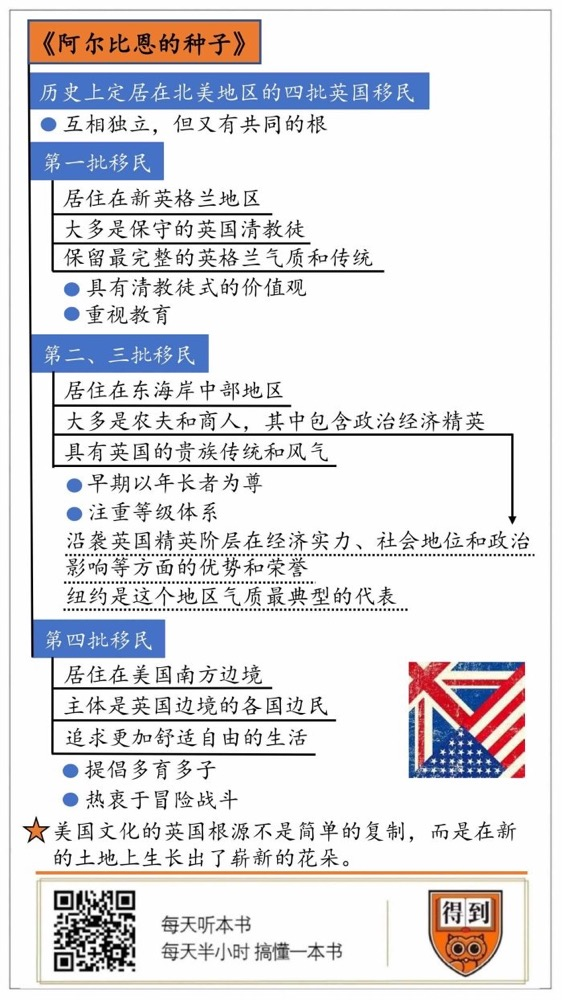

# 《阿尔比恩的种子》| 徐爽解读

## 关于作者

大卫·哈克特·费舍尔，是马萨诸塞布兰迪斯大学的历史学教授，著有《华盛顿的十字路口》，曾荣获普利策奖。

## 关于本书

《阿尔比恩的种子》是对美国历史学经典问题的经典解答。以问题为导向，以叙事方式呈现了早期美国史，详细讨论了什么是当今美国自由社会最有力的决定因素。文化是了解不同人群共同体的极佳路径，上至国家、民族，下至地方社会、宗族、个人，无不带有先天的文化烙印。同样的，理解美国，也要从理解美国文化的源流开始。本书将为你提供一条探究美国文化基因、进而理解美国立国之本的通路。

## 核心内容

本书从民俗的角度切入解答了一个重大问题，即美国自由体系的决定因素到底是什么。作者认为，1629～1775年英国向北美的四波移民潮，深刻地改变了北美大陆，带来了四种不同的不列颠民俗，并奠定了新世界不同地域文化的基础。这四种文化在英属北美扎下根基，最终成为英属北美自由社会的基石。现今美国人口只有不到20%有英国祖先，但从文化意义上讲，大多数美国人都是阿尔比恩的种子，无论他们的祖先是谁。

## 前言

你好，欢迎每天听本书。本期音频为你解读的是《阿尔比恩的种子》。先来解释一下书名，在西方古代神话里，巨人阿尔比恩是古希腊海神波塞冬的儿子，传说是他建立了最早的英国，阿尔比恩后来也就成了不列颠岛或者说英国的代称。“阿尔比恩的种子”，意思就是，来自英国的移民撒到了北美大陆上，形成了今天的美国。

在美国，这本书是非常重要的经典，据说克林顿执政八年，这本书就在他案头放了八年。它好就好在，不但把三百多年前美国人的精神风貌描绘记录得特别细致，还清楚地指出了他们之间的根源，以及对今天美国的影响。在中美关系异常复杂的今天，深入了解美国已经成了一个迫在眉睫的任务，所以，你确实应该听这本书。

美国在独立以后这么多年里，一直维持着稳定的形态，也就是社会上民主政治，经济上资本主义，法律上自由主义，文化上多元主义。你可能留意到了这个国家的结构是比较松散的，而且他们有一个独特的政体联邦制，就是每个州保持相对独立的司法体系，有自己的法律，这和他们最崇尚的价值观是自由有关。你可能要问，为什么他们在这方面和世界上其他国家有这么大的区别呢？这就要从美国的起源讲起。

我们最熟悉的说法是，以五月花号乘客为代表的那一批人最早构成了美国，他们定居在马萨诸塞州附近的新英格兰地区。但你不知道的是，实际上还有三波移民分别在不同的时期到达美国，今天美国的根基是四批而不是一批人。除了五月花号到达的新英格兰地区，另外三批人到达的地点分别是中大西洋地区、特拉华山谷地区以及阿巴拉契亚山脉地区。第二、第三批人们到达的地区离得不远，人群构成也相似，其实也可以当作是一群人。最后一批人落脚的地点，是历史上美国版图的边疆，所以在书中他们也被称为“边民”。这四个群体都来自英国，彼此之间有相当大的差别，但是英国这个国家你肯定也知道，太拥挤了，等他们来到幅员辽阔的美国，才有机会自由地生长和发展，这四个群体彼此之间的区别也就被相应地放大了。他们互相独立，但是又有共同的根，这才形成了联邦制的心理基础。

为了更好地理清脉络，我想从这三个角度入手来为你解读这本书：

首先，前面我们提到，不论这四群人里的哪一个都是“阿尔比恩的种子”，那么，其中最完整地保留了英格兰气质的是哪一群人？

接着，我要来解释，为什么我们说第二群人和第三群人构成的群体，是具有美国特色的英国贵族社会。

最后，通过对第四群人，也就是边区移民的解读，你会进一步理解美国南北方人为什么有这么大的气质差异。

## 第一部分

那么下面，我就带你观察第一个角度，在这些“阿尔比恩的种子”里，最完整地保留了英格兰气质的是哪一群人？

答案很明确，就是最初移民到新英格兰地区，被称为“洋基佬”的人们。究竟什么是洋基佬呢？我们不妨在这里引用一首美国诗歌来为洋基人做个总结。诗是这么写的：

> 对外国人而言，洋基是美国人。 对美国人而言，洋基是北方人。 对北方人而言，洋基是东部人。 对东部人而言，洋基是新英格兰人。

诗写得很清楚。尽管对今天的人来说，洋基人就是美国人，但是对美国人来说，洋基人指的其实就是新英格兰地区的居民，尤其是以马萨诸塞州、康涅狄格州、佛蒙特州等州为主的新英格兰地区，也就是本书所说的第一波移民最早开发、受英格兰影响最深的地区。在新英格兰当地，洋基人一词指的是具有英国血统的老派新英格兰人，这个称谓暗含了清教徒式的价值观。简单说，洋基人可以算是“美国人中的美国人”，也就是受英格兰影响最深、最早的那一拨美国人。为什么这么说呢？这就必须从新英格兰地区的重要性说起了。

从十七世纪开始直到今天，新英格兰一直是美国的文化与经济核心地区。波士顿交响乐团和波士顿美术馆是这个地区的文化地标。教育也是新英格兰地区传统的优势之一，这里顶尖大学和学院的密集程度是其他任何地区无法比拟的，包括哈佛、麻省理工、耶鲁等世界级名校都在新英格兰。而从政治影响力来看，新英格兰对于塑造美国政治制度和民众观念一直扮演着领头的角色。新英格兰的中心城市波士顿虽然不是首都，但一直是美国两党之一民主党的大本营。

而以波士顿为中心的新英格兰地区，之所以能保持政治、文化、经济产业的优势与活跃，很大程度上，与它受英国传统的影响最为深远和长久有关。说到这里，你可以回顾一下最初的这批“阿尔比恩的种子”的历程。

1620年12月，五月花号带着102名殖民者与清教徒抵达马萨诸塞州的普利茅斯湾，在度过了漫长严冬后，建立了北美最早的一批殖民地。这段历史也就成了美国历史上第一个感恩节的由来。最早来到普利茅斯定居的英国殖民者，大多是保守的英国清教徒，他们中的大多数来自伦敦东北方向的东英吉利地区。这些移民大多受过很好的教育，有着强烈的宗教信仰。早期清教徒们期望在定居点创造一个符合清教徒道德规范、极端稳定、结构良好的城市，他们称之为“山巅之城”。这也是美国人长期以来心中所追求的社会理想。这一点从五月花号船的著名牧师约翰·温斯罗普就能看出来，他后来成为马萨诸塞湾殖民地最初的统治者。

可以说，今天的新英格兰地区早已是美国的智慧与资金来源，在微电子、电脑及生物技术、教育、高科技、金融服务、旅游及医药等行业都保持着领先优势，但这背后若隐若现的，一直是不曾改变的清教精神。这一点从小镇上许多简朴的木结构房屋和白色教堂尖塔，以及点缀在大西洋沿岸的传统灯塔，你就能略见一斑。从建立殖民地开始，波士顿先民们一直严守清教教义，日常生活自律古板，把世俗化的诸多事务都看成手段，而“上帝才是唯一目标”。这在如今已经高度世俗化的人们来看，恐怕很难理解和奉行。这种传统和保守的价值取向，在他们生活的诸多方面都有体现。

他们的家庭观念非常传统，甚至保守，把两性结合视为传宗接代的工具。对于女性来说，既不能晚婚，也不能早婚，当然，更不可以自由婚姻。在当时，男女如果在没有父母或官员同意的前提下就结婚，是会被马萨诸塞法庭罚款的。婚姻被视为是在上帝面前缔结的契约，承担着生儿育女的职责，妻子的使命则是相夫教子。这样古板的婚姻家庭观念不是在美国发明的，而是综合了英格兰的婚姻观念，根据偏远乡村的良好风俗建立起来的。这也让新英格兰地区长期保持着比较平稳的生育率。尽管新英格兰地区的海湾盛产鲜美的龙虾，但这些清教徒家庭餐桌中最重要的菜肴，却是豌豆汤以及保持英国传统风味的各种馅饼，他们甚至可以被称为西方世界最为朴素的饮食者。

此外，新格兰地区的先民在娱乐方面也乏善可陈，不喜欢与赌博和饮酒有关的游戏，但对于子女的教育和学习却极端重视，甚至达到了重于一切的程度。早在1642年，马萨诸塞地区就有专门立法，要求所有孩子要由父母或监护人教会读书。以这样的强制方式来要求儿童受教育，这在早期殖民地中非常罕见。不仅如此，殖民者对于高等教育的推崇和支持也非常积极，这甚至形成了新英格兰地区显著区别于其他区域的地方特质。在马萨诸塞湾的早期社会中，即使下层劳动人口，比如技术、工人或者家政、女仆等，识字率也在50%以上，这高出当时所有其他英属北美殖民地，甚至是当时英国平均水平的两倍。

在教养子女问题上，新英格兰地区还有一种独特的传统。父母希望子女成才，要求就很严厉，常常在孩子大一点的时候就把他们送到其他家庭暂养，有时也会把别人家的同龄孩子领回家。这么做的目的，是为了防止孩子过度依赖家长，促使小孩尽早独立，并且在另外一个家庭可以发展自己的社交才能，尽早知道与人相处的边界和礼仪。这种方式现在依然被保留在美国的文化传统里，有些孩子在寄宿家庭求学就是它的遗风。

这种对教育的重视影响了整个美国。远在美国独立战争开始以前，当时的马萨诸塞州政府就要求每个家庭每年都要缴纳一捆谷物给剑桥镇的大学，绝大多数家庭忠实地履行了这项义务。正是靠着这样一种捐资助学、社会办学的方式，新英格兰地区成百上千的家庭捐出了一个个“大学谷”，而大学捐款也成为此后美国大学蓬勃发展的生存之道。哈佛、耶鲁、普林斯顿等顶尖名校数百年都遵循以捐赠为主的传统，它们财政收入的主要来源中，永久捐赠基金的投资回报和教育捐赠一直是资金来源的重要支柱。

这就是第一个问题的答案，在这些“阿尔比恩的种子”中，新英格兰地区的洋基成为美国人的代称，因为他们是最早的、也是最传统的美国人，保留了最完整的英格兰气质。

## 第二部分

但是“阿尔比恩的种子”其实有四个，所以保留的英格兰气质也各有侧重，在理解了第一个问题之后，我现在来带你了解一下，为什么我说第二群人和第三群人可以被视作同一个大群体，这个大群体又体现出了英格兰气质的哪个侧面。

如果说新英格兰地区最全面地保留了英格兰气质，甚至还为今天的美国提供了智慧与资金来源，那么，东海岸中部地区接纳的第二和第三批移民的发展则秀出了实力，展现出了英国精英阶层在经济实力、社会地位和政治影响等方面的优势和荣誉。

我先帮你勾画一下这两批移民遍布的大概范围。从北往南，这个地区依次有七个州：纽约、宾夕法尼亚、新泽西、马里兰、西弗吉尼亚、特拉华和弗吉尼亚州。其中最大的两个州，纽约州和宾西法尼亚州，在十九世纪更是煤钢和机械等重工业的重镇。两个州最大的城市，纽约和费城，也都是大西洋沿岸中部地区的中心城市。

追根溯源，从移民的历史构成上来看，东海岸中部地区移民的来源比新英格兰地区要广，早期定居者绝大多数是农夫和商人。尽管同样显示出强烈的宗教因素的影响，但这个地区的殖民者信仰的宗教派别，比起新英格兰地区那种清一色清教的情况要复杂得多。简单数一数，就有许多基督教的其他派别，比如圣公会、卫理公会以及长老派等等。

可以说，这两批最早移民大西洋沿岸中部地区的殖民者中，有着许多盎格鲁-撒克逊精英，这注定会延续他们在英国传统中经济实力、社会地位和政治影响等方面的优势和荣誉。即使到了今天，形式上的平等已经成为世界范围内压倒性的政治正确，你也仍然可以从这里的精英政治传统中，隐约感受到英国的贵族传统和风气。

这种英国传统在从心态到社会等级等方面都有所体现。比如，在殖民地早期的弗吉尼亚，受英国民俗的影响，殖民者家庭遵行父权制，以年长者为尊。在社交场合，这里的东部美国人都喜欢把自己的年龄报得老一点，一来更成熟，二来有资历。这和今天流行的风气形成了有趣的对比。我们知道，二十世纪以后的世界以现代化为荣，人们通常喜欢把自己的年龄报得年轻一点，以便显示自己还年轻，还能跟得上时代潮流。等级体系也一样。在早期弗吉尼亚乃至美国东北部地区，因为以大族和年长者为尊，从社会关系到家庭关系都讲求等级和次序。这可以说是复制了英国的等级体系，只是在新英格兰这个体系不太明显，而弗吉尼亚因为移民者中大家族背景复杂，延伸并强化了英国的社会等级，从雇主、农场主到商人、农夫和雇工等，等级链条分得更细。

在这样的等级体系中，高等级对低等级人施用暴力甚至被认为是合法的。比如贵族对平民、主人对仆役、丈夫对妻子、父母对孩子，习惯性暴力能够得到不成文规则的默许。但低等级对高等级，比如仆役对主人、平民对贵族的暴力，则会遭到严厉的惩罚，这被视为是严重破坏社会秩序、制造混乱的罪行。这其实就是英国社会体系的一个翻版。今天，我们很少再看到这样的等级和次序原则，如今的美国似乎看上去是平等和民主的，但实际上，过去僵化而保守的等级壁垒并没有真正消失，而是以更加隐秘的方式继续存在于美国政治圈层和社会生活当中。

美国政治界有一个说法，每七个美国人中，就有一个的根可以追溯到纽约。我就用纽约为你说明一下这个其实源自英国传统等级体系的特点。

相较于波士顿和费城，纽约市显得更为年轻，它的历史开始得要晚一些。纽约是从哈德逊河谷下游地带兴建的一个叫新阿姆斯特丹的城市成长而来，因此它更多荷兰风格，而更少英格兰影响。但即使如此，纽约城多元混居又内部分层的格局，也充分展示着美国社会的缩影。比如，数字10021在纽约就有着特殊的含义。10021是美国纽约市的一个邮政编码，但它所代表的邮区同时还是美国最富裕的社区——纽约市曼哈顿东西方向，位于第五大道和东河之间，从东61街到东80街的一块区域。这里盘踞着大量在财富、权力和社会地位顶层的人物、奢豪的私人俱乐部和优质私立名校，被称为是“看不见的大族区”。而在纽约，这样的上流社区星罗棋布，和环境、治安较差的城区比邻而居，形成的是一个折叠的都市。

你看，这就是第二个问题的答案，东海岸中部地区的移民，沿袭了英国精英阶层在经济实力、社会地位和政治影响等方面的优势和荣誉，现在的纽约市就是这个地区气质最典型的代表。

## 第三部分

接下来，我要带你观察的是最后一颗、也是包含独特成分的“种子”，这群人在美国历史上被称为边区移民。他们和刚刚说的两个群体有一个很大的区别，说得好听就是有开拓精神，不好听呢，就是相对来说比较好斗。

其实这里所谓的边区，是指早期北美殖民地时代概念下的南方边界。那个时代，如今美国南方最早的定居者虽然也是英国新教徒，但主体其实是来自英国北部边境的苏格兰、爱尔兰人，其中很多人还有外国血统。这群人像一个联合军团，作者说，正是这群来自英国边境的边民，成为了早期美国南方边境居民的主力阵容。这些英国移民来到自然条件更为优越的南方，和宗教信仰关系不大，主要是为了更加舒适的生活，所以他们身上的宗教色彩不像北方人那么强烈。而且他们原本也住在英国的边境，开拓性更强，更加崇尚武力、更加直率火爆，强调对家族和尊长的忠诚，反感迷信权威，讲求报复就得针锋相对、以眼还眼。我们统称他们为边民。

边民们性格分明，对内有很强的忠诚度，对外则明显排外。边区的核心家庭都比较大，提倡多育多子。那个时代的北卡罗来纳州有一个总督做过人口普查，发现靠近洛基河的三十个家庭中，每个家庭都有不少于五六个孩子。1800年南部高地的出生率，比北部的第二三批移民聚居的特拉华山谷要高出40%。

和他们的英国边区先祖一样，这些美国边区移民对自由的理解就是“足以自由活动的空间”，因此，也就不难理解为什么他们热衷于向西冒险了。很多人沿着马里兰、弗吉尼亚和卡罗莱纳的山脉漂泊到西部和南部。从阿巴拉契亚山脉高地，跨过密西西比河，迁徙到密苏里、密西西比、阿肯色、德克萨斯、田纳西、肯塔基和佛罗里达这些地方，深入到今天美国南部、中西部的广阔区域。对于这些第一代定居者而言，征服边区的历程艰难危险。在他们到达之前，这里是剽悍好战的印第安民族的天下，这些骄傲的族裔是不会轻易在殖民者面前屈服的。然而移民而来的北不列颠人，带来了古代英国边民对其他族裔的好斗本性，残酷的战争始于十七世纪晚期，一直延续到十九世纪初期。

你还要注意一点，就是早期的边境殖民者并不都是出身寒微，他们之中同样有精英阶层兴起，虽然人数很少，但迅速在边区建立了文化上的统治地位，并且延续了很多代。边区富豪的第一个例子，便是第一个出身边区的总统安德鲁·杰克逊家族，还有从爱尔兰移民美国的波尔克家族等等。这些边境的家族，无论来自英格兰、苏格兰还是威尔士，在价值观和信仰上都比较趋同，家族彼此联姻，很快在南部高地形成一个关系紧密的精英阶层。

所以你看，这些历史经验积淀到了今天，就造成了当今美国南方人和北方人在气质上的差异。一般来说，美国南部人比北部人更加倾向于冒险。比如，在和印第安人的战争中，南方的战斗要激烈得多。历史上开拓内陆的西进运动中，南方人也发挥了很重要的作用。

## 总结

说到这儿，我们就把美国早期移民史上四个主要地域捋了一遍，这么做主要是为了给你揭示出美国深层的文化结构。这里面当然有保留完整的英格兰气质和传统，也有英国社会注重等级体系的一面，甚至还有英国边民特质的放大和发挥。不过你需要注意的是，这本书涉及到的这四个地区主要集中在美国东部，也就是历史上的英属北美地区，至于今天美国的其他领土，是在美国建国以后，发起西进运动和1848年加州发现金矿后开发出来的，这一历史时期受到的英国影响相当微弱，就不是这本书的主要内容了。

还有一点也值得你注意。英属北美地区虽然各有自身鲜明的地域文化，内部存在差异，但从大趋势来说，它们并不是相互对抗，而是彼此融合的。从这一点上，我们也可看出美国号称“世界熔炉”的部分原因。实际上，熔炉就是美国多元共生社会的一个形象说法。而且，这种文化根源在现实中的转变也是很有意思的，美国文化的英国根源不是简单的复制，而是在新的土地上生长出了崭新的花朵。

当然，考虑到这本书庞大的体量，所以英国文化的种子，也不能彻底解释美国社会纷繁复杂的所有民俗和地域特征，不过，在这些细节之外，这本书深入到文化的根基，给我们中国人提供了看待美国的完全崭新的视角，这才是最有价值的。

撰稿：徐爽

脑图：摩西

转述：徐惟杰