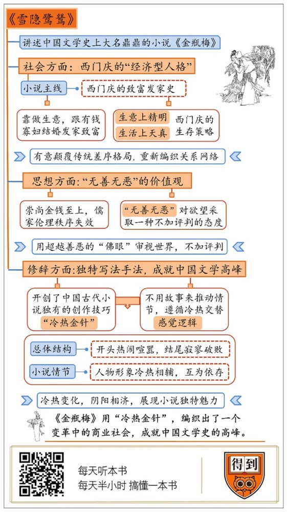

# 《雪隐鹭鸶》| 刘玄解读

## 关于作者

格非，当代著名作家、学者，清华大学文学教授，著有《迷舟》《相遇》等中短篇小说四十余篇，《欲望的旗帜》《人面桃花》《山河入梦》《春尽江南》等长篇小说六部，以及《小说艺术面面观》《小说叙事研究》《文学的邀约》《博尔赫斯的面孔》等多部论著和随笔集。

## 关于本书

本书是著名作家、学者格非研究《金瓶梅》的专著。书名“雪隐鹭鸶”四字取自《金瓶梅》中的诗句，意思是《金瓶梅》中深远幽微的人情世态和历史文化信息。格非教授认为，《金瓶梅》是一部激愤之书、悲悯之书，更是一部别开生面、寄意深远的呕心沥血之作。

## 核心内容

全书第一、第二部分联系明代社会史和思想史脉络，将《金瓶梅》置于十六世纪全球社会转型和文化变革的背景中详细考察，对小说所展现的器物日用、经济活动、观念风习等方面进行深入浅出的探讨；第三部分以细腻生动的随笔和例话形式对《金瓶梅》文本展开细读，赏析其文章修辞的精彩之处。

## 前言

你好，欢迎每天听本书。今天要为你解读的书名字叫《雪隐鹭鸶》，它讲的是中国文学史上大名鼎鼎的小说《金瓶梅》。

很多专业人士，尤其是作家，都对《金瓶梅》推崇备至。跟它同时代的明代文人袁宏道只看了一段，就赶紧给好朋友董其昌写信说：《金瓶梅》写得太好了，云霞满纸，比汉代的名赋《七发》写得还好。鲁迅也说过：《金瓶梅》写尽了人情和世事，那时候的小说没有比它写得更好的了。还有人说，《金瓶梅》是中国历史上第一部文人独立创作的长篇小说，地位堪比西方小说史上的《堂吉诃德》。

然而，虽然《金瓶梅》和四大名著一样有名，真正读完它的人其实并不多，这当然跟它写色情的坏名声有关。不过一般人读不完，更主要的原因可能是它不好读，甚至会觉得它写得很啰嗦。

《雪隐鹭鸶》这本书的作者格非老师刚拿到《金瓶梅》的时候，也没有被它吸引，后来在一次闲谈中听到别人说，《金瓶梅》比《红楼梦》写得好，心里不服，才开始认真阅读《金瓶梅》，然后才被它迷住，花了很大的工夫来研究它，写了这本讲《金瓶梅》的书。

格非老师是当代著名作家，获得过茅盾文学奖和鲁迅文学奖，现在是清华大学中文系的教授。他说，自己写这本书就是希望人们能重读《金瓶梅》。在他看来，《金瓶梅》开创了中国小说很多个第一次。他在讲的时候经常会荡开一笔，拿它和卡夫卡、马尔克斯等等西方小说史上最伟大的小说家比较一番，感叹这样的表达在《金瓶梅》里原来早就出现了。

《金瓶梅》的超前不只是叙事技巧上，它也在中国文学上第一次写了一个变革中的商业社会。格非老师说，我们今天或许依然处在那个时候开始的那场变革的延长线上。所以说，虽然讲《金瓶梅》的书很多，但是我觉得格非老师的讲解更值得推荐给你，因为它更贴近今天的读者，是我们接近这部巨著理想的引路人。

今天的解读，我会按照格非老师的思路，带你从人物、思想和写法三个方面理解《金瓶梅》。首先，理解了西门庆这个人物，你就理解了《金瓶梅》写的到底是什么。其次，理解了它背后的思想，你就会明白《金瓶梅》为什么要赤裸地描写人的欲望。第三，理解了它独特的写法，你就懂了《金瓶梅》为什么是开创性的，为什么是中国文学的高峰，它的魅力到底在哪里。

## 第一部分

如果要给《金瓶梅》找一个主线，可以说就是西门庆的发家史。小说开始的时候，西门庆只是一个有几间铺子的普通商人，到了中后期，他已经成了大宋山东清河县最有钱、最有权的人，用他自己的话说，就是有“泼天的财富”。他积累财富的方法主要有两种：一是做生意，二是跟有钱的寡妇结婚。挣来的钱，他除了为扩大生意行贿、买官、搞投资，剩下的都用来享乐挥霍了。

这样一个人物，出现在今天的小说或者电影里没什么稀奇，但是在中国古代小说史上可以说是前无古人，也后无来者。站在传统的主流道德立场上看，很多人会觉得西门庆放荡、奸恶，是个彻头彻尾的坏人，这当然也没什么不对。但是格非老师提醒我们，这样的评价忽视了西门庆这个人物的复杂，也忽视了产生这个复杂人物的社会、政治、经济、法律环境，我们就很难真的理解这部小说。所以说，想要读懂《金瓶梅》，首先要给西门庆一个合理的定位，用格非老师的话说：他是中国文学史上独一无二的传统社会中的“经济型人格”。

这是什么意思呢？我们来看一看西门庆身上最特别的地方，你就能明白了。在西门庆身上，有一个很有趣的矛盾。他在生活里可以说是既肤浅又天真，但是在生意场上却是精明过人。他身边的妻妾、仆人、妓女、帮闲都经常使些小手段骗他的钱。他还不长记性，被骗了一次，只要对方稍微安抚一下，他就不计前嫌，心甘情愿地投入下一场骗局。但是，他跟官场人物或者商业伙伴打交道的时候，又像是换了一个人，只凭直觉就能明白利益在哪里，见识老到，行动果敢，从来没吃过亏。

我来举个例子。西门庆有一个朋友，也是他身边最聪明的帮闲，叫应伯爵。小说中间的时候，西门庆已经很有钱了，手里的银子要增值，最直接的方法就是放贷。于是应伯爵带了两个来历不明的人李三、黄四，怂恿西门庆放贷给他们。应伯爵的目的显而易见，就是收佣金。西门庆就像个傻子一样，也不问李三、黄四的来历，也不管钱放出去怎么用，就把钱给他们了。看到这儿，你肯定会觉得西门庆好傻，又被应伯爵糊弄了。

到了小说故事进行了十几回以后，李三、黄四这两个人物又出现了，他们撇开应伯爵，自己上门想直接跟西门庆交易。应伯爵听说后恼羞成怒，反过来揭这两个人的短，说他们俩是骗子，让西门庆不要放贷给他们。西门庆怎么回答的呢？他说：我不怕，要是他们不还银子，我可以把他们抓起来。接着，他就让手下人照旧放贷给李三、黄四。

这两段情节，中间隔了十几回，发生了很多事情，稍不留神就会忽略它们的关系。但如果把这两件事放到一起琢磨一下，你就会发现，原来之前西门庆全凭应伯爵一句话就放贷，不是因为他傻，他心里早就想好了应对策略。那时候他已经掌管着清河县的大权，就算对方赖账，他也不怕。所以他虽然知道应伯爵坑他，也没有点破。这既是他的精明，也是他的厚道。

我们再来做个对比，你就明白我为什么说他这也是厚道了。西门庆出了名的有钱又好骗，所以他身边的人经常给他介绍生意，想从中揩点油水。有一次，他另外一个朋友花子由给他介绍了一个无锡米商。花子由说：米商急着在运河解冻前把米卖完回家，所以米价便宜，西门庆可以把米买下来，等着涨价再卖出去，大赚一笔。听着挺靠谱是吧？但是，西门庆一下子就看穿了，这是个骗局。

这个米商把南方的稻米抢先收下来运到北方卖，说明他很精明，想在大批货物来南方之前卖个好价钱，“解冻前卖完回家”，不过是说辞而已，这是其一。其二，运河结冰了，米都不好卖，说明北方根本不缺粮，如果运河解冻，大批粮船来了，价格还会跌的更惨。还有，花子由这个人平时跟西门庆交情不深，突然跑来推销，很可能是跟米商勾结来骗钱的。

西门庆对待花子由的态度跟对待应伯爵完全不同，他一口回绝了这桩买卖。你想想，为什么面对来蒙他的朋友，他的态度截然不同呢？于情，花子由跟他的关系当然远远比不了应伯爵，他不用给花子由面子；于理，应伯爵介绍的生意虽然风险很大，但是他可以控制，也就将计就计；而花子由介绍的明显是赔钱买卖，他当然不能上当了。

对比之下，你就会发现，西门庆这种“生意上精明，生活上天真”的态度，可以说是他必须采取的一种生存策略：生活上天真，才能把妻妾、仆人、帮闲、妓女都笼络在身边，维持好社会关系网络；生意上精明，是为了挣更多钱，这样才能扩大社会关系网络。这个社会关系网络是《金瓶梅》的一个核心，一切故事都发生在这张复杂纠缠的网里面。

我们说西门庆这种“经济型人格”很独特，正是因为他所处的社会关系网络跟我们一般印象中的传统社会很不一样。著名社会学家费孝通先生对中国传统社会的概括是“差序格局”。整个社会是基于血缘形成的一种同心圆结构，每个人都应该在各个圆上扮演好自己的角色。而《金瓶梅》的世界与此完全不同。西门庆家大业大，但是他和妻妾、仆从几乎没有血缘关系，他既没有父母，也没有兄弟，唯一的女儿很少出场，倒是没有血缘关系的女婿陈敬济成了书里的重要人物。小说好像是有意割断了传统社会里最重要血缘，让西门庆孤身一人面对这个社会，构建自己全新的社会关系网络。

我们可以这么理解，小说就是有意要颠覆传统的“差序格局”，用西门庆来编织一种全新的社会里全新的关系网络。在这个社会关系网络里，钱就是让一切运转的动力。《金瓶梅》里有名有姓的人物一共有300多个，几乎是人人皆商，连尼姑造访西门庆家，表面上是来宣讲佛教教义，实际上也是为了向西门庆的妻妾兜售经卷，念的还是生意经。西门庆所有的活动都围绕着钱，挣钱、花钱、撒钱。他娶第三房小妾孟玉楼的时候，连人都没有见过一面，只听媒婆说孟玉楼继承了前夫的一大笔遗产，就下定决心，一定要把她娶到手。

小说的主舞台清河就是这样一个繁华热闹、金钱至上的世界。这个南北交汇的商贸重镇，漕运发达、店铺林立，巨贾豪商、贩夫走卒熙来攘往，妓女戏子招摇过市。小说里虽然说《金瓶梅》的故事发生在宋朝，但是它展现的其实是明代中后期的社会。那时候，商业极大地繁荣，人的商业意识觉醒，也形成了全新的社会秩序，对传统的社会秩序产生了巨大的冲击。今天我们已经知道，这个变化是16世纪全球化大潮的一部分。欧洲人从美洲带回白银，从中国购买丝绸、瓷器，解决了中国一直以来白银短缺的问题，制造了巨大的繁荣，才有了这样的清河，这样的《金瓶梅》。从这个角度看，《金瓶梅》写的明代中后期的中国，就像是海明威、菲茨杰拉德笔下镀金时代的美国。

## 第二部分

好，下面来说《金瓶梅》的主题和思想。关于《金瓶梅》最大的争议，就是它为什么有很多大尺度的色情描写。有人说，它就是一本色情小说，在明代中后期，这种小说很常见；也有人说它是一本劝人戒欲的书，小说写西门庆最后纵欲而亡，其实是一种警示。今天，我想请你跳出这个非此即彼的思路，重新审视一下这个问题。有的人读出“淫”，有的人读出“戒淫”，正是因为小说对欲望采取了一种不加评判的态度。这种态度是理解《金瓶梅》的关键。

读这部小说，你会觉得作者好像根本不分是非。西门庆跟潘金莲合谋害死武大郎，然后娶潘为妾；不久又故技重施，害死了好友花子虚，把他的遗孀李瓶儿娶回家，用“丧尽天良”来形容也不算过分了。但是小说对西门庆几乎没有批评。而书里少有的“好人”，西门庆的正妻吴月娘，作者又经常讽刺她假道德、伪君子。

《金瓶梅》的世界里好像既没有好人，也没有绝对的恶人，格非老师说，这不是作者不分是非，而是他有意采取了一种“无善无恶”的价值观，这个价值观跟当时流行的阳明心学异曲同工。在我看来，这个观点是这本《雪隐鹭鸶》最有价值的洞见。

什么是“无善无恶”的价值观？王阳明心学里的这个“无善无恶”其实来自佛家，特别是禅宗。禅宗标榜明心见性，看破功名利禄、酒色财气。如何看破？就是了悟“生死无常”，这不是在模糊善恶的界限，而是觉得善恶都是执念，应该放下。了悟，就是要从是非善恶的执念中超脱出来，从更高的维度上担负生命的自觉。

阳明心学为什么在当时很流行呢？因为它是为了解决明代新的社会问题才出现的。王阳明自己总结了他那个时代的两大弊病：一个是恪守程朱理学让人行事迂腐；二是士农工商的伦理次序已经改变了。所以，以程朱理学为基础的社会管理模式就慢慢不起作用了。他提出心学，倡导“无善无恶”的价值观，就是一种为社会开出的药方：因为在伦理秩序失序，道德原则失效的社会里，不加判断才是合理的策略。

我们当然不能说《金瓶梅》的作者写小说也跟王阳明一样是为了解决社会问题，但是《金瓶梅》用超越善恶的“佛眼”带你审视那样的世界，其实和阳明心学有相似的效果。

但是，这也造成了一个悖论：欲望和恶流于世间，对社会、人情、伦理都造成了巨大的破坏，但是它又事先被原谅和宽恕了。这好像是一个逃不出去的困境。确实，《金瓶梅》体现的正是社会变革中的道德困境，和困境中人们在道德上的困惑。这就是为什么有人读出“淫”，有人读出“戒淫”。

这同样也是阳明心学没有完全解决的困境。在善恶的问题上，之前程朱理学的态度是要有取舍，这就给欲望设置了一道屏障。阳明心学提出“无善无恶”，善恶一体，相当于是把这道屏障给打破了。普遍意义上的人欲，包括情欲，都成了合理的。结果我们也知道了，晚明社会欲望膨胀、极尽繁华。清代的学者甚至认为，这就是明朝灭亡的症结。

你可能会说，小说只写了困境和困惑，其实没有给出解决方案啊。这也是对《金瓶梅》一种普遍的批评。但是，我们也反过来想想这个问题，既然在这样的道德困境里，人必然会困惑，保持一双冷静的佛眼，难道不就是最合理的策略了吗？在冷静的审视、深刻的洞察里，你才能看清楚自己要面对的世界到底是什么样的，你才能通过这样的世界，反观你自己，思考你的立场、你的偏好，你看待世界的基本视角到底是什么样的。

## 第三部分

好，说完了《金瓶梅》的主题和思想，最后我们来看看小说用了什么技巧表达这个复杂的主题。《金瓶梅》的写法跟我们一般理解的小说不太一样，它不是用故事来推动情节，而是用感觉的对比和变化来推动情节发展。这个技巧还有个专业名词来描述，叫“冷热金针”，是《金瓶梅》开创的一种中国古代小说独有的创作技巧。

你可以这么理解“冷热金针”，小说家有冷热两根线，他拿着一根金针用这两根线编织出了整部小说。小说就像是一条有花纹的地毯，人物、情节是我们能看到的图案，但编织的方法决定了毯子的肌理。这里说的冷热，既是感官，也是情绪。比如热，你可以想象一下春天的温暖，温暖是感官体验，春天也会让人觉得昂扬向上，昂扬向上就是情绪体验。这个观点是明代评点《金瓶梅》的文人张竹坡提出来的，他认为整部《金瓶梅》，不管是总体结构，还是情节布置，都贯彻了“冷热金针”这个方法。

先看总体结构。中国古代小说特别强调开头和结尾要有呼应。怎么呼应呢？《金瓶梅》这部小说是开头热、结尾冷，叫“热起冷结”，就像一年有四季，春天是开始，热闹喧嚣，人声沸腾，是热起，冬天是结束，寂寥破败，死走逃亡，是冷结。

整部小说的第一个故事，在回目里就明确点出了“热”字，“西门庆热结十兄弟”，讲的是西门庆和应伯爵等等十个好朋友聚餐、结拜，一片热闹。小说的结尾第100回是“普静师幻度孝哥儿”。这时候，西门庆已经死去十几年，他的家早已破败，靖康之变，金兵入关，他的遗孀吴月娘带着他的遗腹子孝哥和仅剩的几个仆人逃跑，被一个和尚带到了永福寺。在永福寺，普静和尚对吴月娘说：你前夫西门庆一生作恶，现在转世托生成了你的孩子，就是来遭报应，他会散尽家财，会死得很惨。你只有让他做我的徒弟，修行佛法，才能让他们解脱轮回之苦。吴月娘本就信佛，最后果然让孝哥出家去了。这是冷得很彻底了，西门庆一生所有的一切都成了空。所以张竹坡说：《金瓶梅》两截书，上半截热，下半截冷。西门庆的命运，起头热得可笑，后文一冷，便冷得彻底。这种“热起冷结”的寓意也很明显，就是我们对人世常有的感慨：是非成败转头空，或者纵有千年铁门槛，终须一个土馒头。

冷热的对比和变化不只体现在总体布局，小说在叙述各段情节，描写各个人物的时候，处处可以见到这种处理。还是说第一回，前半段是“西门庆热结十兄弟”，后半段是“武二郎冷遇亲哥嫂”。热闹的结拜之后，紧跟着讲了从《水浒传》搬过来的武松偶遇兄长武大郎的故事。为什么是冷遇呢？这个冷字最直接的意思应该是武松和潘金莲之间要有意保持距离的“冷”，跟西门庆和兄弟结拜那种刻意的热络是一种对比。而且，这两段情节又都是热中有冷，冷中有热。西门庆和兄弟结拜回来，妻子吴月娘就给他泼了一头冷水，讽刺他这群兄弟根本靠不住。还有，小说一边讲西门庆和朋友间的热络，一边反复提到西门庆一个小妾卓丢儿病得很重，不久之后就死了。这都算是热中的冷。另一边，武松遇到哥哥武大，回家又见到潘金莲，几次因为金莲的妖娆低头，是他刻意保持距离的冷，但其实你又能感觉到武松和金莲之间的那种张力——刻意的冷，都是为了掩盖内心不该有的热。

你看，《金瓶梅》的故事，不只是靠人物、故事推动的，更是靠冷热的对比和变化推动的。从横的方面来看，冷热相辅，互为依存；从纵的方面看，冷热相继，互为因果。通过这种横纵关系，小说里零散、琐碎的情节和各个层次的意思就被细腻的金针编织到了一张冷热交替的大网里。

我再举一个例子。西门庆升官的时候，他的第五房妾李瓶儿刚好生下了他的第一个儿子官哥，同时又赶上西门庆过生日，可以说是三喜临门，西门庆要大宴宾客。这是西门庆的人生巅峰，也是小说热的顶点。这中间，小说专门安排了一段情节，是宴席上让两个太监选戏。格非老师说，这是一段妙绝天下的文字，值得我们细细玩味。

表面看，这个情节是在讽刺当时的官场。两个太监选戏完全是一场笑话，他们在西门庆三喜临门的宴席上，居然连选几出苦戏，大煞风景，写出了太监的昏聩，也反映了在场人物各种复杂的心思。但是，这段情节的作用绝不只是表现人物。在最热闹的宴会上，借太监的嘴说出最冷、最丧的唱词，是典型的热中带冷，这是点明主题的惯用手法。这种手法，在《红楼梦》也很常见。比如一个太监就说了一词，“叹浮生有如一梦里”，点题的意思很明显，暗示着宴繁华热闹的宴席有如梦里，同时它也预示了西门庆的儿子官哥将要有难，因为这句词出自当时的读者都很熟悉的杂剧，讲的是狸猫换太子的故事。太监还说了一句唱词是，“想人生最苦是离别”，也有同样的作用。它就像《红楼梦》的判词，暗示了后面李瓶儿的死。李瓶儿死的时候，这首词也再次出现了，就是在提示读者这种冷热相继的关系。

冷热变化，阴阳相济，符合古人眼中世界运行的本质规律，可以说，小说是把这种规律转化成了一种写作技巧，用非理性的感觉逻辑，代替了理性的故事逻辑。《金瓶梅》正是因为这种写法呈现出一种独特的魅力。

## 总结

好，《雪隐鹭鸶》这本书，我就讲完了。《金瓶梅》是中国最伟大的小说之一，把它放到16世纪的世界小说史上看，几乎没有一部作品可以望其项背。近代作家李劼人甚至说，西方小说直到19世纪，出现了托尔斯泰、福楼拜之后，才能和它相提并论。它的主题和写法也都直接影响了之后的《红楼梦》。

格非老师在《雪隐鹭鸶》这本书里讲了他自己对《金瓶梅》的理解，分了社会、思想和修辞三个部分。我们今天也是从这三个角度讲了这本书，我来带你回顾一下。

第一部分社会，我们讲了西门庆是传统社会中的非典型人格——“经济型人格”。要想读懂《金瓶梅》，首先要把它放回到16世纪的全球化和中国的社会转型中，这样才能理解西门庆和围绕他形成的那个人人皆商、金钱至上的社会关系网络。

第二部分思想，我们讲了《金瓶梅》的主题思想是“无善无恶”的价值观。当时的社会，传统的儒家伦理秩序不起作用了，整个社会秩序和价值观都陷入混乱，《金瓶梅》展现的就是这样一个世界。在这样的一个世界里，用一双超越善恶的“佛眼”旁观，或许才是最合理的选择。

第三部分修辞，我们讲了《金瓶梅》的写法“冷热金针”。它的整个故事不只是按照故事逻辑串联的，更是遵循了冷热交替的感觉逻辑。这个写法，是理解《金瓶梅》的钥匙。

希望今天的解读，能成为你读或者重读《金瓶梅》的一个契机。

撰稿：刘玄

讲述：徐溟旭

脑图：摩西脑图工作室