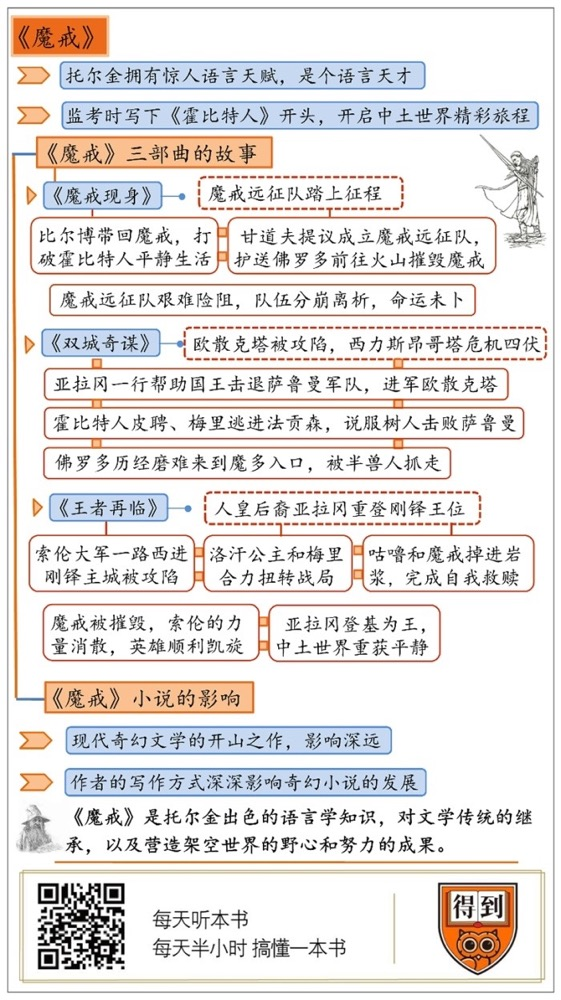

# 《魔戒》三部曲｜黄昱宁工作室解读

## 关于作者

1892年，J.R.R.托尔金出生在南非。他自小语言天赋过人，大学在牛津修的古英语、日耳曼语、哥特语等。他在一个偶然的机缘下开始写作，于是有了《霍比特人》。《霍比特人》的成功鼓舞出版商游说托尔金继续创作续集。1955年，《魔戒》三部曲全本问世。托尔金在小说创作的基础上，托尔金又总结出一套“架空世界”的理论，为现代奇幻文学的发展定下了基调。

## 关于本书

托尔金从二战后期开始创作《魔戒》，一写就是十年。小说虚构了一个架空的中土世界，为了让它变得更加丰富和真实，托尔金在正文以外，还编撰了包括帝王传记、年表、族谱、历法、语言发音规则和文字书写方式等附录，力图完成对整个中土世界的全景式呈现。

## 核心内容

《魔戒》三部曲讲述了，霍比特人佛罗多从他叔叔手上继承了一枚戒指，不成想这枚戴上就能让人隐身的戒指竟然是魔王索伦的至尊魔戒，它的力量十分强大，一旦被索伦得到，那么整个中土世界都将被黑暗笼罩。在睿智的巫师甘道夫的指引下，佛罗多一行人踏上了冒险之旅，他们打算深入索伦的腹地魔多，将魔戒投入末日火山的岩浆中。远征队在随后的征途中遭遇了挫折，有人战死，有人失踪。最终，佛罗多没有辜负同伴的希望，凭借善良的秉性和坚强的意志成功来到了末日火山，最终摧毁了至尊魔戒。

## 前言

你好，欢迎每天听本书，今天为你解读是世界奇幻文学的经典之作，《魔戒》三部曲。

说到《魔戒》，许多人可能先看过电影，然后才读的原著，倒不是因为原著默默无闻，实在是因为电影名气太大，上映之初就大获热捧，得奖无数，时至今日更是当之无愧的银幕经典。然而，真要论历史地位，原著可一点也不逊色。

在西方文学的门类中，有一支称为“奇幻文学”，英文叫Fantasy，它的历史可以追溯到古希腊，魔法和超自然元素的运用原是它最鲜明的特征，《伊利亚特》《奥德赛》《埃涅阿斯纪》等古代经典为它的发展奠定了基调。在此后漫长的文学史中，奇幻文学的传统一直得以延续，中文读者较为熟悉的《亚瑟王传奇》《格列佛游记》等都可以在一定程度上被归入这个类别。

奇幻文学尽管历史悠久，定义却始终不明，魔法、冒险、传奇、英雄事迹、超自然元素都是它不可或缺的元素，然而仅凭这些，似乎尚不足让它独立于其他文学类别以外而自成一派。直到《魔戒》问世，奇幻文学最具辨识度的属性得以确认，那就是，奇幻文学要营造出一个架空世界，然后凭借自洽的历史观和世界观设定，给读者营造出沉浸式的阅读感受。因此，人们公认《魔戒》为现代奇幻文学的开山之作，它的典范意义影响深远。

《魔戒》凭什么能做到这一点？《魔戒》作者托尔金对奇幻文学的最大贡献又是什么？在回答这些问题之前，我们不妨先了解一下托尔金，看看能不能从他的生平经历中找到我们想要的答案。

## 第一部分

自幼年时起，托尔金就表现出了惊人的语言天赋，入学前，他通过家庭教育掌握了基础的拉丁语和法语。同时，他对植物学也有极大的兴趣，还在母亲的鼓励下大量阅读儿童文学，当时的托尔金绝不会想到，幼年的兴趣与经历不知不觉帮他完成了最初的文学训练。

1911年，托尔金进入牛津大学埃克塞特学院，主修古英语、日耳曼语系、威尔士语和哥特语。据说，托尔金掌握的现代和古代语言加起来有20多种，是不折不扣的语言天才。正是在这些语言学知识的基础上，托尔金才能在之后的创作中为不同种族设计出各自的语言。

1915年，大学毕业的托尔金投身一战，后来他因病住院，直到一战结束他都在医院疗养。在这段时期，托尔金因为研究需要，大量接触了北欧神话与英国的民间传说，深深为之着迷，语言学家和文学创作者的纽带在这时已隐隐结下。托尔金继承了这些文学传统中的史诗风格，冒险远征主题和浪漫主义自然观。

一战结束不久，托尔金开启了自己的学院生涯。1920年他成了利兹大学最年轻的语言学教授，1925年又回到母校牛津任职，一直工作到1959年退休。按照正常的职业轨迹，托尔金会是一个优秀但不为大众所知的学者，他会在古英语研究领域建立自己的威望，不会与文学史产生关联。然而，学者与作者的界限在30年代初的一场考试中打破，托尔金的跨界之旅也由此展开。在这场考试中，无所事事的监考老师托尔金，在学生的空白试卷上写下了“从前在地底洞穴里，住着一个霍比特人。”中土世界的故事于是浮现纸上，这就是《魔戒》的前传、托尔金的文学处女作《霍比特人》。

《霍比特人》原本是托尔金给自己孩子写的一部童话，精明、富有商业头脑的出版商却认为成年人也会喜欢这些故事，于是就怂恿托尔金出版这部作品。果不其然，1937年小说出版以后，引起了读者热烈的反响，出版商继续游说托尔金写作续集，这才有了后来的《魔戒》。

可是《魔戒》的写作远比《霍比特人》来得艰难。造成这种情况的一个原因是二战，战争引起的混乱与动荡，让托尔金没法安心构思与写作。此外，也有小说创作野心的原因，写作《霍比特人》时，托尔金只需要把那些天马行空的故事写下来就行。而在构思《魔戒》的时候，他想让中土世界更加丰富、严谨、更加有始有终，光是编撰中土世界的历史恐怕就花了他不少时间，更不用说他还要在博物学、语言学、历史学等层面锚定中土世界的边界。写作《魔戒》的艰难，最深层的原因可能缘于托尔金思想的变化。《魔戒》的意义已经超越了《霍比特人》那种睡前读物的性质，它是托尔金对人类文明反思的产物，因此，托尔金不仅要说清楚自己的所思所想，还必须要把它形象化、故事化，这其中的艰辛程度可想而知。

托尔金出色的语言学知识，对文学传统的继承，以及营造架空世界的野心和努力，都能帮助我们理解《魔戒》为何能成为现代奇幻文学的开山之作，托尔金给奇幻文学带来的贡献。

1955年，《魔戒》三部曲终于全部问世，此时距离托尔金动笔写作这个故事已经过去了10年。不出意料，托尔金的小说再次大获成功。许多评论者称赞《魔戒》继承了自《伊利亚特》《奥德修斯》以来的史诗传统，著名美国诗人奥登更是认为《魔戒》的文学成就超过了米尔顿的《失乐园》——后者可是英语文学中排得上号的经典。为什么《魔戒》会引起这么多人的关注？它是如何超越语言、种族、阶级的限制成为雅俗共赏的传世之作？它的特别之处在哪里？要回答这些问题，我们必须随着托尔金一道，从那恢宏壮丽的中土世界中寻找答案。

## 第二部分

本期音频参考的是朱学恒翻译的版本，他把三部曲的第一部名称翻译成《魔戒现身》，直译的话也可以叫“魔戒远征队”。故事接着《霍比特人》的时间线展开，背景仍是中土世界。

距离上一本《霍比特人》故事里的主角霍比特人比尔博·巴金斯上次出门冒险，已经过去了好几十年，这几十年里，岁月静好。不过，危机却隐隐浮现。比尔博年轻时曾经跟随灰袍巫师甘道夫一起冒过险，带回了一枚可以让人隐身的戒指。经过一番调查他才知道，原来这枚戒指就是传说中的至尊魔戒，它原本属于黑暗魔君索伦，后来辗转来到比尔博手中，现在比尔博又把它送给了自己的侄子佛罗多。

当年，索伦诱骗精灵工匠打造了一系列魔戒，它们都无比强大，此外，他又在末日火山偷偷打造了至尊魔戒，它能够统领其他戒指，拥有至高无上的力量。后来精灵和人类联手打败了索伦，魔戒却没有被摧毁，因此，索伦的邪恶意识也没有被彻底消灭。如今，他积攒了足够的力量，准备东山再起，他一方面扩充自己的半兽人军队，另一方面四处搜寻魔戒下落，一旦重获魔戒，索伦的力量就会完全恢复，到时整个中土世界都将笼罩在黑暗的阴影中。

在这个危急关头，甘道夫嘱咐佛罗多带着魔戒前往精灵故乡，向精灵王寻求庇护，甘道夫自己也去寻求巫师领袖萨鲁曼的帮助。就这样，佛罗多和他忠实的仆人山姆，以及两个好朋友皮聘和梅里一起，踏上了他们想都不敢想的冒险之旅。

生性乐观开朗的霍比特人，刚走到夏尔的边界就捅了篓子，索伦的爪牙闻风而至，幸好得到神行客亚拉冈的帮助才化险为夷。亚拉冈大有来头，他是人皇的直系后裔，是人类王国刚铎的王位继承人。在亚拉冈的护送下，佛罗多一行人有惊无险地来到了精灵的国度。在那里，不同种族的代表从中土世界各地赶来，共同商议处置魔戒的办法。

索伦的力量越来越强，就连精灵也抵御不了魔王的军队，而且巫师领袖萨鲁曼竟然也投靠了索伦，双方之间的差距进一步拉大。这场商议形成了两种意见，有人提议借助魔戒的力量对抗索伦和萨鲁曼，这遭到甘道夫的反对，他很了解，魔戒不是一般人能够驾驭的，它会腐蚀持有者的意志，令他堕入黑暗。因此，甘道夫的建议是组成一只魔戒远征队，护送佛罗多前往索伦老巢附近的末日火山摧毁魔戒。这个计划的危险之处在于，一旦索伦发现他们的行踪，那就相当于送羊入虎口，把魔戒亲手送还给魔王。而且，参加会议的众人也不理解，为什么连巫师、精灵和人类勇士都驾驭不了的魔戒，手无缚鸡之力、身高只有普通人类一半的霍比特人反倒能持有？

这个问题的答案涉及《魔戒》的基本主题——善与恶的较量。如果说索伦和魔戒象征着最幽暗、最阴沉的恶，那么以佛罗多为代表的霍比特人就代表了最纯粹、最朴素的善，只有后者才能和前者针尖对麦芒。除此以外，力量、智慧、知识、技术通通都不管用，不单不管用，反而可能沦为邪恶的帮凶，最后落得万劫不复的下场，巫师领袖萨鲁曼不就是一个最好的例子！萨鲁曼曾经暗中帮助巫师与精灵组成的组织反抗索伦，但后来受到索伦的引诱堕落了。

托尔金酝酿这部小说的时候，正好是二战时期，一定程度上，萨鲁曼是战时欧洲知识界的一个缩影。当时许多知识精英否定普通民众的生活方式，进而否定自由的价值，推崇力量与强权统治，这才给纳粹提供了上位的可能，也因此引发了人类历史上最大规模的屠杀。托尔金显然不属于这个阵营，虽然他没有全身心地拥抱启蒙理性，他也很忧虑工业化造成的环境破坏以及由此导致的人性堕落，但他没有极端到否定日常生活的价值，更没有把希望寄托于索伦这样的魔君，他依然肯定人性中还存有可贵之处，他把人类的希望寄予到最朴素的道德力量。这层意思隐隐构成了小说的底色，相较之下，奇幻文学的定义和中土世界的建构都是技术层面的问题。

故事继续。本着自愿原则，一共9人加入了魔戒远征队，他们分别是灰袍巫师甘道夫，人皇后裔亚拉冈，刚铎宰相之子波罗莫、矮人贵族葛罗音之子金雳、幽暗密林精灵王子勒苟拉斯，再加上霍比特人佛罗多的四人队伍。

征途当然不会一帆风顺，自然天险的阻隔是一端，半兽人的追击是另一端。远征队先是在矮人曾经的圣城摩瑞亚失去了甘道夫，又在安都因河旁被半兽人袭击，波罗莫战死，紧接着佛罗多和山姆趁乱离开，为了不再拖累同伴，他们决心结伴前往末日火山。剩下的人里面，皮聘和梅里又被半兽人掳走，亚拉冈则带领勒苟拉斯和金雳前去追击。到这里，远征队分崩离析，众人踏上了各自不同的命运之路，小说第一部也就此完结。

小说第二部叫《双城奇谋》，直译就是“双塔”。双塔指的是萨鲁曼居住的欧散克塔和索伦领地魔多的西力斯昂哥塔，从小说内容来看，第二部基本上是围绕这两座塔展开。

这里不妨多说一句，我们前面说过三部曲的底色，所以很多人都认为托尔金写《魔戒》有影射现实的意味，譬如索伦和萨鲁曼的同盟，好比是希特勒与墨索里尼，或者二战初期的苏德。类似的索引都有蛛丝马迹可循，然而这对于文学本身似乎没什么必要，文学虽然不能脱离现实单独存在，可是只把它视为现实的投影，那无疑是对文学的矮化。

言归正传，小说上半部讲的是萨鲁曼的欧散克塔被攻陷，这份功劳主要由洛汗国的骑士和树人分享。亚拉冈一行人在追击半兽人的过程中，来到洛汗国，意外遇到涅槃重生的甘道夫，在甘道夫带领下，他们清除了洛汗国王身边的谗臣，恢复了国王的心智，随后和洛汗骑兵一起打退了萨鲁曼军队的进攻。在这之后，洛汗军队进军欧散克塔，直取萨鲁曼的老巢。他们最终抵达时却惊讶地发现，萨鲁曼的老巢似乎刚遭遇了大洪水，更出乎众人意料的是，在欧散克塔门口的废墟上，霍比特人皮聘和梅里正悠闲地大吃大喝。原来他俩乘乱逃进了法贡森林，在那里遇到了古老的树人一族。

萨鲁曼为了集结军队，大肆破坏森林激起了树人的愤怒，皮聘和梅里趁机说服他们召开树人会议，召集树人攻打萨鲁曼。树人是中土世界最古老的种族，树形人身，身高超过4米，看似行动迟缓实际上力量惊人。在他们面前，萨鲁曼简直不堪一击，被打得不敢出塔半步。看到大局已定的甘道夫决定不再理会萨鲁曼，他委托树人监视萨鲁曼，自己转头准备即将来临的索伦领地魔多与人类王国刚铎间的大战。

前面我们提到过托尔金对工业化和环境污染的担忧。树人这一段无疑是他这种立场最好的注脚。如果回溯英国文学史，在哈代、劳伦斯等作家的笔下我们也能找到类似的主题。实际上，在作家那里，自然被破坏不仅是环境污染这么简单，它更意味着美的失落，意味着人性的破碎，意味着心灵的枯竭、道德的滑坡。两者之间为什么会有这样的关联呢？因为从18世纪末欧洲浪漫主义思潮出现以来，自然就被看成是人性的培养皿，美的训练营，心灵与道德力量的发源地。这个传统可以一直上溯到德国思想家歌德和他著名的《少年维特的烦恼》。因此，在拒斥工业化，拥抱自然人性这点上，托尔金很好地继承了浪漫主义文学的传统，他还用一种类似神话的方式赋予了它新的形式。

接下来，我们把视线转向佛罗多和山姆，他们独自启程以后，一路历经磨难终于来到了魔多的入口。可索伦的老巢又不是路边茶馆，想来就来想走就走，面对紧闭的大门和守门的半兽人，佛罗多和山姆只好绕道。不得已，他们跟着史麦戈走上了一条密道。史麦戈是谁？他是在比尔博之前魔戒的持有者，他也是霍比特人，但由于长期持有魔戒，心智和外貌都已经扭曲。因为常常发出“咕噜咕噜”的声音，所以他又被称为“咕噜”。自从丢失魔戒以后，咕噜一直寻找着它的下落，为此还不惜孤身前往魔多打探，所以他知道进入魔多的密道。此时，咕噜看上去已经被佛罗多和山姆驯服，实际上，他的内心仍潜伏着另外一个人格，心心念念要杀死佛罗多和山姆，抢回魔戒。这种两面性让“咕噜”成为《魔戒》中一个让人过目不忘的人物。最终，对魔戒的占有欲占了上风，咕噜把佛罗多和山姆引入了怪物巢穴，想要借刀杀人，紧要关头，老实巴交的山姆以惊人的勇气和力量打退了怪物。可佛罗多却被半兽人发现，抓进了西力斯昂哥塔里，山姆一路尾随来到塔下，想要伺机救出佛罗多，小说第二部至此完结。

小说第三部叫《王者再临》，顾名思义，说的是人皇后裔亚拉冈重新登上刚铎的王位。萨鲁曼的覆灭，让刚铎免除了腹背受敌的危险，然而索伦的力量仍然大大强于人类的军队，而且索伦仍有余力在攻打刚铎的时候，分兵袭击矮人和精灵，让他们自顾不暇，无法来支援刚铎。洛汗的骑兵在大战之后也需要休整，不能全速赶往应援。面对魔多的大军，兵力处于劣势的刚铎军队伤亡惨重。索伦的大军一路西进，直指刚铎主城，一番鏖战以后，城门告破，刚铎宰相在绝望中自焚，只剩甘道夫一人指挥着守城士兵苦苦支撑。

眼看主城就要陷落，洛汗骑兵及时赶到，杀得半兽人阵脚大乱。可半兽人军队的战力还在，一番整顿以后，再度杀了回来，洛汗国王战死，局势再度逆转。危急时刻，洛汗公主和霍比特人梅里合力斩杀了敌方主将，力挽狂澜。少女和霍比特人完成了伟大骑士没能做到的壮举，可见，希望并非由力量和知识保障，而是需要平凡者的决心和勇气来守护。

最后，亚拉冈和勒苟拉斯、金雳一起率领亡者大军赶来助阵。这些曾经因为临阵脱逃而受到诅咒的亡灵士兵，响应了亚拉冈的召唤，履行了曾经对人皇许下的誓言，终于换得灵魂的解脱。

这一场大战以刚铎惨胜告终，可威胁仍没有结束，索伦依然留有后手，而且刚铎的战力所剩无几。亚拉冈第一时间救治重伤的众人，刚铎有一句古语，王之手乃医之手。人皇后裔归来的消息，一时间传遍了刚铎都城的大街小巷。亚拉冈深知当务之急是摧毁魔戒，而不是重登王位，他提议，集结最后的有生力量，进军魔多，转移索伦的视线，为佛罗多和山姆争取时间。也就是说，亚拉冈相信甘道夫的判断，决定把整个中土世界的希望交付给佛罗多和山姆。

山姆和佛罗多没有辜负众人对他们的期望，山姆英勇地救出了佛罗多，随后两人一路跋涉，来到了末日火山的入口。幸亏有亚拉冈率领大军在正面战场牵制索伦，让他没发现原来魔戒就在自己的老巢里。就算如此，真要销毁魔戒也不容易。在末日火山的烈焰旁，佛罗多经历了此行最大的考验。他终于不可避免地受到了魔戒蛊惑，想要戴上戒指一走了之。这时，一路尾随他们的咕噜冲上前去，一口咬断了佛罗多的手指，抢走了魔戒，却不幸一脚踏空，连人带戒指一起掉进了岩浆中。咕噜曾经是善良的霍比特人，受到魔戒蛊惑堕入幽深的黑暗之中，如今，他戏剧性地完成了自我救赎，恶反过来成就了善，这说明，托尔金对人类的未来仍保有希望。

直到这时，索伦才发现大事不好，却为时已晚。随着魔戒被摧毁，他的力量迅速消散，正面战场的半兽人军队也随之土崩瓦解。此时，精疲力竭的佛罗多和山姆面对着爆发的火山岩浆，做好了必死的准备，幸好，甘道夫派出巨鹰救了他们，英雄才得以顺利凯旋。

之后便是故事的尾声，众人无一例外都获得了圆满的结局。回到夏尔以后，佛罗多一行人还遭遇了一个小插曲，萨鲁曼纠结余党霸占了夏尔，后来被佛罗多等人轻易打败，萨鲁曼最后也没能善终，死在了自己奴仆手上。如果把几个霍比特人的故事线单拎出来，我们会发现，《魔戒》其实是一部成长小说。托尔金在最后安排这个插曲，是为了显示几个主人公成长以后的状态，这也让小说在结构上完成最后的闭合。

遗憾的是，在主角佛罗多身上，我们没能看到少年成长的轨迹，其他人或者莽撞或者怯懦，在冒险征途中，他们逐渐克服了缺点，成长为独当一面的勇士。唯有佛罗多，自始至终都闪耀着圣徒的光辉，他没有缺陷，没有私欲，与其说他是一个活生生的人，不如说他是托尔金安插在小说中的一个符号、一个概念。因此，不少人会喜欢山姆、梅里和皮聘，而对佛罗多敬而远之。

在小说最后，魔戒远征队的队员要么寿终正寝，要么远走他乡，总之无一例外都离开了中土世界。有人认为，托尔金这样安排别有深意，小说中也提到，随着至尊魔戒被摧毁，其他魔戒的力量也会一起消失，因此，巫师和精灵才会纷纷离开中土世界。他们的离去意味着魔法和神秘力量自此退场，历史开始进入理性和技术统治的年代，这或许能带来稳定和安全，但也会导致单调与乏味。那么谁来承担反抗平庸的重任呢？答案自然是艺术，在托尔金那里，就是文学，就是神话，这也是他写作《魔戒》的最深层、最形而上的动机。

## 第三部分

《魔戒》三部曲的故事讲完了，不过，中土世界的大门可没有就这么关上。托尔金在写完《魔戒》以后，继续打造他的中土世界。1973年，托尔金去世以后，家人在他的手稿中发现了大量与中土世界相关的内容，于是就整理出版了《精灵宝钻》《中土历史》等著作，为中土世界提供了更多有意思的细节。很显然，托尔金不只想讲关于魔戒的故事，他更想把中土世界的来龙去脉、风土人情一起呈现在读者眼前。就拿《魔戒》来说，小说除了正文以外，还包括帝王传记、年表、族谱、历法、语言发音规则和文字书写方式等附录。托尔金的野心，恐怕是想在文学中创造一个堪比现实世界的虚构空间，他的这种想法为奇幻文学的创作打开了新的局面。

托尔金认为，奇幻文学最重要的不是魔法、不是超自然元素，而是要营造一个Secondary World，中文通常翻译为第二世界或架空世界。在那里，小到烹调方法、起居习惯，大到种族构成、历史事件、价值观念等，都跟现实世界完全不同。但是它们又得像现实世界一样，保持内在一致性，要有自洽的历史观和世界观，不能逻辑混乱，否则就是胡编乱造，那样一来虚构的架空世界也会随之分崩离析。

在以《魔戒》为代表的一系列作品中，托尔金孜孜不倦地描绘中土世界的方方面面。他为中土世界创造了霍比特人、精灵、人类、矮人、半兽人等不同种族的居民，为他们编撰各自的历史和风土人情，他甚至凭借自己的语言学知识，为不同种族设计各自的语言，其中最详细的是精灵语，它有系统的发音和语法规则，如果有人愿意甚至可以像学习一门外语一样学习精灵语。这些细节既充满奇思妙想，又严丝合缝、和谐共存，丝毫不会让读者感到突兀，还能让人沉浸其中。而且，读者通过阅读能经历这场虚拟出来的宏大叙事，获得精神体验，这对于各个时代的年轻读者来说，都具有强大的亲和力，这也是奇幻文学引人入胜的根本原因。

托尔金的写作方式深深影响了后来奇幻小说的发展，《哈利·波特》就在托尔金的理论上做了拓展和延伸。《哈利·波特》小说中巫师世界和现实世界并存，两者互有交集，却遵循不同的价值观和世界观，两个世界也分别拥有自成一体的道德规范和行为准则。而近年来把奇幻文学推向新高峰的《冰与火之歌》，也就是美剧《权力的游戏》的原著小说，也离不开《魔戒》打下的基础。《冰与火之歌》的作者乔治.RR.马丁就说过，《魔戒》中巫师甘道夫的死亡启发了他的写作灵感，让他喜欢用酷烈的、出其不意的方式，安排那些已经跟读者观众建立起情感联系的人物“突然死亡”。这种处理方式激发的宿命感，确实是《魔戒》和《冰与火之歌》的共同精神内核之一。

如果说史诗风格的应用，冒险、远征主题的书写，浪漫主义自然观的表达凸显了托尔金对文学传统的继承，那么架空世界的营造和处理，则是他对文学传统，尤其是奇幻文学传统所做的最大创新，也是他送给读者最好的礼物。

## 总结

好，我们来回顾一下本期内容里的知识要点，我们知道：

第一，托尔金是个不折不扣的语言天才。据说，他掌握的现代和古代语言加起来有20多种。

第二，《霍比特人》之后，托尔金写了《魔戒》三部曲，大获成功。《魔戒》超越了睡前读物的性质，是托尔金对人类文明反思的产物。

第三，《魔戒》的基本主题是善与恶的较量。只有霍比特人所代表的最纯粹、最朴素的善，才能战胜如索伦和魔戒象征着最幽暗、最阴沉的恶，除此以外，力量、智慧、知识、技术通通都不管用。

第四，在拒斥工业化，拥抱自然人性这点上，托尔金很好地继承了浪漫主义文学的传统，他还用一种类似神话的方式赋予了它新的形式。

第五，托尔金认为，奇幻文学最重要的不是魔法、不是超自然元素，而是要营造一个架空世界。这个世界要保持内在一致性，要有自洽的历史观和世界观，不能逻辑混乱。

撰稿：黄昱宁工作室

脑图：摩西脑图工作室

转述：徐惟杰