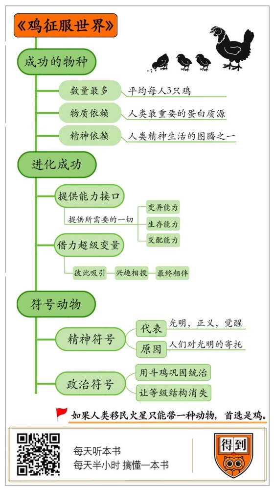

# 《鸡征服世界》| 李南南解读

## 关于作者

安德鲁·劳勒，记者，科普作家，其作品涉猎广泛，类型多样。他是《科学》杂志撰稿人和《考古学》杂志特约编辑，也在《国家地理》《纽约时报》《太阳报》《天文学》等报刊发表过文章。

## 关于本书

作者安德鲁·劳勒在人类的生活史和文化史中，搜寻鸡的踪影。这本书并不是某一个学科的专业论著，而是一本关于鸡的趣味读物，涉及到了鸡的方方面面，包括鸡的生物学意义、社会学意义、文化意义等。建议你带着轻松的心情走进这本书，也走进一直在我们身边，却被忽视的，鸡的世界。

## 核心内容

鸡的经历将告诉我们，一个物种究竟是怎样走向成功的？除了自我的进化之外，还有另一种方式，就是搭载一个超级变量。鸡的超级变量，就是人类。鸡的生活习性以及生存、变异、繁殖能力，使它恰好可以嵌入人类的物质生活，随着人类的脚步一同迁徙繁衍。而鸡的打鸣、好斗等生物特性，又恰好满足了人类的想象和娱乐需要，使它进一步嵌入我们的精神和政治生活，并且最终在我们的物质和文化中无处不在，成为人类最重要的动物伴侣，也成为这个星球上数量最庞大的禽类。

## 前言

你好，欢迎每天听本书。

提起这个世界上处境最糟糕的动物，鸡一定会排在前几名。鸡的自然寿命是10到20年，但是在人类的干预下，一只鸡从孵化到出笼，只需要六周。然后，它们就成为了食品流水线上一块长了羽毛的肉，被大卸八块，发往世界各地：鸡翅去了西班牙，鸡肠子去了土耳其，鸡骨头去了荷兰的鸡汤工厂，鸡胸肉去了美国和英国，而鸡爪，这个老外眼里的黑暗料理，则到了咱们中国。匆匆看来，鸡短暂的一生，都被锁死在人类的食品工业里。

但是，我今天要为你解读的这本《鸡征服世界》，也许会扭转你对鸡的看法。作为一个生物个体，鸡的处境的确很糟糕，但从整个族群的角度看，鸡却是一个非常成功的物种。

首先，鸡是世界上数量最多的禽类，地球上一共有200亿只鸡，平均每个人3只，比猪、牛、羊，甚至耗子加起来都要多。进化论告诉我们，生物进化的最终目的就是繁殖，也就是拥有尽可能多的后代，从这个角度看，鸡是成功的。

其次，鸡也是人类依赖程度最高的动物之一，它是人类最重要的蛋白质源。假如地球上所有的猫、狗都消失了，肯定有不少人伤心，但对全球经济或者国际政治造成的影响却微乎其微。但是，要是鸡都消失，就会引发灾难。2012年，墨西哥为了消灭禽流感，捕杀了上百万只鸡，导致鸡蛋价格飙升。人们纷纷游行抗议，要求政府下台。这次事件被称为“鸡蛋大危机”。而且未来，科学家建议，假如人类移民火星只能带一种动物，首选还是鸡。

除了物质依赖，鸡还是人类精神生活的图腾之一。几乎在所有的宗教里，都有鸡的身影，而且鸡的地位往往很高。在基督教的传说里，上帝曾经化身为公鸡，在伊斯兰教的传说里，鸡是颂扬真理的神明，连希腊女神雅典娜的头盔，上面的造型也来自于鸡冠。

那么，鸡究竟是怎么做到这一切的呢？作为一种起源于亚洲丛林的动物，它的足迹为什么会遍布全世界？又是怎么从15000多种动物中脱颖而出，成为人类最重要的动物伴侣？它又为什么会成为几乎所有宗教里，重要的精神符号呢？

总结成一个核心问题就是，鸡这个物种，究竟是怎么成功的？

本书的作者安德鲁·劳勒是一位科普作家，也是《科学》杂志的撰稿人。他在人类的生活史和文化史中，搜寻鸡的踪影。这本书并不是某一个学科的专业论著，而是一本关于鸡的趣味读物，涉及到了鸡的方方面面，建议你带着轻松的心情走进这本书，也走进一直在我们身边，却被忽视的，鸡的世界。

接下来，我将从两个方面，为你解读这本书。

## 第一部分

第一部分，我要说的是，鸡是怎么实现进化意义上的成功，成为这个星球上数量最多的禽类的。它的扩张，并非完全取决于自身的进化，而是因为它提供了一系列的能力接口，这些接口恰好都让它连接上一个超级变量——人类，借助人类的力量，鸡完成了自我的扩张。

要想知道鸡的足迹是怎么遍布世界的，得先弄清楚鸡是怎么走进我们的生活的。我们知道，所有的家养动物，都不是生来如此，而是人为塑造的结果，比如人类用剩余的食物收买狼，让它们保护人类，从而演变成了狗。而野猫因为会捉老鼠，所以获得人们的善待，从而变成了家猫。

但是，唯独鸡的出现，显得疑点重重。目前所有种类的家鸡，几乎都源于同一个祖先，红原鸡，它们最初起源于亚洲的森林里。按照我们通常的设想，红原鸡一定有什么吸引人的地方，比如肉多、能生蛋、笨拙、容易捕捉等等，这些特性促使人类去捕捉它们，并且驯化它们成为家鸡。但是，假如你见过纯正的野生红原鸡，就不会这么想了。红原鸡，基本就等于低配版的鹰。

首先，它极其敏感警觉，只要周遭有任何的风吹草动，马上就会展翅高飞，溜之大吉。注意，是飞，不是跑。红原鸡和只会上蹿下跳的家鸡可不一样，它们有很不错的飞行能力，一次飞行的距离能达到1500米，人类要想抓住它们非常困难。其次，即使抓住了也驯服不了，因为红原鸡和鹰一样，桀骜不驯，而且脾气暴躁，有的红原鸡被逮到后宁可撞死在笼子上，也绝不做笼中鸟。最后，即使退一步，想办法驯服了它们，意义也不大，因为红原鸡的肉并不比别的鸟多，而且它们一年只能下6个蛋，食用价值很有限。

总之，抓捕红原鸡，是一件性价比很低的事。那么，红原鸡又是怎么走进我们的生活，成为家鸡的呢？根据书中的研究，人和红原鸡之间，并不是猎人和猎物的关系，而是像相亲一样，先是彼此吸引，然后兴趣相投，越来越合拍，最终走到了一起。

这个过程是这样的。首先，红原鸡最喜欢的食物，是杂草、谷子壳，还有农作物或者腐肉上的虫子，这些东西恰好都是人丢弃，或者是本来就想除掉的。红原鸡填饱肚子的同时，正好也充当了清洁工。而且红原鸡的生活节奏和农业社会的居民非常相似，日出而作，日落而息，从不会在人们熟睡的时候出来捣乱，相处很和谐。再加上红原鸡天性敏锐，对周围的豺狼虎豹异常敏感，一旦感知到危险就会尖叫，这就等于给人类配备了天然的警报器。

这么一来二去，红原鸡和人就走得越来越近，并且在人类居所的附近筑巢安家。而且红原鸡还是一种很恋家的动物，一旦定居在一个地方，就全家世世代代住在这里，很少远离住所。

但仅仅是做邻居，还不足以让红原鸡变成家鸡。根据作者的考证，红原鸡在演化的过程中，发生了某种突变，导致它们肉突然变多，而且生长周期大大缩短。按理说，某个个体的突变，不足以马上波及整个族群，但鸡偏偏是例外。它们有个习性，特别爱交配。不管是公鸡还是母鸡，都有着发泄不完的交配欲。这就导致突变迅速蔓延，没过多久，人类就发现周围多了不少长得快，肉又多的鸡。

后面的事估计你已经猜到了，人类当然不会放过送上门的大餐，于是，人类开始把红原鸡关进鸡笼，鸡从此开始成为一种日常的食物。

但是，这只是鸡向人类社会迈出的第一步。一次偶然的变异，使它走进了人类的鸡笼。鸡的扩张，从此时才刚刚开始，它们随后展现出的超强生存能力和可塑性，都让它进一步嵌入人类的生活，并且借由人类的力量大规模扩张。

首先，鸡对环境的适应能力非常强，从喜马拉雅山脚下，到热带雨林，从干旱的大漠，到潮湿的海岛，鸡都能活得很精彩。而且它们可以不吃人类的食物，只要吃点杂草和昆虫，也能茁壮成长。它们就像一群可以自我复制的活体罐头，人类不管走到哪，都要带着它们。

其次，在陪人类走遍全世界的过程中，鸡的另一个特性开始显现，就是它们异乎寻常的可塑性。按照书里的说法，鸡就像一坨神奇的黏土，只要环境合适，你可以把它捏成任何你想要的样子。

在不同的居住环境里，鸡开始发生各种各样的变异。比如有一种日本鸡，尾巴展开有6米长，可以做成工艺品，是艺术家的最爱；再比如菲律宾的斗鸡，凶悍程度不亚于雏鹰，是当地人最重要的娱乐消遣；还有的体重不到两斤的矮脚鸡、体重超过十斤的梵天鸡和一天下一个蛋的来亨鸡……鸡的品种数不胜数。

更重要的是，鸡的变异可以人为干预，即使过去的人没有任何生物或者遗传学知识，也能对鸡开展改造，获得他们想要的品种。因为鸡很喜欢交配，所以人只要盯着它们，出现一只变异的新品种，就可以抓住它，去跟别的鸡交配，让这个品种迅速壮大。换句话说，鸡的变异能力、生存能力、交配能力，三者彼此作用，使鸡就像一把长了羽毛的瑞士军刀，能够在特定的时间与空间里，为我们提供所需要的一切。

回顾历史，人类文明扩张的每一步，都伴随着鸡的脚印，人不管走到哪，都会把鸡带在身边。它是饲养成本最低的蛋白质来源，蛋白质含量比牛肉和猪肉都要高，而且鸡肉蛋白很有利于人体吸收，被称为百分百蛋白。

放眼现在，地球上有200亿只鸡。一个不到1000平方米的鸡舍，可以同时养一万只鸡。整个地球上，唯一没有活鸡的大陆是南极洲，因为人们怕鸡携带的禽流感病毒会威胁南极帝企鹅的生存。

畅想未来，我们还是离不开鸡。实验已经证实，鸡可以在辐射程度不亚于切尔诺贝利核泄漏的环境中，健康地存活，除了生长速度慢一点，没有任何异常。假如未来人类移民火星，只能携带一种动物的话，首选还是鸡。总之，可以想象，只要人类还是地球食物链的顶端，鸡的数量优势就不可撼动。

除了食用价值之外，鸡的另一个重要作用，是它的药用价值。16世纪的一位意大利科学家曾写道，无论内病还是外病，几乎没有鸡治不了的。当然，其中不免有夸张的成分，比如用鸡蛋清治疗烧伤。科学已经证实，把鸡蛋清涂抹在烧伤的皮肤上只会让病情恶化。但是，也有不少功效是实实在在的，比如，鸡汤可以减缓炎症、疏通鼻塞、缓解胸闷，鸡冠中的透明质酸可以美容，舒缓皱纹，鸡骨头里的蛋白成分可以用来缓解类风湿关节炎。

但鸡身上对医学最重要的部分，其实是鸡蛋。我们知道，鸡是流感的主要传染源，很多流感都属于禽流感，由鸡传染给人。但你未必知道，直到2012年之前，我们用来预防流感的疫苗，它的主要原料，也来自于鸡，确切地说，就是鸡蛋。

疫苗发挥作用的原理，是提前把微量的，已经灭除活性的病毒注射到身体内，然后诱发人体产生抗体，这样我们就能在病毒大举进攻的时候击退它们。所以，制造疫苗，要从培养病毒开始，而最廉价、效率最高、效果最好的培养皿，就是鸡蛋，而且是已经受精，能够孵出小鸡的鸡蛋。当然，在成为病毒培养器的那一刻起，它们就再也没有孵化的机会了。

注意，这些疫苗针对的，可不光是鸡带来的禽流感，而是几乎人类的所有种类的流感。所以总体来说，鸡在流感这件事上，是功远远大于过的。直到2012年，美国食品和药物管理局，才批准了一种无需使用鸡蛋的流感疫苗。虽然现在已经有了新技术，制造疫苗已经用不着鸡蛋，但是，在医学研究中，鸡蛋仍然是最重要的样本之一。

别看鸡蛋的结构好像很简单，但从生物学的角度看，它的复杂程度不亚于任何一种生物，当然，这是具体的生物学问题，咱们就不多说了。总之，你可以把鸡蛋看成是另一种圆滚滚的小白鼠，是绝佳的实验体，而且鸡蛋的生物模式和人类有很多相似之处，人还能用仪器透过蛋壳，观测到它的完整生长过程。这几条结合到一起，就使鸡蛋成为难得的生物样本，可以通过给它注射肿瘤细胞、艾滋病病菌或者其他病原体，来观察这些疾病的生长轨迹，进一步了解每种疾病的模式。只有了解疾病，才能提高治愈的可能性。所以，鸡蛋，也是人类疾病研究中，重要的探路石。

以上是第一部分内容，我们解释了鸡是怎么成为数量最多的禽类，遍布世界的。起初，因为鸡的生活习性和人很像，使它们成为人类的邻居，一次偶然的变异，使它们成为食物，被关进人类的鸡笼。随后，鸡的生存、繁殖和变异能力，三者相辅相成，使它们进一步符合人类需求。它们也借由人类的饲养和迁徙，遍布全世界。今天，鸡已经成为人类最重要的蛋白质源，并且有着很大的医学价值。

## 第二部分

接下来第二部分，我要告诉你的是，鸡不光在我们的物质生活里发挥着重要的作用，它也是一种“符号动物”。一方面是精神符号，在一定程度上为人们提供精神支撑，另一方面是政治符号，在一定程度上影响着人们的政治生活。

我们先说说鸡是怎么成为精神符号的。在今天的人看来，鸡在历史上的存在感似乎很低。它既没有像骆驼那样，背负着沉重的商品，连通丝绸之路的经济，也没有像战马那样，随着蒙古骑兵征战欧亚大陆，更不像猫狗之类的宠物，成为人类的生活伴侣，在人们的情感里占有一席之地。

但是，回顾过去，鸡在世界各地文化中的地位，要远远超过我们的想象。更难得的是，几乎所有的文化，都对鸡持肯定态度。鸡在世界各地文化中的地位有多高？书里给我们举了几个例子。

在古代波斯，鸡被认为是正义使者，为了对抗恶魔和巫师而降生于世，当它响起嘹亮的鸣叫，不幸就会绕道而行。而且鸡还驱逐了懒惰恶魔，这位懒惰恶魔企图让人类陷入无限的昏睡中，是鸡神兵天降，向懒惰恶魔发出了致命一击。据说波斯国王王冠上的锯齿状设计，灵感就来自于公鸡的鸡冠。

在伊斯兰教的传说中，穆罕默德曾经见过一只体型巨大，美得不得了的公鸡，爪子踩着地面，鸡头直冲云霄，向世间传播着真主的荣耀。

在基督教的传说里，公鸡是黎明使者，和耶稣一样，能够让人类苏醒，并且唤醒所有的病人和懒惰者。世界各地的基督教堂，都配有公鸡形状的风向标，安装在教堂的最顶端，位置比十字架还要高。

在日本的神道教中，有一位非常重要的神，叫天照大神，而白鸡，是唯一一种能将天照大神呼唤出来的动物。

而在中国，鸡被称为五德之禽，也就是具备了文德、武德、勇德、仁德、信德五种高贵品格。它也是人和神灵沟通，最重要的媒介。只要赶上祭祀、驱邪、作法，就往往少不了杀鸡。道士认为鸡血可以驱逐邪祟，义结金兰的兄弟，喝上一碗带鸡血的酒，就可以让神灵进驻自己的身体，监督自己的一举一动，一旦做了什么对不起兄弟的事，体内的神灵就会惩罚你。

总之，几乎在全世界所有的宗教、文化里，都有鸡的影子，而且更难得的是，鸡的象征意义居然惊人的相似，它都代表着光明、正义和觉醒。至于原因，估计你已经从刚才的讲述中猜到一二，这一切的传说，其实都源于鸡的一个，我们早就习以为常、见怪不怪的习性——打鸣。

对今天的人来说，打鸣好像没什么了不起，但对电灯发明之前的古代人来说，打鸣可是件大事。过去没有电灯，很多地方连油灯都没有，太阳落山，周围就剩一片黑暗，而人类天生就怕黑。经过了一夜的煎熬之后，公鸡打鸣，太阳升起，世界才恢复正常。注意，是先有公鸡打鸣，然后太阳升起，正所谓“雄鸡一唱天下白”，唱在前，白在后。

今天我们已经知道，这是因为公鸡体内有一种叫做褪黑素的激素，它对阳光极其敏感，所以公鸡往往能在人之前就感知到阳光。但在古人看来，太阳是被公鸡召唤出来的，公鸡一定具备某种神力。于是，鸡成了人们对光明的寄托，人们演绎出各种各样的故事，来神化鸡的形象。但讽刺的是，人们一边敬畏着鸡，一边又在各种祭祀仪式中杀鸡，表示对神灵的敬畏。

造成这一切的根本原因，还是因为鸡的繁殖能力太强，太容易饲养了。假如跟神灵沟通一定要杀点什么作为买路费，根据经济学劣币驱逐良币的原则，杀牛宰羊成本太高，鸡显然是最佳选择。于是，打鸣和养殖成本低，这两个特性加在一起，使鸡在人类的文化中无处不在，它一方面是神灵本身，另一方面也是跟神灵沟通的媒介，是人向神靠近路上的买路费。

除了作为精神符号，鸡有时也被当做政治符号，在某种程度上，有意或无意的，影响了我们的政治生活。

首先，请你想象这么一幅画面：一只羽毛斑斓的大公鸡，爪子上绑着一把锋利的尖刀，屁股里插着半截辣椒，一副视死如归的表情。在它的对面，是另一只状态差不多的公鸡。这就是17世纪，在西班牙的殖民统治下，菲律宾的斗鸡场的真实写照。爪子绑上尖刀，是为了增加杀伤力，屁股里插辣椒，是为了激发出狂暴的战斗力。

在西班牙殖民菲律宾期间，这样的斗鸡场，是每个城镇的必备建筑，它们是西班牙的殖民者建造的。菲律宾人本来就酷爱斗鸡，如今，西班牙人又把这项活动推向了新的高峰。但是，西班牙人大肆兴建斗鸡场，可不是为了丰富当地人的文化娱乐生活，而是为了巩固自己的统治。

我们都知道，菲律宾的面积虽然不算很大，但是它拥有数百座岛屿，数十个民族，而且距离西班牙半个地球之遥。对西班牙人来说，统治它并非易事。所以，西班牙人就想把所有的人口都集中到城镇，这样更便于监管和征税。城镇里总得有点乐子吸引当地人吧，于是西班牙人就瞄准了斗鸡。

西班牙殖民者虽然修建了大量的斗鸡场，但他们又严格规定，只有周末或者节假日可以斗鸡，平时不行。当然，这不是为了倡导健康规律的生活方式，而是为了敛财。斗鸡不光是个观赏项目，更是一场赌博。假如规定只有周末才能斗鸡，那么这些已经憋了一周，手早就痒痒得不得了的当地人，就会带着一周的收入，迫不及待地前往斗鸡场，然后输个精光。

根据统计，18到19世纪期间，西班牙人通过斗鸡获得的收入，很可能超过了烟草的收入，而当地人因为斗鸡赌博欠下西班牙人的债，却越来越多。斗鸡在一定程度上，巩固了西班牙人的统治。

俗话说，水能载舟，亦能覆舟，鸡能够巩固权力，换个用法，它也能动摇权力。在书里，就有这么一个例子。根据历史学家的研究，在6世纪非洲西部的村落里，社会已经出现了阶层之分，分为平民阶层和精英阶层，但是到了12世纪，这些等级结构突然消失了。造成这一切的因素之一，就是鸡。

要想知道鸡为什么能动摇权力，得先弄清楚这些权力是怎么来的。话说在西非的村庄里，牛羊是权力的象征，因为饲养它们需要大量的土地，只有地主才能养得起。手握牛羊的地主，不仅垄断了优质的肉食来源，也垄断了信仰，因为祭祀仪式必须宰杀牲畜，只有地主有牲畜，有和神灵沟通的权力。

但是随后，鸡半路杀出，撼动了这种垄断。鸡的饲养成本很低，人人都可以养，可以吃它们的肉，还可以杀鸡搞祭祀。从物质到精神，精英阶层的垄断都出现了动摇。

而且历史学家还推测，西非在12世纪，就已经出现了男女平等的社会结构，幕后推手也是鸡。原先，牛羊之类的大牲口养起来很费劲，是男人的专利，但在养鸡这件事上，男女平等，女人不用再依附于男人。按照书中的建议，假如你想建立一个男女更加平等的社会，那么鸡就是首选家禽。

以上就是第二部分内容，我们解释了鸡作为一种符号动物，是怎么作用于我们的精神和政治生活的。鸡日出打鸣的习性，恰好迎合了人们对黑暗的恐惧和对光明的渴求，使鸡被赋予了神圣宗教和文化意义。而鸡的其他习性，也可以用来满足一些政治需求。

## 总结

到这里，这本《鸡征服世界》已经为你解读完了。通过鸡的经历，我们可以看到，一个物种究竟是怎样走向成功的。除了自我的进化之外，还有另一种方式，就是搭载一个超级变量。鸡的超级变量，就是人类。

鸡的生活习性以及生存、变异、繁殖能力，使它恰好可以嵌入人类的物质生活，随着人类的脚步一同迁徙繁衍。而鸡的打鸣、好斗等生物特性，又恰好满足了人类的想象和娱乐需要，使它进一步嵌入我们的精神和政治生活，并且最终在我们的物质和文化中无处不在，成为人类最重要的动物伴侣，也成为这个星球上数量最庞大的禽类。

撰稿：李南南

脑图：摩西

转述：成亚