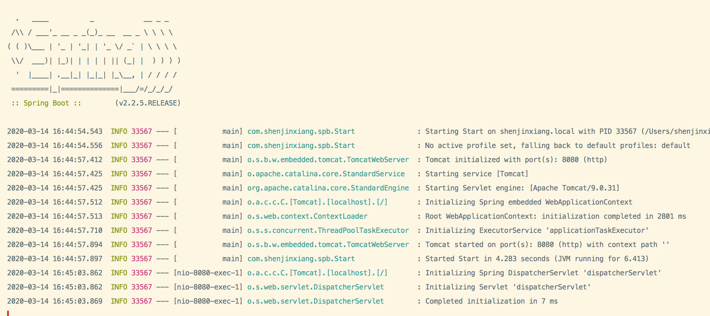
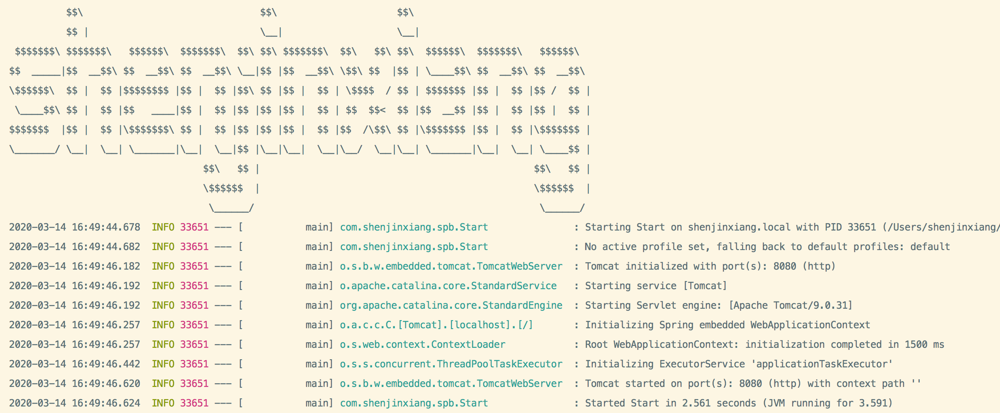

# HelloWorld

## 创建项目
创建maven项目，`pom.xml`配置：
```xml
<parent>
    <groupId>org.springframework.boot</groupId>
    <artifactId>spring-boot-starter-parent</artifactId>
    <version>2.2.4.RELEASE</version>
    <relativePath/> <!-- lookup parent from repository -->
</parent>

<dependencies>

    <dependency>
        <groupId>org.springframework.boot</groupId>
        <artifactId>spring-boot-starter-web</artifactId>
    </dependency>

</dependencies>
```

## 启动类
```java
@SpringBootApplication
public class Start {

    public static void main(String[] args) {
        SpringApplication.run(Start.class, args);
    }
}
```

## Controller
```java
@RestController
public class HelloController {

    @GetMapping("/hello")
    public String hello() {
        return "Hello World!";
    }
}
```




## 设置banner
设置项目启动时的字符图：
```
  .   ____          _            __ _ _
 /\\ / ___'_ __ _ _(_)_ __  __ _ \ \ \ \
( ( )\___ | '_ | '_| | '_ \/ _` | \ \ \ \
 \\/  ___)| |_)| | | | | || (_| |  ) ) ) )
  '  |____| .__|_| |_|_| |_\__, | / / / /
 =========|_|==============|___/=/_/_/_/
 :: Spring Boot ::        (v2.2.4.RELEASE)

```

在`src/main/resources`目录下新建banner.txt文件，然后将自己的图案黏贴进去即可，可以用一些工具网站生成：[http://www.network-science.de/ascii](http://www.network-science.de/ascii/) 或[http://patorjk.com/software/taag](http://patorjk.com/software/taag/#p=display&h=0&f=Varsity&t=Shen%20JinXiang)



banner也可以关闭，在main方法中：

```java
@SpringBootApplication
public class Start {

    public static void main(String[] args) {
        SpringApplication application = new SpringApplication(Start.class);
        application.setBannerMode(Banner.Mode.OFF);
        application.run(args);
    }
}
```

## 部署
如果需要打包成jar，需要配置`pom.xml`:
```xml
<build>
    <plugins>
        <plugin>
            <groupId>org.springframework.boot</groupId>
            <artifactId>spring-boot-maven-plugin</artifactId>
        </plugin>
    </plugins>
</build>
```
