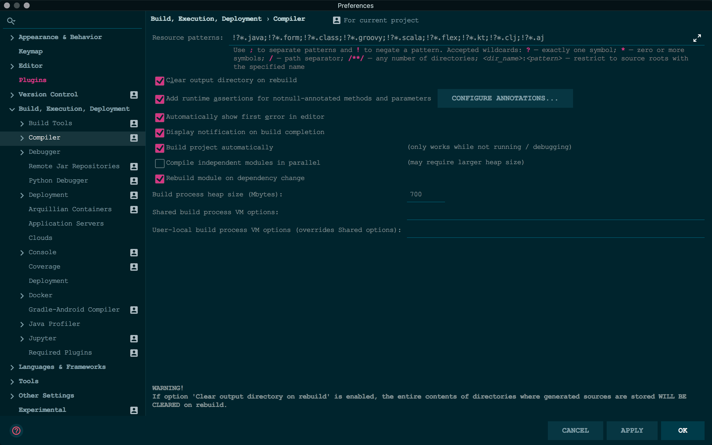
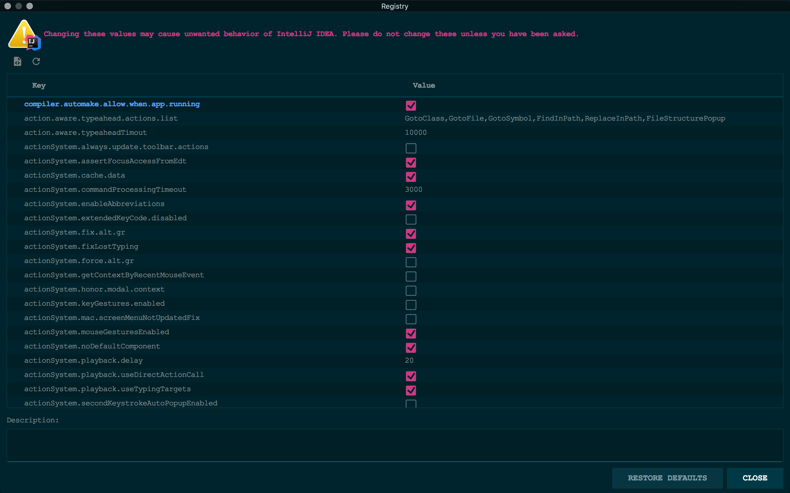

# IntelliJ IDEA热部署
## 配置pom.xml
**添加依赖**
```xml
<dependency>
    <groupId>org.springframework.boot</groupId>
    <artifactId>spring-boot-devtools</artifactId>
    <optional>true</optional>
</dependency>
```

**设置plugin**
```xml
<plugin>
    <groupId>org.springframework.boot</groupId>
    <artifactId>spring-boot-maven-plugin</artifactId>
    <configuration>
        <fork>true</fork>
    </configuration>
</plugin>
```

## 配置IDEA
### 第一步
打开Setting -> Build, Execution, Deployment -> Compiler 在右侧找到 `Build project automatically` 选中


### 第二步
快捷键 `Ctrl + Alt + Shift + /` 打开 Maintenance -> Registry... 在列表中找到 `compiler.automake.allow.when.app.runngin` 选中

