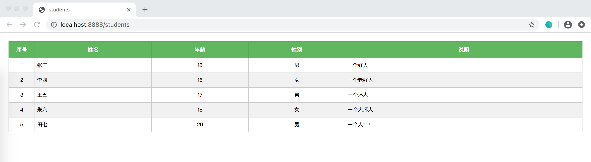

# 使用thymeleaf
## 配置
**pom.xml**
```xml
<dependencies>

    <dependency>
        <groupId>org.springframework.boot</groupId>
        <artifactId>spring-boot-starter-web</artifactId>
    </dependency>

    <dependency>
        <groupId>org.springframework.boot</groupId>
        <artifactId>spring-boot-starter-thymeleaf</artifactId>
    </dependency>

    <dependency>
        <groupId>org.springframework.boot</groupId>
        <artifactId>spring-boot-devtools</artifactId>
        <optional>true</optional>
    </dependency>

</dependencies>
```

**application.yml**
```yml
server:
  port: 8888

spring:
  thymeleaf:
    cache: false
```

## 启动类
```java
@SpringBootApplication
public class Start {

    public static void main(String[] args) {
        SpringApplication application = new SpringApplication(Start.class);
        application.setBannerMode(Banner.Mode.OFF);
        application.run(args);
    }
}
```

## 实体类
```java
public class Student {

    private String name;
    private int age;
    private int gender;
    private String description;

    public Student(String name, int age, int gender, String description) {
        this.name = name;
        this.age = age;
        this.gender = gender;
        this.description = description;
    }

    // setter and gettter
}
```

## controller
```java
@Controller
@RequestMapping("/students")
public class StudentController {

    @RequestMapping("")
    public String index(Model model) {
        List<Student> studentList = new ArrayList<>();
        studentList.add(new Student("张三", 15, 1, "一个好人"));
        studentList.add(new Student("李四", 16, 0, "一个老好人"));
        studentList.add(new Student("王五", 17, 1, "一个坏人"));
        studentList.add(new Student("朱六", 18, 0, "一个大坏人"));
        studentList.add(new Student("田七", 20, 1, "一个人！！"));
        model.addAttribute("students", studentList);
        return "student";
    }
}
```

## 页面
thymeleaf模版文件**student.html**：
```html
<!DOCTYPE html>
<html xmlns:th="http://www.thymeleaf.org">
<head>
    <title>account</title>
    <meta http-equiv="Content-Type" content="text/html; charset=UTF-8" />
    <link rel="stylesheet" th:href="@{/css/style.css}" type="text/css">
</head>
<body>
<div class="data-container">
    <table class="data-table">
        <tr>
            <th>序号</th>
            <th>姓名</th>
            <th>年龄</th>
            <th>性别</th>
            <th>说明</th>
        </tr>
        <tr th:each="stu, stat: ${students }">
            <td class="xh-td" th:text="${stat.count}"></td>
            <td class="" th:text="${stu.name}"></td>
            <td class="center-td" th:text="${stu.age}"></td>
            <td class="center-td" th:text="${stu.gender == 0 ? '女' : '男'}"></td>
            <td class="" th:text="${stu.description}"></td>
        </tr>
    </table>
</div>
</body>
</html>
```

样式文件**style.css**：
```css
body {margin: 0px; padding: 0px;}

.data-container {
    display: block;
    margin: 20px;
}
.data-container .data-table{
    display: inline-table;
    width: 100%;
    border-collapse: collapse;
}
.data-container .data-table tr th, .data-container .data-table tr td {
    border: 1px solid #ccc;
}
.data-container .data-table tr th {
    height: 36px;
    line-height: 36px;
    font-size: 13px;
    text-align: center;
    color: #fff;
    background: #5cb85c;
    border-color: #4cae4c;
}
.data-container .data-table tr td {
    height: 30px;
    line-height: 30px;
    font-size: 12px;
    padding: 2px 5px;
}
.data-container .data-table tr:nth-child(odd) {
    background: #f1f1f1;
}
.data-container .data-table tr td.xh-td {
    width: 50px;
    text-align: center;
}
.data-container .data-table tr td.center-td{
    text-align: center;
}
```

## 访问结果

