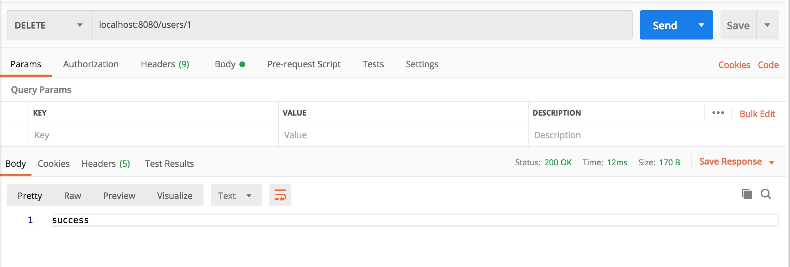

# 构建RESTful-API

## HTTP动词

- GET（SELECT）：从服务器取出资源（一项或多项）。
- POST（CREATE）：在服务器新建一个资源。
- PUT（UPDATE）：在服务器更新资源（客户端提供改变后的完整资源）。
- PATCH（UPDATE）：在服务器更新资源（客户端提供改变的属性）。
- DELETE（DELETE）：从服务器删除资源。

## 示例

以用户`user`为例：

| 请求类型 | URL       | 说明                             |
| -------- | --------- | -------------------------------- |
| GET      | /users    | 查询用户列表                     |
| GET      | /users/id | 根据id查询用户信息               |
| POST     | /users    | 新增用户信息                     |
| PUT      | /users/id | 根据id修改用户信息（需全部信息） |
| PATCH    | /users/id | 根据id修改用户信息（需部分信息） |
| DELETE   | /users/id | 根据id删除用户信息               |


## 代码实现

### pom.xml

```xml
<?xml version="1.0" encoding="UTF-8"?>
<project xmlns="http://maven.apache.org/POM/4.0.0"
         xmlns:xsi="http://www.w3.org/2001/XMLSchema-instance"
         xsi:schemaLocation="http://maven.apache.org/POM/4.0.0 http://maven.apache.org/xsd/maven-4.0.0.xsd">
    <modelVersion>4.0.0</modelVersion>

    <parent>
        <groupId>org.springframework.boot</groupId>
        <artifactId>spring-boot-starter-parent</artifactId>
        <version>2.2.4.RELEASE</version>
        <relativePath/>
    </parent>

    <groupId>com.shenjinxiang</groupId>
    <artifactId>Spring-Boot-RESTful</artifactId>
    <version>1.0-SNAPSHOT</version>

    <build>
        <plugins>
            <plugin>
                <groupId>org.springframework.boot</groupId>
                <artifactId>spring-boot-maven-plugin</artifactId>
            </plugin>
        </plugins>
    </build>

    <dependencies>

        <dependency>
            <groupId>org.springframework.boot</groupId>
            <artifactId>spring-boot-starter-web</artifactId>
        </dependency>

    </dependencies>

</project>
```

## 项目启动

```java
@SpringBootApplication
public class Start {

    public static void main(String[] args) {
        SpringApplication.run(Start.class, args);
    }
}
```

### 实体类

```java
public class User {

    private Long id;
    private String name;
    private Integer age;
    private String desc;
 
    // getter and setter
}
```

### Controller

```java
@RestController
@RequestMapping(value = "/users")
public class UserController {

    // 创建线程安全的Map，模拟users信息的存储
    static Map<Long, User> users = Collections.synchronizedMap(new HashMap<Long, User>());

    @GetMapping("/")
    public List<User> queryAllStudent() {
        return new ArrayList<User>(users.values());
    }

    @GetMapping("/{id}")
    public User getUser(@PathVariable Long id) {
        return users.get(id);
    }

    @PostMapping("/")
    public String postUser(@RequestBody User user) {
        users.put(user.getId(), user);
        return "success";
    }

    @PutMapping("/{id}")
    public String putUser(@PathVariable Long id, @RequestBody User user) {
        User u = users.get(id);
        u.setName(user.getName());
        u.setAge(user.getAge());
        u.setDesc(user.getDesc());
        users.put(id, u);
        return "success";
    }

    @DeleteMapping("/{id}")
    public String deleteUser(@PathVariable Long id) {
        users.remove(id);
        return "success";
    }
}
```


## 测试

### 新增

第一条记录：


第二条记录：


第三条记录：


### 查看所有记录


### 修改一条记录


### 根据id查询


### 根据id删除记录



查看结果:


## 整合Swagger2

### 配置pom.xml

```xml
<dependency>
    <groupId>io.springfox</groupId>
    <artifactId>springfox-swagger2</artifactId>
    <version>2.9.2</version>
</dependency>

<dependency>
    <groupId>io.springfox</groupId>
    <artifactId>springfox-swagger-ui</artifactId>
    <version>2.9.2</version>
</dependency>
```

### Swagger配置类

```java
@Configuration
@EnableSwagger2
public class SwaggerConfig {

    @Bean
    public Docket buildDocket() {
        return new Docket(DocumentationType.SWAGGER_2)
                .apiInfo(buildApiInf())
                .select()
                .apis(RequestHandlerSelectors.basePackage("com.shenjinxiang.spb.controller"))
                .paths(PathSelectors.any())
                .build();
    }
    private ApiInfo buildApiInf() {
        return new ApiInfoBuilder()
                .title("系统RESTful API文档")
                .version("1.0")
                .build();
    }

}
```

### 修改controller

```java
@Api(value = "用户Controller")
@RestController
@RequestMapping("users")
public class UserController {

    // 创建线程安全的Map，模拟users信息的存储
    static Map<Long, User> users = Collections.synchronizedMap(new HashMap<Long, User>());

    @ApiOperation(value = "获取用户列表", notes = "获取用户列表")
    @GetMapping("")
    public List<User> queryAllStudent() {
        return new ArrayList<User>(users.values());
    }

    @ApiOperation(value = "获取用户信息", notes = "根据用户id获取用户信息")
    @ApiImplicitParam(name = "id", value = "用户id", required = true, dataType = "Long", paramType = "path")
    @GetMapping("/{id}")
    public User getUser(@PathVariable Long id) {
        return users.get(id);
    }

    @ApiOperation(value = "新增用户", notes = "根据用户实体创建用户")
    @ApiImplicitParam(name = "user", value = "用户实体", required = true, dataType = "User")
    @PostMapping("")
    public String postUser(@RequestBody User user) {
        users.put(user.getId(), user);
        return "success";
    }

    @ApiOperation(value = "更新用户", notes = "根据用户id更新用户")
    @ApiImplicitParams({
            @ApiImplicitParam(name = "id", value = "用户id", required = true, dataType = "Long", paramType = "path"),
            @ApiImplicitParam(name = "user", value = "用户实体", required = true, dataType = "User") }
            )
    @PutMapping("/{id}")
    public String putUser(@PathVariable Long id, @RequestBody User user) {
        User u = users.get(id);
        u.setName(user.getName());
        u.setAge(user.getAge());
        u.setDesc(user.getDesc());
        users.put(id, u);
        return "success";
    }

    @ApiOperation(value = "删除用户", notes = "根据用户id删除用户")
    @ApiImplicitParam(name = "id", value = "用户id", required = true, dataType = "Long", paramType = "path")
    @DeleteMapping("/{id}")
    public String deleteUser(@PathVariable Long id) {
        users.remove(id);
        return "success";
    }
}
```

### 访问

启动服务以后：

