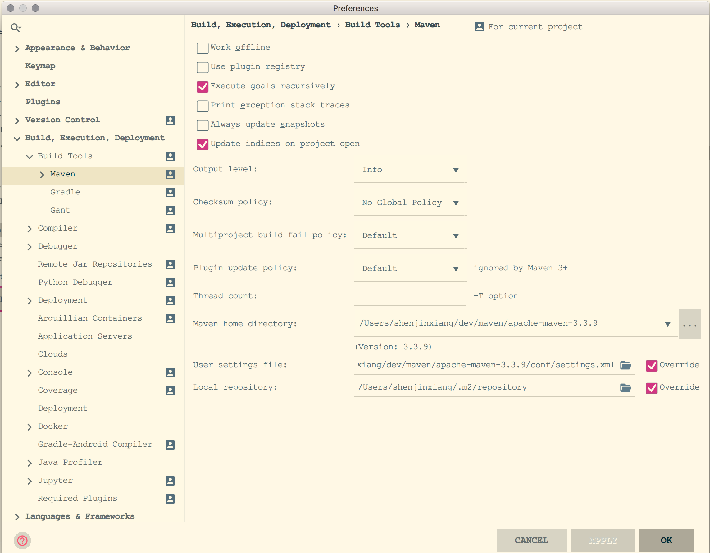

# 环境准备

## 工具版本
* jdk: 1.7及以上版本即可
* maven: 3.3以上版本

## maven配置
在`settings.xml`配置文的`profiles`标签添加：
```xml
<profile>
    <id>jdk-1.8</id>
    <activation>
        <activeByDefault>true</activeByDefault>
        <jdk>1.8</jdk>
    </activation>
    <properties>
        <maven.compiler.source>1.8</maven.compiler.source>
        <maven.compiler.target>1.8</maven.compiler.target>
        <maven.compiler.compilerVersion>1.8</maven.compiler.compilerVersion>
    </properties>
</profile>
```

## idea设置
idea中配置maven：

setting -> Build,Execution,Deployment -> Build Tools -> Maven，设置maven的地址和配置地址以及本地仓库地址


