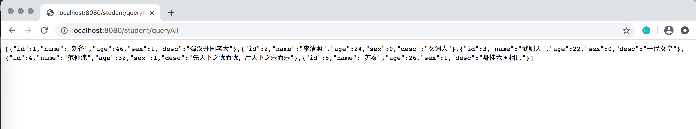
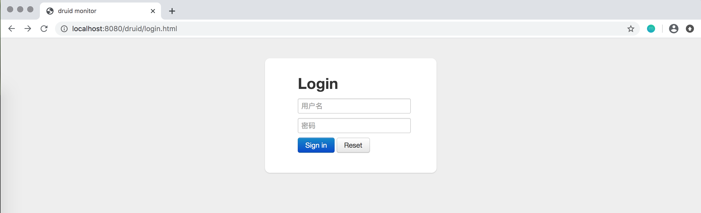

# 配置MyBatis
## 配置pom.xml
### 引入mybatis-spring-boot-starter
```xml
<dependency>
    <groupId>org.mybatis.spring.boot</groupId>
    <artifactId>mybatis-spring-boot-starter</artifactId>
    <version>2.1.1</version>
</dependency>
```
不同版本的Spring Boot和MyBatis版本对应不一样，具体可查看[官方文档](http://www.mybatis.org/spring-boot-starter/mybatis-spring-boot-autoconfigure/)。
### 引入驱动

**mysql**
```xml
<dependency>
    <groupId>mysql</groupId>
    <artifactId>mysql-connector-java</artifactId>
    <scope>runtime</scope>
</dependency>
```

**oracle**

由于版权的原因，我们需要将`ojdbc6.jar`依赖安装到本地的maven仓库，下载`ojdbc6.jar`，执行命令：
```bash
mvn install:install-file -DgroupId=jar包的groupId -DartifactId=jar包的artifactId -Dversion=jar包的版本号 -Dpackaging=jar -Dfile=jar包所在本地目录
```
安装到本地maven仓库以后，在pom中引入：

```xml
<dependency>
    <groupId>com.oracle</groupId>
    <artifactId>ojdbc6</artifactId>
    <version>11.2.0.3</version>
</dependency>
```

## 配置application.yml
```yml
spring:
  datasource:
    username: root
    password: 123456
    url: jdbc:mysql://localhost:3306/spb?useUnicode=true&characterEncoding=utf-8&useSSL=true&serverTimezone=UTC
    driver-class-name: com.mysql.cj.jdbc.Driver
```

## 准备数据
创建表：
```sql
CREATE TABLE `student` (
  `id` int(11) NOT NULL AUTO_INCREMENT,
  `name` varchar(100) DEFAULT NULL,
  `age` int(3) DEFAULT NULL,
  `sex` tinyint(1) DEFAULT NULL,
  `desc` varchar(200) DEFAULT NULL,
  PRIMARY KEY (`id`)
) ENGINE=InnoDB DEFAULT CHARSET=utf8
```

导入初始数据：

```sql
insert into student (`name`, `age`, `sex`, `desc`) values ("刘备", 46, 1, "蜀汉开国老大");
insert into student (`name`, `age`, `sex`, `desc`) values ("李清照", 24, 0, "女词人");
insert into student (`name`, `age`, `sex`, `desc`) values ("武则天", 22, 0, "一代女皇");
insert into student (`name`, `age`, `sex`, `desc`) values ("范仲淹", 32, 1, "先天下之忧而忧，后天下之乐而乐");
insert into student (`name`, `age`, `sex`, `desc`) values ("苏秦", 26, 1, "身挂六国相印");
```

## 使用注解方式的mapper
编写StudentMapper.java
```java
package com.shenjinxiang.spb.mapper;

import com.shenjinxiang.spb.bean.Student;
import org.apache.ibatis.annotations.*;
import org.springframework.stereotype.Component;

import java.util.List;

@Component
@Mapper
public interface StudentMapper {

    @Select("select `id`, `name`, `age`, `sex`, `desc` from student")
    @Results(id = "queryAllStudent", value = {
        @Result(property = "id", column = "id", javaType = Integer.class),
        @Result(property = "name", column = "name", javaType = String.class),
        @Result(property = "age", column = "age", javaType = Integer.class),
        @Result(property = "sex", column = "sex", javaType = Integer.class),
        @Result(property = "desc", column = "desc", javaType = String.class)
    })
    List<Student> queryAll();

    @Select("select `id`, `name`, `age`, `sex`, `desc` from student where `id` = #{id}")
    @Results(id = "queryById", value = {
            @Result(property = "id", column = "id", javaType = Integer.class),
            @Result(property = "name", column = "name", javaType = String.class),
            @Result(property = "age", column = "age", javaType = Integer.class),
            @Result(property = "sex", column = "sex", javaType = Integer.class),
            @Result(property = "desc", column = "desc", javaType = String.class)
    })
    Student queryById(int id);

    @Insert("insert into student (`name`, `age`, `sex`, `desc`) values (#{name}, #{age}, #{sex}, #{desc})")
    int add(Student student);

    @Update("update student set `name` = #{name}, `age` = #{age}, `sex` = #{sex}, `desc` = #{desc} where `id` = #{id}")
    int update(Student student);

    @Delete("delete from student where `id` = #{id}")
    int delById(int id);
}
```

## 编写service

StudentService.java
```java
public interface StudentService {

    List<Student> queryAll();

    Student queryById(int id);

    int add(Student student);

    int update(Student student);

    int delById(int id);
}
```

实现类StudentServiceImp.java
```java
@Service("studentService")
public class StudentServiceImp implements StudentService {

    @Autowired
    private StudentMapper studentMapper;

    @Override
    public List<Student> queryAll() {
        return this.studentMapper.queryAll();
    }

    @Override
    public Student queryById(int id) {
        return this.studentMapper.queryById(id);
    }

    @Override
    public int add(Student student) {
        return this.studentMapper.add(student);
    }

    @Override
    public int update(Student student) {
        return this.studentMapper.update(student);
    }

    @Override
    public int delById(int id) {
        return this.studentMapper.delById(id);
    }
}
```

## 编写controller
StudentController.java
```java
@RestController
@RequestMapping("/students")
public class StudentController {

    @Autowired
    private StudentService studentService;

    @GetMapping("")
    public List<Student> queryAll() {
        return this.studentService.queryAll();
    }

    @GetMapping("/{id}")
    public Student queryById(@PathVariable("id") int id) {
        return this.studentService.queryById(id);
    }

    @PostMapping("")
    public int add(@RequestBody Student student) {
        return this.studentService.add(student);
    }

    @PutMapping(value = "/{id}")
    public int update(@PathVariable int id, @RequestBody Student student) {
        return this.studentService.update(student);
    }

    @DeleteMapping("/{id}")
    public int delById(@PathVariable("id") int id) {
        return this.studentService.delById(id);
    }
}
```

## 测试
启动项目，访问`http://localhost:8080/student/queryAll`:


## 配置打印sql日志
```yml
logging:
  level:
    com:
      shenjinxiang:
        spb:
          mapper: debug
```

## 使用xml方式
配置application.yml:
```yml
mybatis:
  type-aliases-package: com.shenjinxiang.spb.bean
  mapper-locations: classpath:mapping/*Mapper.xml
```

修改mapper接口：
```java
@Component
@Mapper
public interface StudentMapper {

    List<Student> queryAll();

    Student queryById(int id);

    int add(Student student);

    int update(Student student);

    int delById(int id);
}
```

编写xml文件，在resources/mapping 目录下新建StudentMapper.xml文件：
```xml
<?xml version="1.0" encoding="UTF-8"?>
<!DOCTYPE mapper PUBLIC "-//mybatis.org//DTD Mapper 3.0//EN" "http://mybatis.org/dtd/mybatis-3-mapper.dtd">
<mapper namespace="com.shenjinxiang.spb.mapper.StudentMapper">

    <resultMap id="baseResult" type="com.shenjinxiang.spb.bean.Student" >
        <result property="id" column="id" jdbcType="INTEGER" />
        <result property="name" column="name" jdbcType="VARCHAR" />
        <result property="age" column="age" jdbcType="INTEGER" />
        <result property="sex" column="sex" jdbcType="INTEGER" />
        <result property="desc" column="desc" jdbcType="VARCHAR" />
    </resultMap>

    <select id="queryAll" resultMap="baseResult">
        select `id`, `name`, `age`, `sex`, `desc`
        from student
    </select>

    <select id="queryById" parameterType="int" resultMap="baseResult">
        select `id`, `name`, `age`, `sex`, `desc`
        from student
        <where>
            and `id` = #{id}
        </where>
    </select>

    <insert id="add" parameterType="com.shenjinxiang.spb.bean.Student" >
        insert into student
        (`name`, `age`, `sex`, `desc` )
        values
        (#{name}, #{age}, #{sex}, #{desc})
    </insert>

    <update id="update" parameterType="com.shenjinxiang.spb.bean.Student">
        update student
        <set>
            `name` = #{name}.
            `age` = #{age}.
            `sex` = #{sex}.
            `desc` = #{desc}.
        </set>
        <where>
            and `id` = #{id}
        </where>
    </update>

    <delete id="delById" parameterType="int">
        delete from student
        <where>
            and `id` = #{id}
        </where>
    </delete>
</mapper>
```

## 使用druid数据源
pom.xml中引入druid

```xml
<dependency>
    <groupId>com.alibaba</groupId>
    <artifactId>druid-spring-boot-starter</artifactId>
    <version>1.1.21</version>
</dependency>
```


配置application.yml

```yml
spring:
  datasource:
    druid:
      # 数据库访问配置, 使用druid数据源
      type: com.alibaba.druid.pool.DruidDataSource
      driver-class-name: com.mysql.cj.jdbc.Driver
      url: jdbc:mysql://localhost:3306/spb?useUnicode=true&characterEncoding=utf-8&useSSL=true&serverTimezone=UTC
      username: root
      password: 123456
      # 连接池配置
      initial-size: 5
      min-idle: 5
      max-active: 20
      # 连接等待超时时间
      max-wait: 30000
      # 配置检测可以关闭的空闲连接间隔时间
      time-between-eviction-runs-millis: 60000
      # 配置连接在池中的最小生存时间
      min-evictable-idle-time-millis: 300000
      validation-query: select '1' from dual
      test-while-idle: true
      test-on-borrow: false
      test-on-return: false
      # 打开PSCache，并且指定每个连接上PSCache的大小
      pool-prepared-statements: true
      max-open-prepared-statements: 20
      max-pool-prepared-statement-per-connection-size: 20
      # 配置监控统计拦截的filters, 去掉后监控界面sql无法统计, 'wall'用于防火墙
      filters: stat,wall
      # Spring监控AOP切入点，如x.y.z.service.*,配置多个英文逗号分隔
      aop-patterns: com.springboot.servie.*


      # WebStatFilter配置
      web-stat-filter:
        enabled: true
        # 添加过滤规则
        url-pattern: /*
        # 忽略过滤的格式
        exclusions: '*.js,*.gif,*.jpg,*.png,*.css,*.ico,/druid/*'

      # StatViewServlet配置
      stat-view-servlet:
        enabled: true
        # 访问路径为/druid时，跳转到StatViewServlet
        url-pattern: /druid/*
        # 是否能够重置数据
        reset-enable: false
        # 需要账号密码才能访问控制台
        login-username: 用户名
        login-password: 密码
        # IP白名单
        # allow: 127.0.0.1
        #　IP黑名单（共同存在时，deny优先于allow）
        # deny: 192.168.1.218

      # 配置StatFilter
      filter:
        stat:
          log-slow-sql: true
```

启动项目后可以访问：`http://localhost:8080/druid/login.html`


输入配置的账号、密码即可查看详细信息。
