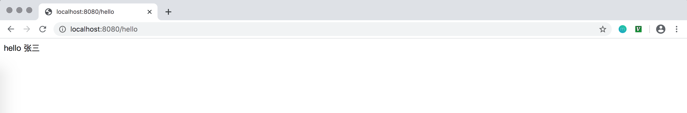
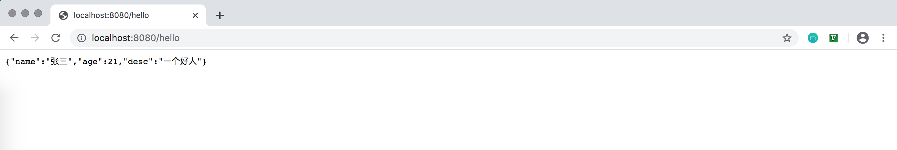
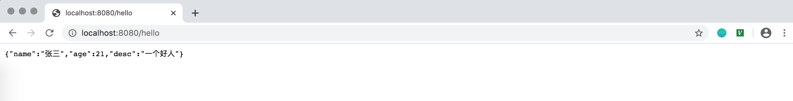
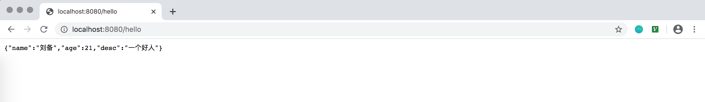

# 配置文件

## yml语法
采用以**数据为中心**的概念，比json、xml更适合做配置文件
### 基本语法
1. 采用`k: v`的格式，表示键值对，冒号`:`后必须有空格
2. 采用空格缩紧表示层级关系，只要是左对齐的数据，就是同一层级
3. 大小写敏感

*示例*
```xml
<server>
    <port>8080</port>
    <path>/hello</path>
</server>
```

对应的yml格式：
```yml
server: 
    port: 8080
    path: /hello
```

### 值的写法
#### 基本类型（数字、字符串、布尔）
直接书写值即可，不需要`'`和`"`

#### map类型
```yml
friends: 
  zhangsan: 
    age: 17
    address: 北京
  lisi:
    age: 21
    address: 上海
```
行内写法：
```yml
friends:
  zhangsan: {age: 17, address: 北京}
  lisi: {age: 21, address: 上海}
```

#### 数组（List, Set）
```yml
pets:
  - dog
  - cat
  - pig
```
行内写法：
```yml
pets: [ dog, cat, pig]
```

## 全局配置文件
Spring Boot 的主配置文件是在`src/main/resources`目录下：`aplication.properties`或`application.yml`文件，可以修改一些默认配置值

附：[application.properties中可配置所有官方属性](https://docs.spring.io/spring-boot/docs/current/reference/html/appendix-application-properties.html)

### @Value 注解
通过`@Value`加载配置文件中的属性值
application.yml内容：
```yml
person:
  name: 张三
  age: 21
  desc: 一个好人
```

单个属性值读取：
```java
@RestController
public class HelloController {

    @Value("${person.name}")
    private String name;

    @GetMapping("/hello")
    public String hello() {
        return "hello " + name;
    }

}
```

浏览器访问`http://localhost:8080/hello`：


对于多个简单属性，可以使用实体类来加载配置数据：
```java
@Component
public class Person {

    @Value("${person.name}")
    private String name;
    @Value("${person.age}")
    private int age;
    @Value("${person.desc}")
    private String desc;

    // getter、setter以及toString方法
}
```
修改`HelloController`代码：
```java
@RestController
public class HelloController {

    @Autowired
    private Person person;

    @GetMapping("/hello")
    public Person hello() {
        return person;
    }
}
```

浏览器访问`http://localhost:8080/hello`：



### @ConfigurationProperties 注解
创建实体类，使用`ConfigurationProperties`注解标注，指定prefix的值对应配置文件的节点
application.yml内容：
```yml
person:
  name: 张三
  age: 21
  desc: 一个好人
  boos: true
  pets:
    - cat
    - dog
    - pig
  dog: {name: 旺财, age: 2}
  info:
    phone: 13434343434
    email: zhangsan@163.com
    address: 北京
  friends:
    - {name: 李四, age: 18, phone: 13333333333}
    - {name: 王五, age: 19, phone: 13444444444}
    - {name: 赵六, age: 20, phone: 13555555555}
```

实体类`Person`：
```java
import org.springframework.boot.context.properties.ConfigurationProperties;
import org.springframework.stereotype.Component;

import java.util.List;

@Component
@ConfigurationProperties(prefix = "person")
public class Person {

    private String name;
    private int age;
    private String desc;
    private boolean boos;
    private List<String> pets;
    private Dog dog;
    private List<Friend> friends;

    // getter、setter以及toString方法
}
```

其他相关实体类:
```java
public class Dog {

    private String name;
    private int age;

    // getter、setter以及toString方法
}

public class Friend {

    private String name;
    private int age;
    private String phone;

    // getter、setter以及toString方法
}

public class PersonInfo {

    private String phone;
    private String email;
    private String address;

    // getter、setter以及toString方法
}
```

添加测试代码:
```java
import com.shenjinxiang.spb002.bean.Person;
import org.junit.jupiter.api.Test;
import org.springframework.beans.factory.annotation.Autowired;
import org.springframework.boot.test.context.SpringBootTest;

@SpringBootTest
public class StartTest {

    @Autowired
    private Person person;

    @Test
    public void test1() {
        System.out.println(person);
    }
}
```
## 自定义配置文件
除了可以在`application.yml`或`application.properties`中配置属性，还可以自定义配置文件，在`src/main/resources`目录中将`application.yml`重命名为`test.yml`，此时需要修改实体类`Person`，添加`@PropertySource`注解，指定配置文件地址即可：

```java
@Component
@ConfigurationProperties(prefix = "person")
@PropertySource("classpath:test.yml")
public class Person {

    private String name;
    private int age;
    private String desc;
    private boolean boos;
    private List<String> pets;
    private Dog dog;
    private List<Friend> friends;

    // getter、setter以及toString方法
}
```
## 通过命令行设置属性值
当项目打包成jar运行时，可以通过命令行设置属性值

> java -jar XXX.jar --属性名=属性值

如在application.yml中有：
```yml
person:
  name: 张三
  age: 21
  desc: 一个好人
```

HelloController:
```java
@RestController
public class HelloController {

    @Autowired
    private Person person;

    @GetMapping("/hello")
    public Person hello() {
        return person;
    }
}
```

项目打包后正常启动，访问`http://localhost:8080/hello`:


项目启动时带上参数设置：
```sh
java -jar target/spb002-1.0-SNAPSHOT.jar --person.name=刘备
```

访问`http://localhost:8080/hello`:



## 使用xml配置
## prefile机制


