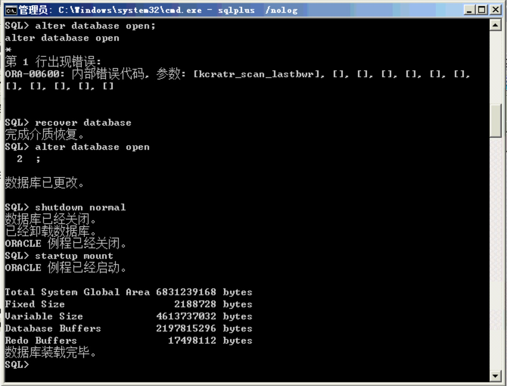

# oracle异常停电

oracle异常停电导致 `ORACLE initialization or shutdown in progress` 错误

```
# 1
sqlplus /nolog
# 2
connect sys/change_on_install as sysdba
# 3
shutdown normal
# 4 
startup mount
# 5
alter database open;
```

第五步出现 `ORA-00600 kcratr_scan_lastbwr`错误，处理方法：

```sh
startup mount
recover database
```

