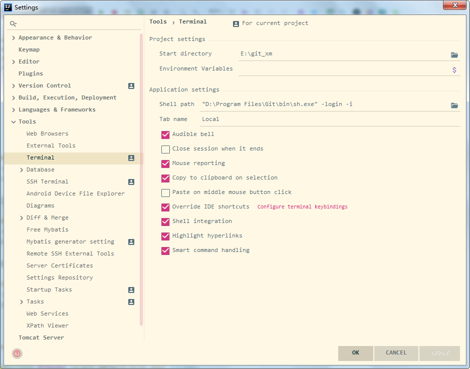

# 解决idea下Terminal工具乱码

JetBrains idea下开发的时候经常会使用到git，当在windos环境的时候，将idea自带的Terminal工具设置为git的，替换windows的cmd命令是个不错的选择。

具体配置：



当Terminal出现乱码时，需要到git安装目录中找到etc目录下的bash.bashrc文件，文件末尾添加:

```bash
export LANG="zh_CN.UTF-8"
export LC_ALL="zh_CN.UTF-8"
```

完成后重启idea即可。